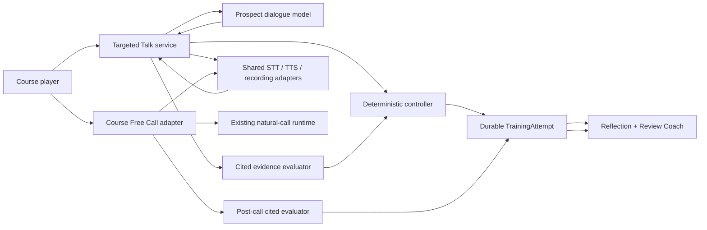

# Sales Trainer Targeted Talk Build Guide

**Date:** 2026-07-28  
**Status:** Implementation-ready local build guide; no live deployment authorized  
**Companion documents:**

- `.ai/context/SALES_TRAINER_EXECUTION_WORK_ORDER_2026-07-28.md`
- `.ai/context/SALES_TRAINER_CURRICULUM_AND_CALL_REVIEW_DESIGN_2026-07-28.md`

## 1. Outcome

Turn the current course shell and the existing Free Call/Coach system into one learning product with two intentionally different conversation modes:

1. **Targeted Talk** — the primary course exercise. The learner talks to a prospect bot inside one bounded call section, topic, tactic, objection family, or hard rule.
2. **Free Call** — the open-ended transfer exercise. The learner handles a natural call without artificial section gates while the Coach observes and later reviews the performance.

The learner-facing name is **Targeted Talk**. For compatibility with the content contract and existing feature flag, its internal course item type and `experienceMode` remain **`gauntlet`** in the first implementation. Do not introduce a competing third runtime or a second synonymous item type.

The course is talk-first. Reading and quizzes support the conversation practice; they are not the center of the experience.

Default unit rhythm:

```text
30–90 second target briefing
→ section-locked Targeted Talk
→ tape review and learner self-reflection
→ short server-owned, model-graded Q&A
→ full Coach feedback
→ retry or advance
```

After a cluster of targeted units:

```text
Free Call
→ learner self-reflection
→ post-call cited evaluation
→ Coach feedback
→ targeted remediation or next section
```

## 2. Binding product rules

### 2.1 Targeted Talk

A Targeted Talk:

- tests one local objective;
- starts at the point in the call where that objective matters;
- does not make the learner repeat earlier call sections unless the earlier behavior is the objective;
- cannot drift into a later section;
- gives the prospect meaningful reactions to what the learner says;
- requires the learner to use the relevant tactic or behavior;
- varies wording, persona, facts, and emotional presentation without changing the required evidence;
- ends with a local pass, bounded retry/remediation result, or infrastructure invalidation;
- records a tape and cited evidence;
- keeps full Coach feedback hidden until the learner reflects.

Examples:

- an opening exercise ends after identity, reason for contact, and permission are handled;
- a Discovery exercise ends after the required discovery objective is met or demonstrably missed;
- an objection exercise begins with the objection already in context and ends after the learner resolves or mishandles it;
- a qualification exercise never continues into price or purchase;
- a DNC judgment exercise records the learner’s judgment only and never changes an operational DNC record.

### 2.2 Free Call

A Free Call:

- is a natural conversation rather than a sequence of visible gates;
- may move through the entire call arc;
- has no Targeted Talk node, hint, retry, or local-objective barrier;
- uses the Coach as an advisory observer that may publish guidance or `HOLD`;
- is evaluated post hoc against the same approved rule IDs;
- records **transfer** evidence, not guided-execution evidence;
- treats a target that never naturally arose as `no_evidence`, not as a fabricated failure;
- cannot certify a learner until `DG-CERT-01` is approved.

### 2.3 Separate dimensions

Keep these concepts separate in every API, model, prompt, and UI:

```ts
direction: "inbound" | "outbound"
experienceMode: "gauntlet" | "free"
sectionId: string
```

`direction` is not an experience mode. `experienceMode` is not a script section.

## 3. Authority and safety

The source hierarchy is binding:

1. Direct Mickey rulings.
2. The approved original tax-resolution script, or a confirmed faithful extraction.
3. Model-generated material, which must be labeled exactly **“Things to consider.”**

Only sources 1 and 2 may create:

- a required rule;
- a deterministic pass or failure gate;
- an unlock;
- a mastery or certification result;
- mandatory remediation.

Model-generated material may explain, suggest, or invite reflection. It may not unlock, fail, certify, discipline, or mutate an operational record.

Additional safety rules:

- Use synthetic prospect data only.
- Never request or store real SSNs, payment details, or customer secrets in a training scenario.
- Simulated DNC is a learning record only.
- Trainer writes must never touch live-call, lead, operational DNC, PhoneBurner, CX, or customer-case state.
- Protected demographic or voice changes must not alter gate difficulty, required evidence, retry behavior, or failure behavior.
- No deployment, service restart, production content publication, or live Coach change is part of this guide.

## 4. Current baseline

The current system already provides useful pieces:

| Capability | Current seam | Reuse posture |
|---|---|---|
| Course enrollment, item pinning, ownership, event IDs, expected-version CAS | `packages/shared-services/src/trainingCourseService.js` | Reuse and extend |
| Immutable rule/course/scenario content bundle | `packages/shared-services/src/trainer-content/` | Reuse and strengthen |
| Voice cockpit, MediaRecorder, VAD, hands-free loop, captions, sentence playback | `apps/web-client/src/workspaces/trainer/SalesTrainerWorkspace.tsx` | Extract and reuse |
| STT, TTS, pinned voice, recording manifests | `packages/shared-services/src/taxResolutionSalesTrainerService.js` | Extract adapters and reuse |
| Natural Free Call dialogue and prospect disposition | current sales-trainer runtime | Keep for Free Call |
| Two-station Coach/observer pattern | current sales-trainer runtime | Reuse as advisory pattern |
| Lesson, quiz, and say-it course players | current course shell | Keep as supporting work |

The current gaps are material:

- `trainingCourseService.js` activates only `lesson`, `quiz`, and `say-it`; `gauntlet` and `free-call` remain locked.
- `TrainerCourseHome.tsx` still describes a lesson-first rhythm.
- `TrainerCoursePlayer.tsx` explicitly says Free Call and later item types are not integrated.
- the legacy browser sends message history, profile, playbook, scenario, model/provider choices, and a derived turn number;
- legacy prospect and Coach state use process-local maps and disappear on restart;
- the current live-turn prompt allows the model to judge phases, emit pass/fail and scorecards, and pause for `continue` or `redo`;
- current in-band `<UI_*>` model tags drive client presentation;
- the legacy `/quiz/grade` route accepts the question, reference answer, and model from the browser;
- the current scenario validator checks basic reachability but not a safe transition grammar, section confinement, bounded cycles, variant parity, hint/retry policy, or complete target audio.

These are reasons to add a separate controller, not reasons to add more prompt prose.

## 5. Reuse capabilities, not authority

Keep five logical hats separate:

1. **Prospect** speaks naturally.
2. **Evaluator** proposes cited semantic evidence.
3. **Controller** advances, retries, hints, passes, fails, or invalidates.
4. **Live Coach** advises or returns `HOLD`.
5. **Review Coach** debriefs and maps misses to remediation after reflection.

The current Free Call prompt combines Prospect, phase judge, health author, and scorecard author. It is a source of natural-call behavior and voice UX, not the Targeted Talk control plane.



The controller is the only authority over Targeted Talk progression. The model never selects the next node, declares a pass, changes mastery, or unlocks an item.

## 6. Static content contract

Continue using `ScenarioBlueprint`, but make its publication contract complete enough to be executable.

```ts
type ScenarioBlueprint = {
  id: string;
  version: string;
  status: "draft" | "published" | "retired";
  experienceMode: "gauntlet";

  sectionId: string;
  phaseScope: string[];
  direction: "inbound" | "outbound";
  localObjective: string;
  excludedSectionIds: string[];
  prohibitedSpeechActs: string[];

  rulePackVersion: string;
  ruleIds: string[];
  promptVersion: string;
  graderVersion: string;

  startNodeId: string;
  maxTurns: number;
  maxVisitsPerNode: number;

  variants: Array<{
    variantId: string;
    version: string;
    personaProfileId: string;
    factSetId: string;
    utteranceSetIds: string[];
    voiceProfileId: string;
    requiredAudioTargetIds: string[];
  }>;

  nodes: Array<{
    id: string;
    type: "prospect" | "agent-response" | "checkpoint" | "terminal";
    sectionId: string;
    reactionIntent: string;
    allowedSpeechActs: string[];
    requiredCriteria: Array<{
      criterionId: string;
      ruleId: string;
      ruleRevision: string;
      detector: "exact" | "sequence" | "semantic";
      required: boolean;
    }>;
  }>;

  edges: Array<{
    id: string;
    from: string;
    to: string;
    priority: number;
    fallback?: boolean;
    condition?: TransitionCondition;
  }>;

  retryPolicy: {
    nodeRetryLimit: number;
    runRetryLimit: number;
    variantStrategy: "unused-first";
  };

  hintPolicy: {
    steps: Array<{
      hintId: string;
      authorityType: "mickey-ruling" | "approved-tax-resolution-script";
      contentRef: string;
    }>;
  };

  terminalOutcomes: Array<
    "passed" | "bounded_miss" | "hard_fail" | "invalidated"
  >;

  audioManifest: {
    manifestId: string;
    version: string;
    requiredTargetIds: string[];
  };
};
```

### 6.1 Safe transition grammar

Replace arbitrary `edge.when` strings with a typed, allowlisted condition AST. Never call `eval`, construct code, or interpret free-form expressions.

Allowed facts:

- `criterion_state`
- `retry_count`
- `run_retry_count`
- `turn_count`
- `hint_level`
- `hard_fail_code`

Allowed operators:

- `eq`
- `neq`
- `lt`
- `lte`
- `gt`
- `gte`
- `in`

Allowed combinators:

- `all`
- `any`
- `not`

Example:

```json
{
  "all": [
    {
      "fact": "criterion_state",
      "criterionId": "synthetic.acknowledge",
      "op": "eq",
      "value": "satisfied"
    },
    {
      "fact": "criterion_state",
      "criterionId": "synthetic.clarify",
      "op": "eq",
      "value": "satisfied"
    }
  ]
}
```

Every non-terminal node must have:

- deterministic edge priority;
- at most one matching highest-priority edge;
- exactly one unconditional fallback;
- a path to a terminal from that node;
- a bounded visit and turn ceiling.

### 6.2 Publication validator

Strengthen `validatePublishedTrainingContent.js` so a published Targeted Talk is rejected when:

- its required rule is draft, retired, missing, model-only, or lacks an approved revision;
- a node or edge leaves the pinned section;
- an excluded phase appears in a node, prompt pack, reaction intent, or allowed speech act;
- an edge uses a string condition or unsupported fact/operator;
- edge priority is ambiguous or a fallback is missing;
- any node cannot reach a terminal;
- a cycle is unbounded;
- `maxTurns`, retry limits, or max visits are absent or invalid;
- variants change section, required criteria, forbidden actions, or terminal policy;
- a variant lacks a required utterance or audio target;
- required target audio is incomplete;
- a learner-visible field exposes a hidden rubric, inactive branch, or canonical answer.

### 6.3 Variant rule

Variants may change:

- exact wording;
- persona;
- voice;
- mood;
- surface facts;
- lead source;
- objection phrasing;
- ordering of non-gating details.

Variants may not change:

- local objective;
- section boundary;
- required or forbidden evidence;
- hard-fail behavior;
- hint ladder;
- pass/fail meaning;
- mastery dimension.

Select an unused variant first and persist its ID/version before a run becomes ready.

Do not require a learner to pass a configured number of variants until `DG-CERT-01`.

## 7. Durable attempt and run state

Keep the existing one-`TrainingAttempt`-per-enrollment-item invariant. Represent bounded retries as runs inside the same attempt so the current unique `{ enrollmentId, itemId }` index can remain.

Add a `gauntletState` projection:

```ts
type GauntletState = {
  schemaVersion: "1";
  experienceMode: "gauntlet";
  direction: "inbound" | "outbound";
  sectionId: string;

  status:
    | "preparing"
    | "ready"
    | "in_progress"
    | "run_failed"
    | "passed"
    | "failed"
    | "invalidated";

  runNumber: number;
  nextTurn: number;
  currentNodeId: string;

  blueprintId: string;
  blueprintVersion: string;
  variantId: string;
  variantVersion: string;
  promptVersion: string;
  graderVersion: string;
  voiceProfileId: string;
  audioManifestId: string;

  criteria: Array<{
    criterionId: string;
    ruleId: string;
    ruleRevision: string;
    status: "pending" | "satisfied" | "failed" | "uncertain";
    evidenceTurnIds: string[];
  }>;

  retryByNode: Record<string, number>;
  hintLevelByNode: Record<string, number>;
  completedVariantIds: string[];
  lastAcceptedEventId: string | null;
  invalidationReasonCode: string | null;
};
```

Extend the append-only event enum with:

```text
gauntlet_initialized
gauntlet_turn_accepted
gauntlet_turn_rejected
gauntlet_hint_revealed
gauntlet_run_failed
gauntlet_retry_started
gauntlet_invalidated
attempt_completed
reflection_added
```

Each accepted turn event stores:

- `eventId`, sequence, expected prior version, run number, and turn number;
- normalized learner transcript;
- accepted transcript turn IDs;
- validated deterministic and semantic evidence;
- before/after controller-state hashes;
- selected transition;
- safe prospect response text;
- prospect audio asset reference;
- recording manifest reference;
- prompt, evaluator, grader, STT, TTS, and voice versions;
- a safe response snapshot used for exact idempotent replay.

Do not persist a raw model payload as authority.

### 7.1 Concurrency and restart rules

- One server-owned attempt, one outstanding learner turn.
- Every mutation carries `eventId`, `expectedVersion`, and `expectedTurn`.
- Same `eventId` plus the same normalized payload returns the persisted response with `duplicate: true`.
- Same `eventId` plus a different payload returns `409`.
- Stale version or turn returns `409`.
- Model/evaluator output that finishes after the accepted version changed is discarded.
- Refresh resumes the same blueprint, variant, node, voice, criteria, tape, and hint state.
- Retry appends a new run; it never erases the old tape.
- Flag-off during an attempt blocks new turns without deleting durable state.
- Reconciliation can rebuild the projection from accepted events after a crash.

Use an atomic attempt-document CAS for event append plus projection update. If an external audio object is created before the CAS and loses the race, mark it orphaned for safe cleanup; never attach it to a newer turn.

## 8. Targeted turn algorithm

`trainingGauntletService.js` is the single decision-owning orchestration service.

For each turn:

1. Reload and authorize the learner, company, enrollment, item, and attempt.
2. Re-check course and Gauntlet feature flags.
3. Load the pinned rule pack, blueprint, variant, voice, prompt, grader, and audio manifest from the server.
4. Verify `eventId`, `expectedVersion`, and `expectedTurn`.
5. Transcribe audio or normalize text.
6. Treat no speech, low-confidence STT, or STT provider failure as retryable input/infrastructure state, not a failed learner move.
7. Run deterministic detectors.
8. Run the bounded semantic evaluator only for the relevant approved criteria.
9. Reject evidence proposals with missing turn citations, unknown rules, mismatched criteria, nonexistent text, or inadequate confidence.
10. Let the deterministic controller choose the transition and next reaction intent.
11. Ask the Prospect model for short dialogue constrained to the current node, facts, allowed speech acts, and reaction intent.
12. Validate the Prospect output before TTS. Discard and regenerate or use a safe approved fallback if it leaves the section, reveals a rubric, performs a prohibited speech act, or attempts a later phase.
13. Resolve the pinned target audio or synthesize permitted dynamic connective dialogue.
14. Atomically append the accepted event and CAS-update the projection.
15. Return the persisted safe response.

The Prospect output contract may contain only:

```ts
{
  dialogue: string;
  speechActs: string[];
  evidenceProposals?: Array<{
    criterionId: string;
    citedTurnIds: string[];
  }>;
}
```

It must reject output containing fields such as:

```text
nextNode
pass
fail
score
mastery
unlock
completionEligible
```

A model-proposed pass without valid cited evidence means stay/retry. It never advances.

## 9. Section boundary behavior

The boundary is enforced in three places:

1. **Publication:** every node, edge, reaction, and speech act is within the canonical section.
2. **Controller:** no transition target outside the pinned graph can exist.
3. **Dialogue validator:** out-of-scope prospect text is rejected before it is heard.

Examples:

- A Discovery Targeted Talk cannot quote price, pitch service, seek payment, or close even if the learner asks.
- An objection Targeted Talk begins with the objection context and does not re-grade the opening.
- Seeded earlier-call facts may shape the prospect but cannot count as evidence earned by the learner in this run.
- Repeated misses produce the mapped prospect reaction, then bounded failure/remediation. The prospect does not stonewall forever.
- A hard guardrail may terminate only when it is backed by an approved rule and approved hard-fail policy.

## 10. Hints, Coach, reflection, and review

### 10.1 In-session help

Targeted Talk hints are controller-owned, not model-invented.

- The learner may request a hint.
- The controller releases only the next pinned step.
- Every hint is recorded.
- Hint text cannot count as learner evidence.
- Hints do not change the objective or section.
- The Live Coach may publish a concise observation or `HOLD`, but cannot advance, pass, fail, or supply evidence.

The exact hint ladder remains blocked where it depends on unresolved doctrine. Candidate steps are only **Things to consider** until approved:

1. name the principle;
2. name the required ingredients;
3. show one approved example.

Do not hardcode score effects, mandatory hint penalties, or instant-fail behavior before the relevant `DG-RULE-01` and `DG-CERT-01` decisions.

### 10.2 Reflection before full feedback

At terminal:

1. freeze the tape and execution evidence;
2. ask what the learner noticed;
3. ask what the learner would keep or change;
4. grade reflection separately;
5. reveal the full Review Coach read;
6. offer retry, remediation, or advance.

Reflection never rewrites the execution result.

### 10.3 Q&A

Use the course attempt endpoint and a server-owned semantic assessment service. Do not reuse legacy `/quiz/grade`.

The browser sends only:

```ts
{
  answer: string;
  eventId: string;
  expectedVersion: number;
}
```

The server loads:

- question;
- canonical answer;
- approved rubric and rule revisions;
- relevant accepted transcript;
- grading model policy and version.

The grader returns:

- criterion-level result;
- citations to answer spans and, when relevant, accepted tape turn IDs;
- confidence;
- safe feedback;
- `thingsToConsider`.

Grader outage or invalid output becomes `pending`/retryable, not a learner failure.

## 11. Audio contract

Reuse the existing STT, TTS, voice-locking, playback, and recording capabilities through extracted adapters.

### 11.1 Fixed instructional audio

Pre-generate:

- scenario openings;
- objection anchors;
- required graph target lines;
- say-it targets;
- stable remediation examples.

The attempt enters `ready` only when every required target for the pinned variant is present.

One missing required target invalidates the run. Do not begin an assessed interaction with partial fixed audio and do not silently replace the missing line.

### 11.2 Dynamic dialogue

Dynamic connective prospect dialogue may use live TTS after dialogue validation.

- Pin one voice for the run.
- A dynamic TTS failure may be retried from the already accepted text without resubmitting or advancing the learner turn.
- Text fallback uses the identical controller and rubric.
- Infrastructure failure never becomes a failed learner move.

### 11.3 Cache identity

The content-addressed key includes:

```text
provider
model
exact text including punctuation
voice profile
instructions
speed
format
schema version
```

Global cache content is synthetic. Learner audio remains referenced by the attempt recording manifest. Preserve the AI-voice disclosure.

Production target audio remains blocked by `DG-AUDIO-01`; text/controller fixtures may proceed.

## 12. API contract

Keep generic course start, completion, reflection, and result endpoints in the course API. Add thin Targeted Talk routes:

```text
GET  /api/sales-trainer/course/gauntlet/attempts/:attemptId
POST /api/sales-trainer/course/gauntlet/attempts/:attemptId/turns
POST /api/sales-trainer/course/gauntlet/attempts/:attemptId/hints
POST /api/sales-trainer/course/gauntlet/attempts/:attemptId/retry
```

Multipart turn request:

```text
audio OR text
eventId
expectedVersion
expectedTurn
```

Do not accept:

```text
messages
profile
playbook
scenario or blueprint
currentNode or nextNode
provider or model
referenceAnswer
client turnNumber
recording policy
```

Safe response:

```ts
{
  attemptId: string;
  eventId: string;
  duplicate: boolean;
  version: number;
  acceptedTurn: number;
  transcript: string;

  prospect: {
    turnId: string;
    text: string;
    audioAssetId: string | null;
    audioStatus: "ready" | "retryable" | "invalidated";
  };

  controller: {
    sectionId: string;
    status: string;
    objectiveProgress: number;
    retryCount: number;
    hintLevel: number;
    completionEligible: boolean;
  };

  evidence: Array<{
    ruleId: string;
    result: "pass" | "miss" | "uncertain";
    evidenceTurnIds: string[];
  }>;

  coach: {
    disposition: "guidance" | "hold";
    focus?: string;
  };

  thingsToConsider: string[];
}
```

Never return:

- hidden node graphs;
- canonical gates or answers;
- inactive branches;
- raw model payloads;
- provider secrets or override knobs;
- local paths;
- cache keys.

The existing `/attempts/:attemptId/complete` path must verify `gauntletState.status === "passed"` before completing a Targeted Talk. Item type alone is not completion authority.

## 13. Course Free Call adapter

Do not route Free Call through `trainingGauntletService.js`.

Create a course adapter that:

- starts from an owned `TrainingAttempt`;
- mints a sealed server-side session;
- binds `attemptId`, session ID, recording manifest, rule-pack version, prompt version, profile, playbook, and voice;
- accepts only the learner’s audio/text plus event/version identity on turns;
- does not trust browser-carried history, profile, playbook, model, provider, scorecard, or phase state;
- reuses the existing natural prospect behavior, inbound/outbound flow, disposition reducer, voice cockpit, STT, TTS, and recording capabilities;
- removes the artificial `continue`/`redo` phase pauses from the course Free Call prompt;
- treats model `<UI_*>` tags as presentation only;
- uses an explicit server lifecycle and post-call cited evaluator for completion/evidence;
- requires learner reflection before full Coach feedback;
- stores evidence in the `transfer` mastery dimension;
- allows a validated miss to select only an approved remediation mapping.

The old Free Call surface remains the rollback path while the course adapter is disabled. Flags-off must preserve its behavior exactly.

Suggested course adapter routes:

```text
GET  /api/sales-trainer/course/free-call/attempts/:attemptId
POST /api/sales-trainer/course/free-call/attempts/:attemptId/session
POST /api/sales-trainer/course/free-call/attempts/:attemptId/turns
POST /api/sales-trainer/course/free-call/attempts/:attemptId/end
```

Free Call does not use:

- Gauntlet nodes;
- local section barriers;
- hint ladders;
- retry gates;
- model-authored completion;
- model-authored mastery.

## 14. Frontend build

### 14.1 Extract the shared voice body

Extract the reusable audio work from `SalesTrainerWorkspace.tsx` into focused modules such as:

```text
components/TrainerVoiceLoop.tsx
hooks/useTrainerAudioSession.ts
lib/trainerPlaybackQueue.ts
```

Shared responsibilities:

- mic permission and preflight;
- VAD/MediaRecorder;
- listening/recording/thinking/speaking state;
- upload and cancellation;
- pinned voice;
- sentence playback queue;
- captions and text fallback;
- recording consent/disclosure UI;
- recoverable audio errors.

Use two transports:

- Free Call transport;
- Targeted Talk attempt transport.

Do not share progression state between the transports.

### 14.2 Add the Targeted Talk player

Add `TrainerGauntletPlayer.tsx`, labeled **Talk Session** in the UI.

Before the run, show:

- topic and section;
- local objective;
- estimated turns;
- what is tested;
- what is explicitly not tested;
- mic/text preflight;
- AI-voice disclosure.

During the run, show:

- live transcript;
- prospect response;
- objective progress without exposing hidden gates;
- retry state;
- available hint state;
- clear listening/thinking/speaking state;
- abort/retry control.

During an active voice turn, collapse the curriculum rail so it does not compete with the call controls.

After the run, show:

- tape;
- learner reflection form;
- short Q&A;
- then Coach feedback;
- retry/advance/remediation action.

### 14.3 Add the course Free Call player

Add `TrainerFreeCallPlayer.tsx` around the sealed course adapter.

It may reuse the same voice body and broad cockpit visuals, but it must not show Targeted Talk objective gates, retries, or hints.

### 14.4 Change the course home language

Replace the current lesson-first “How it works” message with:

```text
See the target
→ practice it in a Talk Session
→ review your tape
→ answer a few questions
→ use it in a Free Call
```

## 15. File-by-file implementation map

### Content and validation

- `packages/shared-services/src/trainer-content/publishedTrainingContentContracts.js`
  - retain `gauntlet` as the internal type;
  - add explicit transition, boundary, variant, retry, hint, and audio contracts.
- `packages/shared-services/src/trainer-content/validatePublishedTrainingContent.js`
  - implement the publication checks in Section 6.
- `packages/shared-services/src/trainer-content/publishedTrainingContent.v1.js`
  - remain draft/empty for business doctrine until `DG-SOURCE-01`;
  - allow only explicitly enabled `testOnly` synthetic fixtures before then.

### Persistence and repository

- `packages/shared-models/src/TrainingAttempt.js`
  - add `gauntletState`;
  - extend event types additively;
  - preserve the enrollment-item unique index.
- `packages/shared-repositories/src/trainingCourseRepository.js`
  - add expected-version/expected-turn CAS helpers;
  - add exact event-payload idempotency comparison;
  - add restart reconciliation support.

### Services

- add `packages/shared-services/src/trainingGauntletService.js`
  - only decision-owning Targeted Talk service.
- add a pure deterministic controller module only if it keeps the service easier to test;
  - it receives normalized state/facts;
  - it performs no I/O and has no alternate policy.
- add `packages/shared-services/src/trainingEvidenceEvaluatorService.js`
  - bounded, cited evidence proposals only;
  - no state mutation.
- extract shared STT/TTS/recording adapters from `taxResolutionSalesTrainerService.js`;
  - keep legacy exports working;
  - do not rewrite the Free Call behavior in the same slice.
- add `packages/shared-services/src/trainingFreeCallCourseService.js`
  - sealed course attempt/session adapter;
  - no Gauntlet authority.

### Routes and client APIs

- add thin Targeted Talk and Free Call course routes under `apps/control-plane/src/routes/`;
- add `apps/web-client/src/lib/api/trainingGauntlet.ts`;
- add `apps/web-client/src/lib/api/trainingFreeCall.ts`;
- requests expose no hidden content or provider override.

### UI

- extract reusable voice pieces from `SalesTrainerWorkspace.tsx`;
- add `TrainerGauntletPlayer.tsx`;
- add `TrainerFreeCallPlayer.tsx`;
- wire `gauntlet` and `free-call` in `TrainerCoursePlayer.tsx`;
- update `TrainerCourseHome.tsx` to the talk-first loop.

### Tests

Add focused suites under `tests/trainer/`:

```text
trainingGauntletContentValidation.test.js
trainingGauntletController.test.js
trainingGauntletPersistence.test.js
trainingGauntletRoutes.test.js
trainingGauntletAudio.test.js
trainingGauntletFrontendContract.test.js
trainingSemanticAssessment.test.js
trainingFreeCallCourseAdapter.test.js
```

## 16. Build phases and proof gates

Do not combine phases before the current gate is green.

### Phase A — Static contract hardening

Build:

1. typed transition AST;
2. section/excluded-phase validation;
3. terminal-from-every-node validation;
4. bounded cycles/turns/retries;
5. variant gate-equivalence validation;
6. hint and audio-manifest validation;
7. one test-only synthetic blueprint.

Proof:

- arbitrary `edge.when` strings fail;
- cross-section edge fails;
- unbounded cycle fails;
- a variant with different gates fails;
- missing target audio fails;
- a valid synthetic blueprint passes.

### Phase B — Durable controller state

Build:

1. `gauntletState`;
2. additive events;
3. CAS/idempotency;
4. retry runs;
5. restart reconstruction;
6. safe public projection.

Proof:

- exact duplicate returns the same result;
- duplicate ID/different payload returns `409`;
- stale version/turn returns `409`;
- process restart reconstructs the same node, variant, evidence, voice, and hint level;
- old run tape remains after retry.

### Phase C — Text-only Targeted Talk runtime

Build:

1. deterministic detectors;
2. bounded evaluator interface with a fake evaluator first;
3. deterministic controller;
4. synthetic prospect adapter;
5. pre-TTS dialogue validator;
6. thin routes.

Proof:

- model output cannot advance;
- fake pass with nonexistent citation is ignored;
- Discovery cannot enter price/close;
- earlier seeded context is not counted as learner evidence;
- repeated misses cause meaningful reactions and bounded terminal behavior;
- infrastructure error does not penalize the learner.

### Phase D — Targeted Talk course UI

Build:

1. `TrainerGauntletPlayer`;
2. text fallback;
3. transcript/tape;
4. objective/retry/hint projection;
5. reflection-before-feedback;
6. talk-first home language.

Proof:

- hidden rules/branches never render;
- refresh resumes the same run;
- active talk collapses the curriculum rail;
- keyboard/text-only completion uses the same controller;
- unsupported/draft content fails closed.

### Phase E — Shared voice body and target audio

Build:

1. extract audio hook/component;
2. server-controlled recording policy;
3. pinned voice;
4. fixed target audio manifest/cache;
5. dynamic validated connective TTS;
6. all-or-nothing readiness.

Proof:

- blank STT retries without a miss;
- partial fixed TTS invalidates before assessed playback;
- dynamic TTS retry does not duplicate the learner turn;
- voice remains pinned across refresh/retry;
- protected-trait changes do not change gate behavior.

Production content/audio still waits for `DG-SOURCE-01`, relevant `DG-RULE-01`, and `DG-AUDIO-01`.

### Phase F — Q&A, reflection, and Coach review

Build:

1. server-owned semantic Q&A;
2. cited/versioned grading;
3. separate reflection grade;
4. Review Coach;
5. approved remediation mapping.

Proof:

- browser cannot submit an answer key/model/rubric;
- grader outage produces pending/retry;
- full Coach feedback is unavailable before reflection;
- model-only output is labeled `thingsToConsider`;
- execution evidence cannot be changed by reflection or Coach.

### Phase G — Course Free Call adapter

Build:

1. sealed attempt/session binding;
2. server-owned profile/playbook/history;
3. reusable voice body;
4. natural prompt without artificial phase pauses;
5. post-call cited evaluator;
6. reflection and transfer projection.

Proof:

- no Gauntlet nodes/hints/retries appear;
- model phase/scorecard tags cannot complete or master;
- stale two-station observer output cannot double-advance;
- target opportunity absent becomes `no_evidence`;
- Free Call evidence lands only in `transfer`;
- legacy Free Call stays unchanged while the course adapter flag is off.

### Phase H — Approved content and pilot

Build only after the relevant decisions:

1. confirm the authoritative script extraction;
2. publish the first small rule slice;
3. author one briefing, Targeted Talk, reflection, and Q&A bundle;
4. create its audio manifest;
5. run accessibility and synthetic-user proof;
6. enable for a small local/pilot allowlist.

Proof:

- every deterministic gate has an approved citation/revision;
- every variant has equivalent gates;
- required audio is complete;
- no model-only suggestion affects unlock or mastery;
- rollback flags preserve all durable attempts.

## 17. Required adversarial tests

The implementation is not ready without tests for:

1. learner prompt injection asking for the rubric or next node;
2. browser tampering with rule, blueprint, profile, model, provider, voice, or answer key;
3. model-proposed pass with a nonexistent citation;
4. out-of-bound prospect close inside Discovery;
5. duplicate event replay;
6. duplicate event with changed payload;
7. concurrent stale turns;
8. process restart between accepted event and projection read;
9. no-speech or low-confidence STT;
10. partial fixed target audio;
11. dynamic TTS retry;
12. hint-assisted performance not counting the hint as learner evidence;
13. variant gate parity;
14. protected-trait gate parity;
15. mid-attempt feature-flag shutdown;
16. Free Call model emitting a fake pass/scorecard;
17. stale observer completion;
18. grader/provider outage;
19. simulated DNC staying isolated from operational DNC;
20. Trainer write isolation from live-call and customer systems.

## 18. Feature flags and rollback

Retain the existing independent, default-off flags:

```text
SALES_TRAINER_COURSE_V1_ENABLED
SALES_TRAINER_GAUNTLET_V1_ENABLED
SALES_TRAINER_CALL_REVIEW_V1_ENABLED
```

Rules:

- Course on + Gauntlet off shows Targeted Talks as visibly locked/unavailable.
- Draft, retired, unsupported, or invalid blueprint fails closed.
- Flags off preserves the legacy UI/runtime exactly.
- Turning Gauntlet off mid-attempt blocks new mutations but keeps state readable and durable.
- Rollback does not delete attempts, recordings, events, reflections, or evidence.
- Call Review remains independent of Targeted Talk and Free Call.

## 19. Decision gates

This guide does not resolve the existing gates:

| Gate | Blocks | Work allowed now |
|---|---|---|
| `DG-SOURCE-01` | Publishing Rule Registry v1 and real business content | Schemas, fixtures, controller, UI |
| `DG-RULE-01` | Any deterministic rule whose doctrine is unresolved | Unrelated approved rules and synthetic fixtures |
| `DG-CERT-01` | Certification, thresholds, variants required, skip/override | Practice, reflection, pilot progress |
| `DG-AUDIO-01` | Production Targeted Talk audio | Text/controller fixtures and cache mechanics |
| `DG-LIVE-01` | Live Coach alignment/deployment | Local Trainer work |

Safe pilot defaults:

- certification off;
- no employment/pay/discipline effect;
- approved Targeted Talk may record guided-execution progress;
- Free Call requires completion and reflection only;
- model-only material remains **Things to consider**;
- real-call review stays independently gated.

## 20. First executable slice

Build one **test-only synthetic objection Targeted Talk** before authoring any business doctrine.

It should:

- use `authority.type: "test-fixture"` in an explicitly enabled `testOnly` bundle;
- have one section and one local objective;
- require two synthetic behaviors, such as acknowledge then clarify;
- have two wording/persona variants with identical gates;
- include one recoverable miss reaction;
- include one bounded retry;
- have no production audio requirement in the text-only phase;
- support learner reflection and a server-owned synthetic Q&A;
- prove idempotency, restart, boundary, and model-non-authority rules.

Do not describe the fixture as company policy. Its purpose is to prove the machine.

After that slice passes:

1. add the shared voice body;
2. prove all-or-nothing target audio;
3. build the sealed course Free Call adapter;
4. wait for `DG-SOURCE-01` and the relevant `DG-RULE-01` decision before publishing the first real topic.

## 21. Definition of done

The guide is “off the ground” when:

- the course home is talk-first;
- a learner can enter a section-bounded Talk Session from a course item;
- the server, not the browser or model, owns the blueprint and state;
- the model cannot advance, pass, score, unlock, or certify;
- transcript, audio references, evidence, retries, hints, and versions survive restart;
- the learner reflects before full feedback;
- Q&A uses server-owned questions/rubrics;
- Free Call runs naturally without Gauntlet gates;
- both modes map evidence to the same approved rule IDs but different mastery dimensions;
- all adversarial tests pass;
- feature flags remain default-off until the matching proof gate and product decision are complete.
