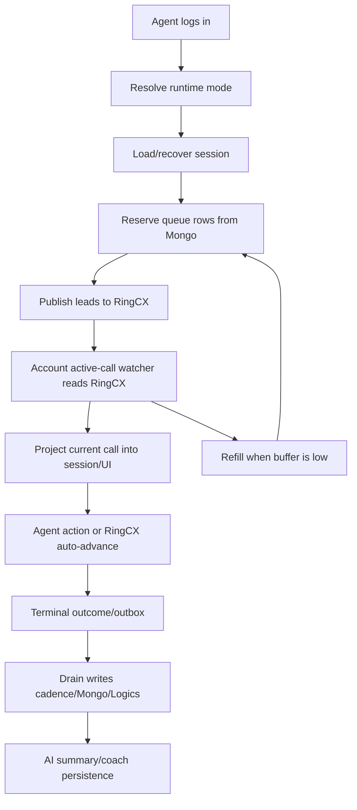
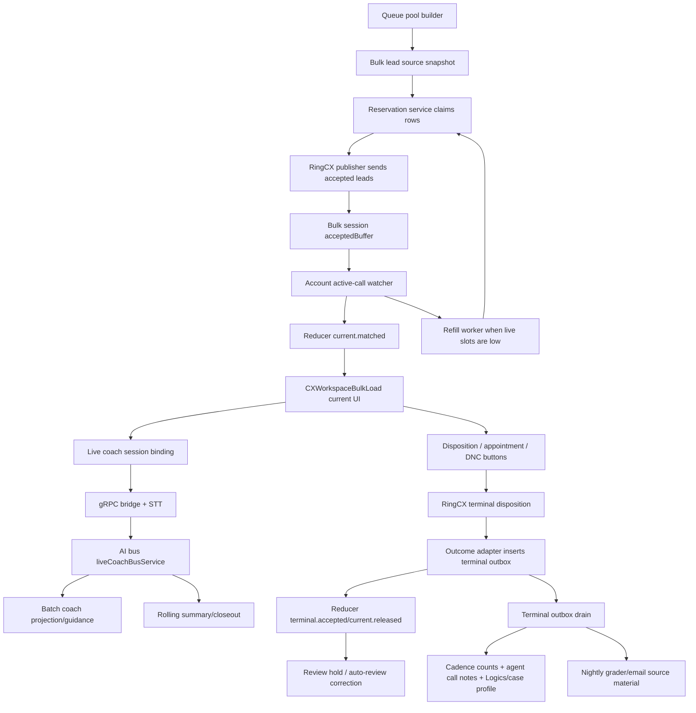

# CX 0.2.0 deep scrub audit guide - 2026-06-25

Purpose: audit the full 0.2.0 flow top to bottom before branch cut and pilot testing. The product surface is CX + Logics + Mongo + wired AI. The cleanup target is not "remove features"; it is remove ambiguity, duplicated ownership, hidden side effects, and throwaway scaffolding.

This guide assumes 0.2.0 is the integrated page/runtime we are trying to run tonight: legacy fallback, slow single fallback, bulk pilot, universal current-call projection, terminal drain, Logics/Mongo persistence, appointment handling, and wired AI coach/summary surfaces.

## Audit Lens

For every file and function, ask:

- Is this necessary for 0.2.0 to do what it needs to do?
- Is this sufficient, or does it rely on hidden side effects elsewhere?
- Is there exactly one owner of the state being mutated?
- Can this fail without corrupting queue state, call outcome counts, or UI state?
- Is this in the hot call loop, or can it be deferred to a drain/worker?
- Is this test/probe/runtime code, or is it product code?

Hard rule: route/export/index files are dangerous. They make work reachable. Review them last and carefully.

## Top-Level Flow



The critical architectural decision: RingCX active-call state is the source for what is currently on the phone. The app queue is the source for what we intend to feed. Terminal drain is the source for durable business writes.

## 1. Branch And Reachability

Files to inspect:

- `apps/control-plane/src/server.js`
- `apps/control-plane/src/routes/commandsCx.js`
- `apps/control-plane/src/routes/readCx.js`
- `apps/control-plane/src/routes/cxBulkLoad.js`
- `apps/control-plane/src/routes/cxSlowSingle.js`
- `apps/control-plane/src/routes/cxSimpleLoop.js`
- `apps/web-client/src/app/routes.tsx`
- `apps/web-client/src/lib/api/queries/cx.ts`
- `packages/shared-services/src/index.js`
- `packages/shared-repositories/src/index.js`
- `packages/shared-models/src/index.js`
- `packages/shared-integrations/src/index.js`

Check:

- Only intended 0.2.0 routes are registered.
- No abandoned preview SDK/get-leads/manual probe endpoint is callable.
- No one-off Mickey/Sean/probe script is imported by product code.
- Legacy fallback remains reachable.
- Bulk and slow modes are reachable only through explicit runtime mode selection.
- AI routes/services exposed through exports are the wired 0.2.0 surfaces, not background experiments.

Poke:

- Search for `previewSdk`, `ringcxPreviewSdkClient`, `fetch-and-dial`, `mickey`, `sean`, `testOnly`, `TODO remove`, and `do-not-commit`.
- Confirm no route bypasses normal auth/session checks.
- Confirm frontend route loading does not silently choose an experimental workspace.

Expected outcome:

- The branch can be explained as one integrated 0.2.0 candidate.
- The only noise left is intentionally parked or ignored.

## 2. Runtime Mode Selection

Files to inspect:

- `packages/shared-services/src/cxDialRuntimeModeService.js`
- `packages/shared-config/src/index.js`
- `apps/web-client/src/workspaces/cx/CXWorkspaceRouter.tsx`
- `apps/web-client/src/workspaces/cx/CXWorkspace.tsx`
- `apps/web-client/src/workspaces/cx/CXWorkspaceBulkLoad.tsx`
- `apps/web-client/src/workspaces/cx/slow-single/CXWorkspaceSlowSingle.tsx`

Check:

- Runtime mode resolves deterministically per agent.
- Bulk disabled means bulk cannot be selected accidentally.
- Legacy fallback does not inherit bulk-only state.
- Slow single and bulk look familiar enough that agents are not learning a new app for every rail.
- Mode selector/debug display does not leak confusing internal implementation language to normal users.

Poke:

- Agent override present and enabled.
- Agent override present but bulk globally disabled.
- No override.
- Malformed env override.
- Browser refresh mid-call.
- Switching from a killed bulk session back to legacy.

Expected outcome:

- The selected rail is obvious in logs.
- No mode silently falls through into a half-enabled state.

## 3. Agent Login And Prep

Files to inspect:

- `packages/shared-services/src/cxWorkspaceService.js`
- `packages/shared-services/src/cxMorningQueueBuilderService.js`
- `packages/shared-services/src/cxCadenceService.js`
- `tests/cx-morning-prep/*`

Check:

- Login should not do heavy queue construction if a morning/prep worker already can.
- Agent group/campaign resolution is cached or persisted where safe.
- Login returns a usable shell quickly and does not block on noncritical repair.
- Queue build can be run before agents arrive, but late-login recovery still works.

Poke:

- Fresh agent login with no stored group.
- Agent with stale/missing group id.
- Agent absent at morning prep, then logs in late.
- Agent logs in while old session is still marked active.

Expected outcome:

- Login does not become the place where the app pays every setup cost.
- Prep failures are visible but isolated per agent.

## 4. Queue Pool Formation

Files to inspect:

- `packages/shared-services/src/cxBulkLoadLeadSourceService.js`
- `packages/shared-services/src/cxReserveModeService.js`
- `packages/shared-services/src/cxQueueReservationService.js`
- `packages/shared-repositories/src/cxDialQueueRepository.js`
- `packages/shared-services/src/ringcxLeadServingService.js`
- `packages/shared-services/src/cxCadenceService.js`

Check:

- Families are clear: green/fresh, blue, yellow, red/aged or whatever final names are chosen.
- The pool is built once and consumed by rails; rails differ by RingCX handoff speed, not by lead eligibility rules.
- New greens should enter the source pool/buffer, not jump directly into an active agent's visible queue unless the mode explicitly says so.
- Served/reserved rows carry ownership stamps: domain, agent, campaign, session, reservationSessionId.
- LeadCadence/Mongo data used to generate rows is not overwritten by call display enrichment.

Poke:

- Build 35: 15/10/5/5 targets.
- Family shortage.
- Duplicate case/phone already active elsewhere.
- Wrong campaign id on candidate.
- Queue refresh at threshold.
- Fresh incoming green while bulk session is running.

Expected outcome:

- There is one queue-building policy.
- Bulk/slow/legacy differ only in how leads are handed to RingCX and how quickly the next lead appears.

## 5. Reservation And Ownership

Files to inspect:

- `packages/shared-services/src/cxQueueReservationService.js`
- `packages/shared-services/src/cxReservationReconcilerService.js`
- `packages/shared-repositories/src/cxDialQueueRepository.js`
- `packages/shared-services/src/idleReaperService.js`
- `apps/control-plane/src/server.js`

Check:

- A reserved row cannot be reaped as stale legacy claimed work.
- Reservation release is guarded by reservationSessionId.
- Startup reconciliation handles dangling reservations.
- Rows with terminal evidence are force-completed; rows without evidence are released.
- Kill/reset releases repository-owned reservations and terminalizes current when appropriate.

Poke:

- Server dies after reserving before publishing.
- Session killed with 30 buffered rows.
- Reaper runs during active bulk session.
- A different session tries to release someone else's reserved row.
- Startup finds stale claimed rows with and without terminal evidence.

Expected outcome:

- No orphaned claimed rows.
- No cross-agent bleed.
- No queue row disappears without either an owner, a terminal outcome, or a release reason.

## 6. RingCX Publishing

Files to inspect:

- `packages/shared-services/src/cxBulkLoadRingcxPublisher.js`
- `packages/shared-integrations/src/ringcxVoiceClient.js`
- `packages/shared-services/src/cxBulkLoadRuntimeService.js`
- `apps/ringcentral-cx/src/server.js`

Check:

- ExternId is deterministic and tenant/domain disjoint.
- Upload payload does not expose full phone in logs or client snapshots.
- Bulk publisher handles accepted/rejected rows separately.
- Campaign route lock uses the row's campaign, not a re-resolved maybe-wrong campaign.
- Default dial priority is NORMAL for normal queue leads.
- Appointment/manual urgent calls use IMMEDIATE only where intended.

Poke:

- Publish 1 row.
- Publish 35 rows.
- One rejected row in a batch.
- Whole batch reject.
- Wrong campaign.
- Missing campaign.
- RingCX 429 or transient failure.
- Publish accepted but later active call never appears.

Expected outcome:

- Rejected rows leave buffer and release reservation.
- Accepted rows stay trackable by externId.
- Publisher does not mutate current call.

## 7. Active-Call Watcher

Files to inspect:

- `packages/shared-services/src/cxAccountActiveCallWatcherService.js`
- `packages/shared-services/src/cxBulkLoadActiveCallWatcher.js`
- `packages/shared-services/src/ringcxActiveCallCaptureService.js`
- `apps/ringcentral-cx/src/server.js`
- `tests/cx-bulk-load/cxAccountActiveCallWatcherService.test.js`
- `tests/cx-bulk-load/cxBulkLoadActiveCallWatcher.test.js`

Check:

- Watcher reads RingCX once per account, not once per agent.
- Fanout updates each logged-in agent independently.
- Busy/review-held agent does not block other agents.
- Matching prefers externId/UII/campaign-owned identity proof.
- Phone-only match never promotes a current call unless explicitly scoped and safe.
- Watcher is the only thing that makes RingCX current-call projection authoritative.

Poke:

- Five agents active at 1000ms polling.
- One account read fails.
- One agent on review hold.
- Active call has externId.
- Active call has only phone.
- Two candidates match same active call.
- Active call changes before terminal button is clicked.
- RingCX returns 429.

Expected outcome:

- A single account snapshot updates all sessions.
- No cross-agent churn.
- No ambiguous active call is guessed into the UI.

## 8. UI Projection And Button State

Files to inspect:

- `apps/web-client/src/workspaces/cx/CXWorkspaceRouter.tsx`
- `apps/web-client/src/workspaces/cx/CXWorkspaceBulkLoad.tsx`
- `apps/web-client/src/workspaces/cx/slow-single/CXWorkspaceSlowSingle.tsx`
- `apps/web-client/src/workspaces/cx/CXWorkspace.tsx`
- `apps/web-client/src/workspaces/cx/AppointmentList.tsx`
- `apps/web-client/src/lib/api/queries/cxBulkLoad.ts`
- `apps/web-client/src/lib/api/queries/cxSlowSingle.ts`
- `apps/web-client/src/lib/api/queries/cx.ts`

Check:

- Middle section shows the active RingCX call, not a queue guess.
- Middle section does not eject the visible call until a replacement active call is detected, or until the mode intentionally clears it.
- Buttons are enabled only when there is a current call with enough identity to submit safely.
- Buttons do not submit the page form.
- Queue list is supporting context, not the source of truth for the active call.
- Full phone numbers are not exposed in snapshots/logs.

Poke:

- Active call changes with no button click.
- Agent clicks DNC after prospect hangs up but before next active call.
- Agent clicks appointment and needs time to fill it.
- Browser refresh while current call is active.
- RingCX auto-advances twice quickly.
- Current call identity is ambiguous.

Expected outcome:

- Agent sees stable, current work.
- Button state follows current-call proof, not optimistic queue movement.

## 9. Terminal Outcomes And Buttons

Files to inspect:

- `packages/shared-services/src/cxBulkLoadOutcomeAdapter.js`
- `packages/shared-services/src/cxBulkLoadRuntimeService.js`
- `packages/shared-services/src/cxTerminalOutboxDrain.js`
- `packages/shared-services/src/cxTerminalRectificationService.js`
- `packages/shared-services/src/dispositionMapService.js`
- `tests/queue/cxTerminalOutcome.test.js`
- `tests/queue/dispositionMap.test.js`

Check:

- Explicit button clicks map to one terminal outcome.
- Manual outcome and auto-advance outcome for the same call collapse to one write.
- Different UIIs on same queue item can both write.
- No-UII fallback keys include enough scope to avoid accidental collapse across cases.
- Auto-advanced calls get buffered for rectification/default no-contact handling without blocking the hot loop.
- DNC and appointment are preserved as post-call correction paths when the prospect hangs up first.

Poke:

- Voicemail button.
- DNC button.
- Answered/appointment button.
- No-answer/intercept auto-advance.
- Voicemail box not set up/full.
- Prospect hangs up after a real conversation.
- Agent hangs up first.
- RingCX disposition rejects.
- Button request throws.

Expected outcome:

- Counts are honest.
- No phantom writes before UII/evidence exists.
- DNC/appointment correction remains possible after auto-advance.

## 10. Terminal Outbox And Drain

Files to inspect:

- `packages/shared-models/src/CxTerminalOutbox.js`
- `packages/shared-repositories/src/cxTerminalOutboxRepository.js`
- `packages/shared-services/src/cxTerminalOutboxDrain.js`
- `packages/shared-services/src/cxTerminalRectificationService.js`
- `packages/shared-services/src/hourlySweeperService.js`
- `packages/shared-repositories/src/callLogRepository.js`
- `packages/shared-services/src/cxCallActivityBackfillService.js`

Check:

- Hot loop inserts buffered outcome/evidence, not every expensive side effect.
- Drain is idempotent.
- Drain failure marks the row failed without blocking the rest.
- Empty/malformed payload does not wedge forever.
- Hourly call-log rectification can backfill missed outcomes without double-writing.
- DNC/appointment/logics calls happen off the hot current-call watcher where possible.

Poke:

- Duplicate terminal event for same call.
- Drain process crashes halfway through batch.
- Logics call fails.
- Mongo write fails.
- Call log appears an hour later with better evidence.
- Pending outbox grows.

Expected outcome:

- The live call loop stays crisp.
- Durable side effects eventually happen exactly once or fail visibly.

## 11. Logics And LeadCadence Writeback

Files to inspect:

- `packages/shared-services/src/cxAppointmentService.js`
- `packages/shared-services/src/cxCallActivityBackfillService.js`
- `packages/shared-services/src/cxCadenceService.js`
- `packages/shared-services/src/cxWorkspaceService.js`
- `packages/shared-integrations/src/logicsClient.js`
- `packages/shared-repositories/src/callLogRepository.js`

Check:

- Appointment creates the right Logics task/activity and moves agent state to working/unavailable only as needed.
- Submitting appointment returns the agent to available/off-hook flow when intended.
- DNC writes to the correct Logics/system target and persists locally.
- LeadCadence communication array gets sparse, useful call notes.
- Logics activity remains sparse, not a full AI transcript dump.
- Case profile/client profile updates do not block call progression.

Poke:

- Appointment with valid case id.
- Appointment with missing case id but known phone/case profile.
- DNC after call ended.
- Summary exists but Logics is down.
- LeadCadence communication write succeeds while Logics fails.
- Same call writes twice.

Expected outcome:

- Agents can trust the app to create useful records.
- Failures do not corrupt call state.

## 12. AI/Coach/Summary Integration

Files to inspect:

- `packages/shared-services/src/aiBusRegistry.js`
- `packages/shared-services/src/aiTaskRegistry.js`
- `packages/shared-services/src/aiTaskRunner.js`
- `packages/shared-services/src/aiProviders.js`
- `packages/shared-services/src/liveCoachSanitizedPipeline.js`
- `packages/shared-services/src/liveCoachTranscriptTranslator.js`
- `packages/shared-services/src/coach*.js`
- `tests/ai-bus/*`
- `tests/live-coach/*`
- `tests/livecoach-translator/*`

Check:

- AI bus has one task ownership source, or at minimum one obvious source of truth.
- Coach/summary calls are routed through the 0.2.0 bus surface, not random direct model calls.
- Transcript repair/translation is separate from STT and does not bleed spelling prompts back into transcription.
- Live reaction/guidance work does not block current-call watcher or RingCX polling.
- Call summary/grader work consumes terminal/drain artifacts and can run late.
- Prompt/cache shape keeps stable instructions stable and variable call data small.
- PII/logging rules are clear.

Poke:

- Coach receives transcript turn with bad spelling.
- No transcript available.
- Long call with meaningful content.
- Very short call/insufficient evidence.
- Ask-the-coach question based on clicked transcript/guide/interview context.
- Model/provider fallback.
- AI task timeout.

Expected outcome:

- AI improves the page, but failure or delay does not break dialing.
- Expensive analysis moves into drain/background where possible.

## 13. Mongo State And Data Hygiene

Files to inspect:

- `packages/shared-models/src/CxBulkLoadSession.js`
- `packages/shared-models/src/CxSlowLaneSession.js`
- `packages/shared-models/src/CxTerminalOutbox.js`
- `packages/shared-models/src/AgentState.js`
- `packages/shared-models/src/CallLog.js`
- repositories under `packages/shared-repositories/src/`

Check:

- Unique keys exist where idempotency depends on them.
- Session shape is narrow and does not store unnecessary PII.
- Queue rows keep enough provenance to release/complete safely.
- Terminal outbox has clear pending/drained/failed statuses.
- Old session cleanup does not erase evidence needed by drain.
- Metrics/counting can reconcile from queue/outbox/call logs.

Poke:

- Same queueItemId, two UIIs.
- Same phone, different domain/company.
- Missing case id.
- Missing phone.
- Stale session after server restart.
- Failed drain row older than one hour.

Expected outcome:

- Mongo is the durable state, not a pile of half-overlapping guesses.

## 14. Observability

Required log/event fields:

- `agentEmail` or stable agent id.
- `agentExtensionId`.
- `domain`.
- `runtimeMode`.
- `sessionId`.
- `queueItemId`.
- `externId`.
- `uii` when available.
- `campaignId`.
- `oldPhase`/`newPhase` or old/current call identity where state changes.
- `reason`.
- `writer`.
- timing fields for publish/watch/terminal/drain where useful.

Do not log:

- full phone numbers unless already approved for a specific ops script;
- raw transcripts in hot-loop logs;
- credentials/tokens;
- full Logics payloads with financial/private data.

Poke:

- Can one grep explain why a lead left buffer?
- Can one grep explain why a current call changed?
- Can one grep explain why a terminal outcome wrote or did not write?
- Can one grep explain a refill?
- Can one grep identify 429s and their class of request?

Expected outcome:

- Debugging is possible without reading five collections by hand.

## 15. Manual End-To-End Smoke Tests

Run these before a live pilot:

1. Bulk session starts with a clean queue.
2. Publish 7 real/safe test leads one at a time and verify accepted buffer.
3. Agent goes off hook and first active call appears in middle section.
4. RingCX auto-advances; UI follows via watcher without guessing.
5. Click voicemail/DNC/answered/appointment and verify:
   - RingCX command result,
   - current call remains visible until replacement or intentional release,
   - terminal outcome enters outbox,
   - buffer/refill stays coherent.
6. Drain runs and writes cadence/Mongo/Logics exactly once.
7. Refill triggers when threshold is crossed and publishes the right family mix.
8. Browser refresh recovers the same session/current state.
9. Server restart runs startup reconciliation.
10. Legacy fallback still loads.

Hard test cases:

- Prospect hangs up before agent clicks a button.
- Agent clicks DNC after prospect hangs up.
- Appointment pauses agent work and resumes correctly.
- RingCX returns 429 for call log/download while active-call poller remains healthy.
- RingCX active call has no UII.
- Wrong campaign candidate is reserved and must be released.

## 16. Unit/Build Commands

Known-good CX commands from the latest audit:

```powershell
node --test tests/cx-bulk-load/*.test.js tests/cx-call-state-guard/*.test.js tests/cx-dial-runtime/*.test.js tests/cx-handoff/*.test.js tests/cx-morning-prep/*.test.js tests/cx-simple-loop/*.test.js tests/queue/cxTerminalOutcome.test.js tests/queue/dispositionMap.test.js
npm.cmd run build:web
```

### 20.7 Response to Claude's first response

Use this as the re-audit prompt/answer for the first round of attempted fixes.

#### Overall position

Claude's audit is directionally strong. The useful core is:

- the live bulk runtime boundary was under-tested;
- the watcher/refill path still had a concurrency hole;
- reservation fail-closed behavior was not consistently fail-closed;
- publisher accepted/rejected state could diverge from what RingCX actually received;
- terminal/correction idempotency needed sharper identity;
- terminal drain and startup reconciliation needed safer failure paths.

The severity framing still needs discipline. Some "high" findings are real coverage gaps, not current floor-breaking defects. A few findings target dead or superseded paths and should not steer the pilot patch.

The implementation posture stays: small atomic fixes, simple code, targeted tests, no new broad abstractions unless they remove a specific race.

#### First-response patch review

Some fixes were started and are good directionally, but the patch is not complete and is not green.

Good direction:

- `cxBulkLoadRuntime.js`: the missing `summarizeRingcxLoginPayload` reference is addressed with an inline `require("./dialService")`. A top-level import or extracted `ringcxLoginSummary.js` would be cleaner, but this fixes the immediate runtime ReferenceError if there is no cycle.
- `cxQueueReservationService.js`: `assertNotActiveInUcq()` now catches `existsForLead()` errors and releases the row instead of keeping it. Correct fail-closed direction.
- `cxTerminalOutboxDrain.js`: non-array pending results are normalized to `[]`. Good partial hardening.
- `cxReservationReconcilerService.js`: it now checks `terminalEvidence(adopted)` and releases `[adopted]`. Correct direction, but the test failures show the adopted-row shape/metadata contract is not buttoned up.
- `cxBulkLoadStateMachine.js`: `session.started` now resets current, buffer, completed, trace, review hold, and last outcome. Correct direction.

Current test result observed after the first response:

```powershell
node --test tests/cx-bulk-load/*.test.js
# 155 pass, 2 fail
# both failures in cxReservationReconcilerService.test.js
```

Current label: directional but incomplete.

#### Still required after first response

1. Finish `releaseReserved()` missing-session guard.
   - It still uses `row?.metadata?.reservationSessionId ?? null` in the CAS match.
   - That can still match null/missing fields.
   - Required behavior: if `_id` or `metadata.reservationSessionId` is missing, skip the row and log. Do not call `transitionQueueItemState()`.
   - Required test: `releaseReserved([{ _id: "x" }])` makes zero transition calls.

2. Fix reserve mode policy bypass.
   - Still open in `cxReserveModeService.js`.
   - Required behavior: `green-first` must respect `fresh.eligible`; aged floor must not revive a disabled policy.
   - Required tests: `fresh.eligible=false`, green-first, deficit > 0 -> fresh-day1 target is 0; disabled policy plus `RC_CX_AGED_MIN_RESERVE_PER_CYCLE=5` -> aged target remains 0.

3. Fix publisher accepted/rejected mapping.
   - Still open in `cxBulkLoadRingcxPublisher.js`.
   - Required behavior: only candidates actually uploaded to RingCX can be marked accepted. Candidates dropped for missing phone/externId should be returned as rejected/dropped, not accepted. `cancelBatchForSession()` must require a campaign id when there are externIds to cancel.
   - Required tests: mixed valid/invalid candidate batch; `GENERAL_FAILURE`; missing campaign id in cancel.

4. Fix terminal/correction idempotency.
   - Still open in `cxBulkLoadOutcomeAdapter.js`.
   - Required behavior: UII should anchor the key whenever present, even if queue item id is absent. Non-terminal correction writes should include `eventType` even when `queueItemId:uii` exists. Null writer result should be `written:false`.
   - Expected shape:

```js
if (u) {
  const base = qid ? `${qid}:${u}` : `${sessionId}:uii:${u}`;
  return eventType && eventType !== "terminal" ? `${base}:${eventType}` : base;
}
```

5. Finish terminal drain scan hardening.
   - Partially fixed in `cxTerminalOutboxDrain.js`.
   - Still missing: `listPendingForDrain()` rejection still bubbles/crashes the drain.
   - Required behavior: catch scan failure, log, and return `{ scanned: 0, drained: 0, failed: 0, scanError: true }`.

6. Finish reservation reconciler failure handling.
   - Partially fixed in `cxReservationReconcilerService.js`, but tests currently fail.
   - Likely issue: fake CAS/adopted row does not preserve `metadata.hasTerminal`, so `terminalEvidence(adopted)` returns false, or the implementation needs to merge original row metadata into the adopted return shape.
   - Preferred implementation:

```js
const adoptedRow = {
  ...row,
  ...adopted,
  metadata: {
    ...(row.metadata || {}),
    ...(adopted.metadata || {}),
  },
};
```

Use `adoptedRow` for `terminalEvidence()`, `completeCxQueueItem()`, and `releaseReserved()`.

Required failure behavior: if `terminalEvidence(adoptedRow)` throws, do not leave the row claimed forever. Release `adoptedRow` with reason `reservation-reconciler:evidence-error`, or mark a very explicit retryable state. For pilot, release is safer.

7. Serialize watcher/refill apply.
   - Still open in `cxBulkLoadRuntimeService.js`.
   - Current command mutations are promise-tail serialized, but `watchAccountActiveCalls()` can still enter `beforePersist -> maybeRefill()` outside that tail.
   - Required behavior: account read can stay shared and non-blocking; per-session apply/refill must be serialized; do not add a global floor lock.
   - Acceptable shape: add `sessionApplyTails` or reuse the existing tail only around per-session apply.
   - Required test: two parallel watcher ticks with slow reserve service should produce only one reserve/refill.

8. Add live runtime boundary tests.
   - Still open.
   - Required file: `tests/cx-bulk-load/cxBulkLoadRuntime.test.js`
   - Required coverage: off-hook gate live path does not throw; start rejects non-bulk agents; `bulkOutcomeDisposition("voicemail") === "VM DROP"`; `bulkOutcomeDisposition("dnc") === "Auto Dispo"`; progressive pause/resume token supersede; review/DNC correction outcome does not collide with terminal outcome.

9. Add mutation eligibility tests.
   - Still open.
   - Required file: `tests/cx-bulk-load/cxBulkLoadMutationEligibility.test.js`
   - Required coverage: `__v` guard, `updatedAt` guard, busy session, stale projection by version, stale projection by timestamp, ok when versions match.

#### Lower priority: do not overreact

- `snapshotCandidates` and `normalizeQueueRow`: critique is directionally fair but not floor-critical. `snapshotCandidates()` is not the active reservation-sourced refill path. `normalizeQueueRow` dropping `queueFamily` / `rcxCampaignId` is a latent hazard if that path is reactivated. Add fields defensively or remove/label the dead path, but do not let this displace publisher/reservation/drain fixes.
- Active-call watcher coverage gaps: mostly valid coverage asks, but implementation shape is mostly sound: no phone-only promotion, malformed active-call response throws, account read is one-per-account. Add targeted tests after pilot blockers.
- Terminal rectification coverage: important but not the one-second live loop. Add tests for dry-run default, terminal metadata skip, terminal queue-state skip, duplicate insert, and insert error. Keep rectifier write mode guarded and explicit.

#### Re-audit checklist

Claude should rerun against these exact questions:

1. Do all `tests/cx-bulk-load/*.test.js` pass?
2. Does `releaseReserved()` skip rows missing `metadata.reservationSessionId`?
3. Does green-first respect `fresh.eligible`?
4. Does disabled policy stay all-zero even with aged floor env set?
5. Can publisher ever mark a candidate accepted if it was not uploaded to RingCX?
6. Can cancel fire without campaign id?
7. Do terminal and DNC/appointment correction outbox rows have distinct idempotency keys?
8. Does terminal drain survive scan failure?
9. Does reconciler resolve an adopted row even if terminal evidence throws?
10. Can two overlapping watcher ticks double-refill one session?
11. Is there a runtime-boundary test for `cxBulkLoadRuntime.js`?
12. Is there a direct mutation eligibility test file?

Pilot-candidate status requires:

- the two failing reconciler tests are green;
- all still-open implementation defects above are fixed;
- runtime/mutation/concurrency tests are added;
- `node --test tests/cx-bulk-load/*.test.js` passes cleanly.

Also run syntax checks over new JS files:

```powershell
node --check apps/control-plane/src/server.js
node --check apps/ringcentral-cx/src/server.js
```

Expand this with exact changed files before branch cut.

## 17. Specific Cleanup Signals From Current Audit

- The stale preview SDK client test was removed because the module no longer exists and the path is abandoned.
- Raw `logs/` should not go to branch.
- One-off local scripts should not go to branch unless promoted to formal dev fixtures.
- Route/export/index files need final reachability review.
- AI stays in 0.2.0 only when wired into the page, drain, coach, summary, or AI bus.

## 18. What I Would Be Most Suspicious Of

1. Any function that both changes current call and writes terminal outcomes.
2. Any route that performs RingCX action and Mongo write without a clear idempotency key.
3. Any UI button that clears the middle section before the watcher confirms the next call.
4. Any auto-advance handling that guesses by phone alone.
5. Any queue refill that bypasses reservation ownership.
6. Any Logics call in the one-second watcher path.
7. Any AI call in the hot RingCX polling path.
8. Any catch block that logs and then silently marks success.
9. Any old legacy queue mutation that can touch bulk-owned rows.
10. Any direct model invocation outside the AI bus after 0.2.0 is declared.

## 19. Acceptance Bar

The branch is ready to pilot when:

- Unit tests and web build pass.
- Route/export/index files expose only intended 0.2.0 surfaces.
- Bulk can run a real-agent test for multiple calls without losing current-call projection.
- Auto-advance creates durable terminal evidence or a rectification path.
- DNC and appointment correction are possible after fast hangups.
- Refill keeps buffer coherent and does not steal from another agent.
- Logics/Mongo writes are sparse, useful, and idempotent.
- AI delay/failure does not stop call progression.
- Legacy fallback still works.

If any of those are not true, keep the branch as WIP and do not call it floor-ready.

## 20. Bulk-Run Unit-Test Holes & Fixes (multi-agent audit, 2026-06-25)

A 25-agent find+verify sweep of the 12 bulk-run service/test pairs plus a coverage map. **111 verified holes (36 high-severity).** Every finding was confirmed against the actual code (a skeptic agent had to quote the test gap or the impl line). The structural/bug items below were additionally re-verified by hand. Confirm any high-impact correctness item against the code before changing it.

### 20.1 Must-fix before pilot (structural / bug)

- **[BUG — hand-verified] cxBulkLoadRuntime.js calls summarizeRingcxLoginPayload which is never imported — latent ReferenceError**
  - cxBulkLoadRuntime.js line 1022 calls summarizeRingcxLoginPayload(login) inside the offhookGate.isAgentOffhook closure, but the function is never imported or defined in this file. It lives in dialService.js (line 692). Because all tests inject a fake offhookGate that bypasses this closure, the bug is invisible in test runs. On the live floor, any startCxBulkLoadSession call where agentId and agentGroupId are populated and client.getAgentLogin succeeds will throw ReferenceError: summarizeRingcxLoginPayload is not defined, crashing the isAgentOffhook check and making the session start fail.
  - **Fix:** In cxBulkLoadRuntime.js, add `const { summarizeRingcxLoginPayload } = require('./dialService');` (or wherever it is canonically exported). Alternatively, inline the relevant subset of the summarizer directly in this file (it is a pure data-shaping function). Then add an offhookGate integration test in the new cxBulkLoadRuntime.test.js that calls getService()._offhookGate or a thin wrapper with a fake getAgentLogin to confirm no ReferenceError.
- **[NO TEST — hand-verified] cxBulkLoadRuntime.js has no dedicated unit test**
  - C:/code/tagcontactbridgeparalell/packages/shared-services/src/cxBulkLoadRuntime.js is the live route-handler boundary (the only file the routes actually call), yet has zero dedicated test coverage. Every test in tests/cx-bulk-load/ targets cxBulkLoadRuntimeService.js directly. The wiring layer's logic that IS untested: resolveAgentContext (admin guard, cross-agent 403), assertBulkRuntime (default-off gate), bulkOutcomeDisposition mapping (voicemail→'VM DROP', dnc→'Auto Dispo'), confirmRingcxUiiReleased (post-disposition active-call release verifier with retry waits), pauseRingcxProgressiveDialing / resumeRingcxProgressiveDialing (progressive pause state-machine including token supersede), submitCxBulkLoadReviewOutcome (dnc terminal-outbox mutation), and all env-var resolution helpers (resolveBulkAgentRingcxRoute, envToken). None of these are reachable via the cxBulkLoadRuntimeService.js tests.
  - **Fix:** Add tests/cx-bulk-load/cxBulkLoadRuntime.test.js. Inject a fake userAccountRepository and fake resolveCxDialRuntimeMode/isCxBulkLoadRuntime to test resolveAgentContext + assertBulkRuntime. Test bulkOutcomeDisposition as a pure function (export it or extract to a shared util). Test confirmRingcxUiiReleased against a fake listActiveCalls that returns the UII on first call then drops it. Test progressive pause token supersede (rapid double-call). Test submitCxBulkLoadReviewOutcome for the dnc-only outcome gate, missing queueItemId/uii 400s, and already-drained no-op.
- **[NO TEST — hand-verified] cxBulkLoadMutationEligibility.js has zero test coverage — not referenced in any test file**
  - C:/code/tagcontactbridgeparalell/packages/shared-services/src/cxBulkLoadMutationEligibility.js exports buildVersionGuardOptions and describeBulkLoadMutationEligibility. A grep across all of tests/ for these names and the module path returns zero matches. describeBulkLoadMutationEligibility is the stale-projection guard called inside cxBulkLoadRuntimeService.js watchAccountActiveCalls (line 956) on every watch tick — if it fires, the entire refill+persist path is skipped. buildVersionGuardOptions feeds every repo.updateBulkLoadSession call as the optimistic-locking token. Both functions contain branching on __v version integers, updatedAt timestamps, and the busy flag, none of which is exercised by any test. The version-based stale-projection path (expectedVersion !== latestVersion) and updatedAt fallback path are fully dark.
  - **Fix:** Add tests/cx-bulk-load/cxBulkLoadMutationEligibility.test.js. Test: (1) buildVersionGuardOptions returns {expectedVersion, versionGuard:true} when __v is present, falls back to {expectedUpdatedAt, versionGuard:true} when only updatedAt is set, returns {} when neither is present. (2) describeBulkLoadMutationEligibility returns ok:false/reason:'session-busy' when input.busy=true. (3) Returns ok:false/reason:'stale-projection' when __v differs between session and latest. (4) Returns ok:false/reason:'stale-projection' when updatedAt differs (no __v). (5) Returns ok:true when versions match and when latest is null.

### 20.2 Untested public exports (coverage map)

- [MEDIUM] cxBulkLoadRuntime.js is live (not dead/duplicate) but structurally separated from its orchestrator with no integration seam test — **Fix:** Add a smoke-level wiring test in the new cxBulkLoadRuntime.test.js that builds a fake cxTerminalOutboxRepository (insertOnce), fake cxDialQueueRepository (transitionQueueItemState), fake userAccountRepository, and a fake RingCX client, then drives startCxBulkLoadSession and submitCxBulkLoadDisposition end-to-end through cxBulkLoadRuntime.startCxBulkLoadSession to assert the full adapter chain fires in order (insertOnce called, transitionQueueItemState called with correct states, no ReferenceError). This is distinct from the pure-service tests.
- [MEDIUM] pauseCxBulkLoadProgressiveDialing and resumeCxBulkLoadProgressiveDialing exported from cxBulkLoadRuntime.js have zero test coverage — **Fix:** In cxBulkLoadRuntime.test.js, export or extract the progressive-pause helpers so they can be unit-tested with a fake setAgentState. Tests needed: (1) pause sets agent to pauseStateId and schedules restore; (2) a second pause supersedes the first token so the first restore is a no-op; (3) holdUntilResume=true does not schedule restore; (4) resume explicitly deletes the token and calls setAgentState with availableStateId; (5) env CX_BULK_LOAD_PROGRESSIVE_PAUSE_ENABLED=false short-circuits both directions.
- [MEDIUM] submitCxBulkLoadReviewOutcome exported from cxBulkLoadRuntime.js is completely untested — **Fix:** In cxBulkLoadRuntime.test.js, inject a fake cxTerminalOutboxRepository and fake cxBulkLoadSessionRepository and call submitCxBulkLoadReviewOutcome. Tests needed: (1) unsupported outcome ('voicemail') throws 400; (2) missing queueItemId throws 400; (3) dnc outcome with valid identity calls updatePendingOutcomeByIdentity and returns ok:true; (4) already-drained row (updatePendingOutcomeByIdentity returns null) returns ok:false with reason 'terminal-outbox-already-drained-or-missing'.
- [MEDIUM] Five exports of cxTerminalRectificationService.js are untested: extractRectificationKeysFromCallLog, normalizeRectificationWindow, isRealRingcxUii, buildTerminalRectificationIdemKey, previewCxTerminalRectification — **Fix:** Extend tests/cx-bulk-load/cxTerminalRectificationService.test.js with: (1) isRealRingcxUii: true for a real UII, false for 'cx-synth:*', false for null/empty. (2) normalizeRectificationWindow: given a CallLog with startTime/endTime, returns a window padded by the configured buffer; handles missing timestamps. (3) extractRectificationKeysFromCallLog: extracts correct queueItemId and externId from a representative CallLog shape; returns nulls for a non-cx-bulk call. (4) buildTerminalRectificationIdemKey: deterministic for same inputs, distinct for different UIIs. (5) previewCxTerminalRectification: confirm it returns candidates without calling any writer (inject a writer spy and assert zero calls).
- [LOW] cxBulkLoadRuntimeService.js: bufferDeficit and persistableState are exported but have no direct tests — **Fix:** Add 3-4 targeted unit tests in the existing cxBulkLoadRuntimeService.test.js: (1) bufferDeficit(state, target) returns max(0, target - liveSlots) for key cases including current=null/non-null. (2) persistableState returns exactly the expected keys (status, phase, current, ringcx, acceptedBuffer, completed, stats, trace, lastOutcome, reviewHoldUntil, reviewHoldReason, lastError, completedAt?, killedAt?) and does NOT include sessionId, agentEmail, or agentExtensionId.

### 20.3 Per-service holes (high first)

#### 20.3.1 `cxAccountActiveCallWatcherService.js` ↔ `cxAccountActiveCallWatcherService.test.js`

- **[HIGH] Claim 2: auto-advance switch/completePrevious path (current=q1 active, new externId q2 appears) has no test**
  - No test in the file sets up a session with a live current (current=q1 with uii) AND then supplies a new active call for a different candidate q2. The impl at lines 268-298 handles transition.kind==='switch' with completePrevious===true: it pushes current to terminalObservations with source:'active-call-switch' and fires current.matched to swap current. Every existing test that exercises a 'switch' transition (e.g. line 54-71) starts from current=null, so completePrevious is never true and the terminal-write branch (impl line 273) is never reached. Removing or corrupting the completePrevious branch would not be caught.
  - **Fix:** Add: test('projectBulkSessionFromAccountSnapshot completes previous current and switches to new active call', () => { const cur = { ...candidate('q1','cxbl-q1'), uii:'u1' }; const s = { ...session('s1','acct-a',[candidate('q2','cxbl-q2')],cur) }; const r = projectBulkSessionFromAccountSnapshot(s, [{ externalId:'cxbl-q2', uii:'u2', callState:'ACTIVE' }], { now: new Date('2026-06-23T12:00:00Z') }); assert.equal(r.transitionKind, 'switch'); assert.equal(r.after.current.queueItemId, 'q2'); assert.equal(r.after.completed.length, 1); assert.equal(r.after.completed[0].queueItemId, 'q1'); assert.equal(r.after.completed[0].outcome, 'did_not_connect'); assert.equal(r.terminalObservations.length, 1); assert.equal(r.terminalObservations[0].source, 'active-call-switch'); assert.equal(r.terminalObservations[0].candidate.uii, 'u1'); });
- **[HIGH] Claim 3: manualStartPending zero-match and two-match guard has no test**
  - findManualStartedActiveCall (impl lines 99-115) returns null when matches.length !== 1. The test 'attaches UII to a manually-started current' (test file line 73) only covers the single-match success case. No test feeds zero matching calls or two matching calls. If someone accidentally changed 'matches.length !== 1' to 'matches.length < 1', the dual-phone-bleed footgun would silently reappear. The guard exists specifically to prevent the 2026-06-17 incident pattern.
  - **Fix:** Add two tests: (1) zero-match: const current = { ...candidate('q1','cxbl-q1'), phone:'3106665997', manualStartPending:true }; const s = session('s1','acct-a',[],current); const r = projectBulkSessionFromAccountSnapshot(s,[{uii:'uA',callState:'ACTIVE',dnis:'+13105550000'}],{now:new Date()}); assert.equal(r.transitionKind,'none'); assert.equal(r.after.current?.uii, undefined); (2) two-match: const r2 = projectBulkSessionFromAccountSnapshot(s,[{uii:'uA',callState:'ACTIVE',dnis:'+13106665997'},{uii:'uB',callState:'ACTIVE',dnis:'+13106665997'}],{now:new Date()}); assert.equal(r2.transitionKind,'none'); assert.equal(r2.after.current?.uii, undefined);
- **[HIGH] Claim 4: version-miss / updateBulkLoadSession returning null is never tested**
  - Impl lines 557-565: when updateBulkLoadSession returns null/falsy, the code pushes a 'version-miss' entry to skipped and does NOT call persistTerminalObservations (line 576 is inside the else branch). Every test that calls runCxAccountActiveCallWatchOnce stubs updateBulkLoadSession to return patch (non-null). No test returns null. A race-lost write silently drops terminal observations for released leads — the lead enters limbo. This path is completely unverified.
  - **Fix:** Add: test('runCxAccountActiveCallWatchOnce records version-miss and skips terminal write when repo returns null', async () => { const terminalWrites = []; const current = { ...candidate('q1','cxbl-q1'), uii:'u1' }; const s1 = { ...session('s1','acct-a',[],current), prevActiveExternIds:['cxbl-q1'], trace:{ prevActiveCalls:[{externId:'cxbl-q1',uii:'u1'}] } }; const result = await runCxAccountActiveCallWatchOnce({ sessionRepository: { async listActiveBulkLoadSessions() { return [s1]; }, async updateBulkLoadSession() { return null; } }, client: { async listActiveCalls() { return []; } }, outcomeAdapter: { async persistTerminalOutcome(i) { terminalWrites.push(i); return {}; } }, now: new Date() }); assert.equal(result.applied.writeCount, 0); assert.equal(result.applied.skipped[0].reason, 'version-miss'); assert.equal(terminalWrites.length, 0); });
- [MEDIUM] Claim 5: isSessionBusy second-gate (session-busy-apply) has no test — **Fix:** Add: test('runCxAccountActiveCallWatchOnce skips a session that becomes busy between plan and apply', async () => { const writes = []; const result = await runCxAccountActiveCallWatchOnce({ sessionRepository: { async listActiveBulkLoadSessions() { return [session('s1','acct-a',[candidate('q1','cxbl-q1')])]; }, async updateBulkLoadSession(id, patch) { writes.push(id); return patch; } }, client: { async listActiveCalls() { return [{externalId:'cxbl-q1',uii:'u1'}]; } }, isSessionBusy: (id) => id === 's1', now: new Date() }); assert.equal(writes.length, 0); assert.equal(result.applied.skippedCount, 1); assert.equal(result.applied.skipped[0].reason, 'session-busy-apply'); });
- [MEDIUM] Claim 6: adopted-candidate path (markAdoptedCandidateServing) has no test — **Fix:** Add: test('runCxAccountActiveCallWatchOnce uses markAdoptedCandidateServing for adopted candidates', async () => { const adoptedAttempts = []; const regularAttempts = []; const cand = { ...candidate('q1','cxbl-q1'), adoption:{ source:'ringcx-active-external-id' } }; const s1 = session('s1','acct-a',[cand]); const result = await runCxAccountActiveCallWatchOnce({ sessionRepository:{ async listActiveBulkLoadSessions(){ return [s1]; }, async updateBulkLoadSession(id,p){ return p; } }, client:{ async listActiveCalls(){ return [{externalId:'cxbl-q1',uii:'u1'}]; } }, queueStateAdapter:{ async markCandidateServing(i){ regularAttempts.push(i); return null; }, async markAdoptedCandidateServing(i){ adoptedAttempts.push(i); return {ok:true}; } }, now:new Date() }); assert.equal(regularAttempts.length, 0); assert.equal(adoptedAttempts.length, 1); assert.equal(result.applied.writeCount, 1); });
- [MEDIUM] Claim 7: ambiguous match (two candidates same externId) leaves current untouched — no test — **Fix:** Add: test('projectBulkSessionFromAccountSnapshot leaves current untouched when match is ambiguous', () => { const s = session('s1','acct-a',[candidate('q1','cxbl-q1'),candidate('q2','cxbl-q1')], null); const r = projectBulkSessionFromAccountSnapshot(s,[{externalId:'cxbl-q1',uii:'u1'}],{now:new Date()}); assert.equal(r.matchStatus,'ambiguous'); assert.equal(r.after.current, null); assert.equal(r.changed, false); }); Note: this also locks the invariant that two candidates must NOT share an externId.
- [MEDIUM] Claim 8: cx-synth UII suppression (hasTerminalWriteProof) never asserted — **Fix:** Add: test('runCxAccountActiveCallWatchOnce skips terminal write for synthetic UII and records reason', async () => { const terminalWrites = []; const current = { ...candidate('q1','cxbl-q1'), uii:'cx-synth:fake-uii' }; const s1 = { ...session('s1','acct-a',[],current), prevActiveExternIds:['cxbl-q1'], trace:{ prevActiveCalls:[{externId:'cxbl-q1',uii:'cx-synth:fake-uii'}] } }; const result = await runCxAccountActiveCallWatchOnce({ sessionRepository:{ async listActiveBulkLoadSessions(){ return [s1]; }, async updateBulkLoadSession(id,p){ return p; } }, client:{ async listActiveCalls(){ return []; } }, outcomeAdapter:{ async persistTerminalOutcome(i){ terminalWrites.push(i); return {}; } }, now: new Date() }); assert.equal(terminalWrites.length, 0); assert(result.applied.skipped.some(s => s.reason === 'missing-queue-item-or-uii')); });
- [MEDIUM] Claim 9: reviewHoldMs=0 boundary (buildReviewHoldUntil returns null on current.released) untested — **Fix:** Extend the proposed current-released unit test from claim 1 with two reviewHoldMs variants: (a) with reviewHoldMs:0, assert r.after.reviewHoldUntil === null; (b) with reviewHoldMs:5000 and now: new Date('2026-06-23T12:00:00Z'), assert r.after.reviewHoldUntil === '2026-06-23T12:00:05.000Z'.
- [MEDIUM] Claim 10: writeOptions (version guard) not forwarded — assertion missing from existing test — **Fix:** In the 'writes only changed sessions' test, change the stub to: async updateBulkLoadSession(sessionId, patch, opts) { writes.push({ sessionId, patch, opts }); return patch; }. Add a session with __v:3 (so describeBulkLoadMutationEligibility sets expectedVersion:3 in writeOptions), then assert writes[0].opts.expectedVersion === 3.
- [LOW] Claim 11: error projection (account read failure) not tested at runCxAccountActiveCallWatchOnce level — **Fix:** Add a runCxAccountActiveCallWatchOnce-level test: client throws 429 for acct-a, returns a match for acct-b. Assert result.applied.writeCount===1, writes[0].sessionId==='s2', and that 's1' does not appear in result.applied.writes or result.applied.skipped (it is simply absent, not skipped).

#### 20.3.2 `cxBulkLoadActiveCallWatcher.js` ↔ `cxBulkLoadActiveCallWatcher.test.js`

- **[HIGH] queueItemId-via-externId match path is never tested**
  - Impl lines 91-93: when `call.externId` is NOT in `byExternId` but IS in `byQueueItemId`, a match is pushed with `matchReasons: ['queueItemId']`. Every existing matcher test uses `candidate('q1', 'x1')` where the candidate has a matching `externId`, so `byExternId` always hits first and the `continue` on line 89 bypasses the queueItemId arm entirely. No test constructs a call whose `externalId` equals a candidate's `queueItemId` but differs from that candidate's `externId`. A regression on lines 91-93 (e.g., the arm deleted or the condition flipped) would pass all tests.
  - **Fix:** test('matches a live call to its candidate by queueItemId fallback', () => { const calls = [{ externalId: 'q1', uii: 'u1' }]; const cands = [{ queueItemId: 'q1', externId: 'different-ext' }]; const r = matchActiveCallToCandidates(calls, cands); assert.equal(r.status, 'matched'); assert.equal(r.candidate.queueItemId, 'q1'); assert.deepEqual(r.matchReasons, ['queueItemId']); });
- [MEDIUM] deriveCurrentRelease never tested when current has no externId — **Fix:** test('deriveCurrentRelease returns null when current has no externId', () => { const r = deriveCurrentRelease({ current: { queueItemId: 'q1', externId: '' }, prevActiveCalls: [{ externalId: '', uii: 'u1' }], activeCalls: [] }); assert.equal(r, null); });
- [MEDIUM] deriveReleasedCandidates: prevActiveExternIds string-only entries rightly excluded (no UII) is untested — **Fix:** Add: test('deriveReleasedCandidates does not release a lead known only via prevActiveExternIds (no UII)', () => { const pool = [candidate('q1', 'cxbl-tag-q1')]; const { released } = deriveReleasedCandidates({ prevActiveExternIds: ['cxbl-tag-q1'], prevActiveCalls: [], activeCalls: [], pool }); assert.equal(released.length, 0); }); Also add: test('prevActiveCalls with UII beats prevActiveExternIds-only and lead IS released', () => { const pool = [candidate('q1', 'cxbl-tag-q1')]; const { released } = deriveReleasedCandidates({ prevActiveExternIds: ['cxbl-tag-q1'], prevActiveCalls: [{ externalId: 'cxbl-tag-q1', uii: 'u1' }], activeCalls: [], pool }); assert.equal(released.length, 1); assert.equal(released[0].uii, 'u1'); });
- [MEDIUM] extractActiveCallList retryable error paths untested — **Fix:** Add: test('loadActiveCallsSnapshot throws retryable error when response is null', async () => { const client = { listActiveCalls: async () => null }; await assert.rejects(() => loadActiveCallsSnapshot(client), (err) => { assert.equal(err.message, 'active-call-list-empty-response'); assert.equal(err.retryable, true); return true; }); }); Add: test('loadActiveCallsSnapshot throws retryable error when response has no recognized key', async () => { const client = { listActiveCalls: async () => ({ unknown: [] }) }; await assert.rejects(() => loadActiveCallsSnapshot(client), (err) => { assert.equal(err.message, 'active-call-list-unexpected-response'); assert.equal(err.retryable, true); return true; }); });
- [MEDIUM] deriveCurrentTransition: ambiguous matchResult not tested for kind:none — **Fix:** test('deriveCurrentTransition kind:none when matchResult is ambiguous', () => { const t = deriveCurrentTransition({ queueItemId: 'q1' }, { status: 'ambiguous', reason: 'multiple-candidate-matches' }); assert.equal(t.kind, 'none'); });
- [MEDIUM] deriveCurrentRelease test does not assert activeCallSummary — **Fix:** Strengthen the existing test at line 62-70: assert.ok(released.activeCallSummary, 'activeCallSummary must be set'); assert.equal(released.activeCallSummary.externId, 'cxbl-tag-q1'); assert.equal(released.activeCallSummary.uii, 'u1');
- [MEDIUM] MISSED: deriveReleasedCandidates does not assert activeCallSummary on released candidates — **Fix:** Strengthen the test at lines 20-32: assert.ok(released[0].activeCallSummary, 'activeCallSummary must be set'); assert.equal(released[0].activeCallSummary.externId, 'cxbl-tag-q1'); assert.equal(released[0].activeCallSummary.uii, 'u1');
- [LOW] normalizeActiveCall agentId/username alias never asserted — **Fix:** Add or extend: test('normalizeActiveCall maps username alias to agentId', () => { const n = normalizeActiveCall({ username: 'agent99', externalId: 'x' }); assert.equal(n.agentId, 'agent99'); }); Also test that agentId beats username when both are present: const n2 = normalizeActiveCall({ agentId: 'primary', username: 'fallback', externalId: 'x' }); assert.equal(n2.agentId, 'primary');
- [LOW] matchActiveCallToCandidates not tested with null candidates — **Fix:** test('matchActiveCallToCandidates is safe when candidates is null', () => { const r = matchActiveCallToCandidates([{ externalId: 'x1', uii: 'u1' }], null); assert.equal(r.status, 'ambiguous'); assert.equal(r.reason, 'live-calls-no-identity-match'); });

#### 20.3.3 `cxBulkLoadLeadSourceService.js` ↔ `cxBulkLoadLeadSourceService.test.js`

- **[HIGH] normalizeQueueRow silently drops queueFamily**
  - The impl return object at lines 40-48 of cxBulkLoadLeadSourceService.js does NOT include queueFamily. No test asserts queueFamily survives normalization. HOWEVER: in the live M4 path, fillBuffer (cxBulkLoadRuntimeService.js line 396) injects queueFamily directly from the raw reservation row — 'queueFamily: row.queueFamily' — not from any normalizeQueueRow output. familyRefillTargets (line 123-135) reads from candidatePool, which is the acceptedBuffer populated by the buffer.publish_accepted reducer event using pub.accepted[0].candidate, which comes from the publisher, not from normalizeQueueRow. So the missing-queueFamily bug in normalizeQueueRow is REAL, but its blast radius is limited to the dead snapshotCandidates path only. The M4 runtime path does not route rows through normalizeQueueRow at all. Severity is downgraded from floor-critical to a latent hazard that matters only if snapshotCandidates is ever reactivated.
  - **Fix:** Add a test: normalizeQueueRows([{ _id: 'q1', domain: 'TAG', phone: '5551234567', queueFamily: 'fresh-day1' }]) should return a draft where draft.queueFamily === 'fresh-day1'. Add queueFamily: row.queueFamily || null to the normalizeQueueRow return object. Add a comment noting the M4 path bypasses this function, so the fix is defensive against future reactivation.
- **[HIGH] snapshotCandidates is dead code — its tests give false coverage confidence**
  - leadSource is required as a dep at cxBulkLoadRuntimeService.js line 263 but is ONLY referenced at line 242 (destructuring) and line 263 (the dep-presence guard). Grepping the entire file for 'leadSource' returns exactly those two lines. fillBuffer at line 344 goes directly to reservationService.reserveFromFamilyOrder — leadSource.snapshotCandidates is never called anywhere in the runtime service body. The three unit tests for snapshotCandidates in the test file (lines 52-102) exercise a function the live dialer never invokes. A pre-pilot reviewer sees these tests and reasonably believes the buffer-fill lead-source path is covered when it is not.
  - **Fix:** Add a clearly labeled comment block at the top of the snapshotCandidates tests stating the function is superseded by the M4 reservation path and is not called by fillBuffer. Either remove the export and tests, or add an integration test in the runtime service test suite that verifies the reservation-to-buffer path is exercised. If snapshotCandidates is intentionally kept as a future hook, document that explicitly and remove leadSource from the required-dep guard in createCxBulkLoadRuntimeService since it is never invoked.
- **[HIGH] excludeSessionCandidates does not deduplicate by caseId**
  - excludeSessionCandidates (lines 59-67) builds the 'known' Set exclusively from queueItemId/id/_id — caseId is never inspected. A draft with the same caseId as session.current but a different queueItemId will pass through the filter. The existing test (lines 40-48) never exercises this case: it passes { queueItemId: 'q1' } vs { queueItemId: 'q1' } (same id), not same-caseId/different-queueItemId. The M4 runtime does have a cross-pool interlock at line 379-387 via queueStateAdapter.findActiveSibling, but that adapter is guarded by a typeof check and is explicitly offline in unit tests. No test for excludeSessionCandidates documents or asserts the caseId-dedup behavior one way or the other.
  - **Fix:** Add a test: session = { current: { queueItemId: 'q1', caseId: 42 } }, drafts = [{ queueItemId: 'q2', caseId: 42 }, { queueItemId: 'q3', caseId: 99 }] — assert only queueItemId 'q3' survives, OR add a comment explicitly stating caseId dedup is intentionally deferred to the gate-7 queueStateAdapter.findActiveSibling interlock (so the next reader knows it is a conscious design choice, not a gap).
- [MEDIUM] normalizeQueueRow drops rcxCampaignId — gate-7 route-lock cannot work if rows flow through this path — **Fix:** Add a test: normalizeQueueRows([{ _id: 'q1', domain: 'TAG', phone: '5551234567', rcxCampaignId: 'CAMP_B' }]) and assert the resulting draft has rcxCampaignId === 'CAMP_B'. Add rcxCampaignId: row.rcxCampaignId || null to the normalizeQueueRow return object. Pair this with the queueFamily fix from claim 1.
- [MEDIUM] snapshotCandidates underdelivers when reader obeys the limit and some rows are excluded — **Fix:** Add a test where the reader strictly returns only N rows when limit=N (obeying the limit), session excludes 1 of those N rows, and assert the output length is N-1 (not N). Then either add a comment noting this known shortfall, or fix the impl by calling reader with limit = max + session.knownExclusionCount (requires counting or over-requesting).
- [LOW] normalizeQueueRow row.id (third fallback) is not tested — **Fix:** Add one test: normalizeQueueRows([{ id: 'q5', domain: 'TAG', caseId: 5, phone: '5555000005' }]) should return a draft with queueItemId === 'q5' and externId === 'cxbl-tag-q5'.
- [LOW] domain=null/undefined fallback to TAG is not tested end-to-end in normalizeQueueRow — **Fix:** Add a test: normalizeQueueRows([{ _id: 'q9', caseId: 9, phone: '5559990000' }]) (no domain field) — assert draft.domain === 'TAG' and draft.externId === 'cxbl-tag-q9'.

#### 20.3.4 `cxBulkLoadOutcomeAdapter.js` ↔ `cxBulkLoadOutcomeAdapter.test.js`

- **[HIGH] idemKey value on the returned persistTerminalOutcome envelope is never asserted**
  - Test lines 62-75 assert first.written, second.written, second.reason, and deps.recorded.length — but never first.idemKey. The makeOutcomeIdemKey pure function is covered by lines 32-43, but the end-to-end path through persistTerminalOutcome that computes the key and embeds it in the return envelope is unverified. If the idemKey computation regressed to a constant, the in-memory Set in fakeDeps would still deduplicate correctly (same constant = same key = duplicate) and the idempotency test would still pass, masking a broken key for the durable outbox.
  - **Fix:** Add assert.equal(first.idemKey, 'q1:u1') immediately after line 67 in the single-writer test. Add a no-UII test: call with candidate = { queueItemId: 'q1' } (no uii) and assert result.idemKey === 's1:q1:terminal'.
- **[HIGH] UII-present but queueItemId-absent candidate loses UII from the idemKey (impl bug)**
  - Impl line 33: if (qid && u) return `${qid}:${u}` — BOTH must be truthy. If uii is present but queueItemId is absent, the branch is skipped. If caseId is also absent, execution falls to line 36: return `${str(sessionId)}:${qid}:${str(eventType) || 'terminal'}` which becomes 'sX::terminal' — the UII is entirely lost. Two distinct calls (different UIIs) on the same session with no resolved queueItemId and no caseId collapse to the same key, and only the first outcome is recorded. No test exercises this path.
  - **Fix:** Fix makeOutcomeIdemKey: change the first branch to if (u) return qid ? `${qid}:${u}` : `${str(sessionId)}:uii:${u}` so UII always anchors the key when present regardless of queueItemId. Add test: assert.notEqual(makeOutcomeIdemKey({ sessionId: 's1', uii: 'u1' }), makeOutcomeIdemKey({ sessionId: 's1', uii: 'u2' })) to prove two no-queueItemId calls with different UIIs produce distinct keys.
- **[HIGH] Post-call DNC write collapsed by same queueItemId:uii idemKey as terminal outcome**
  - Impl line 33: when both qid and uii are truthy, the key is always `${qid}:${u}` regardless of eventType. persistTerminalOutcome passes eventType to makeOutcomeIdemKey (impl line 74), but that parameter is ignored on the fast-path (line 33). A post-call DNC event for the same call (same queueItemId + uii) produces an identical idemKey to the terminal outcome and is silently dropped as a duplicate by the outbox. The impl comment at lines 7-11 implies DNC/appointment writes survive as post-call corrections, but the key structure does not support this. No test exercises a DNC write after a terminal write on the same candidate.
  - **Fix:** If DNC/appointment are intended to be separate records, fix makeOutcomeIdemKey line 33: when eventType is not 'terminal', include it even on the uii path: if (qid && u) return (eventType && eventType !== 'terminal') ? `${qid}:${u}:${eventType}` : `${qid}:${u}`. Add test: write a 'terminal' outcome for CANDIDATE, then write persistTerminalOutcome with eventType='dnc' for same candidate, assert deps.recorded.length === 2.
- [MEDIUM] buildCadenceEvent never asserts uii, domain, or agentEmail — **Fix:** Extend the 'buildCadenceEvent is a narrow pure projection' test: add assert.equal(e.uii, 'u1'); assert.equal(e.domain, 'TAG'); assert.equal(e.agentEmail, 'a@x.com'). Add a second buildCadenceEvent call with session = { sessionId: 's2', agent: { email: 'b@x.com' } } (no top-level agentEmail) and assert e.agentEmail === 'b@x.com' to cover the nested fallback at impl line 45.
- [MEDIUM] candidate.ringcx.externId fallback path in buildCadenceEvent never exercised — **Fix:** Add test: const e = buildCadenceEvent({ session: SESSION, candidate: { queueItemId: 'q1', ringcx: { externId: 'rx1' } }, outcome: 'NO_ANSWER' }); assert.equal(e.externId, 'rx1').
- [MEDIUM] candidate.id and candidate._id fallback paths in candidateKey never exercised — **Fix:** Add two buildCadenceEvent tests: (1) candidate = { id: 'i1', caseId: 5 } → assert e.queueItemId === 'i1'. (2) candidate = { _id: 'm1', caseId: 5 } → assert e.queueItemId === 'm1'. Add a persistTerminalOutcome test with candidate = { _id: 'mongo1', uii: 'u3' } to confirm the idemKey uses the _id correctly in the no-queueItemId path.
- [MEDIUM] persistTerminalOutcome silently reports written:true when recordCadenceEvent returns null — **Fix:** Fix impl line 83: change written: result?.written !== false to written: result != null && result.written !== false. Add test: const brokenDeps = { recordCadenceEvent: async () => null }; const adapter = createCxBulkLoadOutcomeAdapter(brokenDeps); const r = await adapter.persistTerminalOutcome({ session: SESSION, candidate: CANDIDATE, outcome: 'ANSWER' }); assert.equal(r.written, false).
- [MEDIUM] No cross-session no-UII isolation test (accidental collapse across sessions on same queue item) — **Fix:** Add test: write a no-UII terminal for session { sessionId: 's1' }, candidate { queueItemId: 'q1' }; write another for session { sessionId: 's2' }, same candidate. Assert deps.recorded.length === 2.
- [LOW] now passed as ISO string silently falls through to wall-clock new Date() — **Fix:** Fix impl line 68: const at = (input.now instanceof Date ? input.now : (input.now ? new Date(input.now) : new Date())).toISOString(). Add test: const r = await adapter.persistTerminalOutcome({ session: SESSION, candidate: CANDIDATE, outcome: 'ANSWER', now: '2026-06-22T10:00:00.000Z' }); assert.equal(r.cadenceEvent.at, '2026-06-22T10:00:00.000Z').

#### 20.3.5 `cxBulkLoadRingcxPublisher.js` ↔ `cxBulkLoadRingcxPublisher.test.js`

- **[HIGH] Claim 1: null-externId candidate silently lands in accepted via publishBatchToRingcx**
  - Impl line 98: `if (c.externId && rejectedExternIds.has(c.externId))` short-circuits to false when `c.externId` is null/undefined, so the candidate falls into accepted (line 101) unconditionally. Impl line 121 passes the raw `input.candidates` list to `toCandidatePublishPatch` — this list is never pre-filtered to match the `payload.uploadLeads` the API actually received. The existing publishBatchToRingcx test (lines 67-81) uses only valid candidates where all have phone+externId. The empty-batch short-circuit test (lines 83-89) does exercise a phoneless/externId-less candidate but returns before `toCandidatePublishPatch` is ever reached (line 117-119 early-return), so the acceptance-path bug is never hit. No test covers the mixed-list case where at least one candidate passes the filter (triggering loadLeads) while another lacks externId/phone.
  - **Fix:** Add a test: call publishBatchToRingcx with candidates=[candidate('q1'), {queueItemId:'q2'} (no phone/externId)], fakeClient.loadLeads returns {rejectedRows:[]}. Assert out.supplied===1, out.accepted has exactly one entry with queueItemId==='q1', and out.accepted does not contain queueItemId==='q2'. Fix the impl by either: (a) pre-filtering candidates before passing to toCandidatePublishPatch — e.g. `const uploaded = new Set(payload.uploadLeads.map(l => l.externId)); const patch = toCandidatePublishPatch(result, input.candidates.filter(c => c.externId && uploaded.has(c.externId)))` — and separately collecting the dropped candidates as rejections, or (b) adding a guard in toCandidatePublishPatch treating falsy externId as rejected with reason 'MISSING_EXTERN_ID'.
- **[HIGH] Claim 2: GENERAL_FAILURE whole-batch path never tested**
  - Impl line 70 defines `TOTAL_FAILURE_STATUSES = new Set(['GENERAL_FAILURE', 'NO_LEADS_PASSED_VALIDATION'])`. Test line 59-64 covers only `NO_LEADS_PASSED_VALIDATION`. There is no test for `GENERAL_FAILURE`. If someone removed 'GENERAL_FAILURE' from the set, all existing tests would still pass while a real RingCX GENERAL_FAILURE response would be silently treated as a partial result, placing all candidates in accepted.
  - **Fix:** Add a test: `toCandidatePublishPatch({ processingStatus: 'GENERAL_FAILURE' }, [candidate('q1'), candidate('q2')])`. Assert `patch.accepted.length === 0`, `patch.rejected.length === 2`, `patch.rejected[0].reason === 'GENERAL_FAILURE'`.
- **[HIGH] Claim 3: cancelBatchForSession fires with no campaignId guard**
  - Impl line 131: `const campaignId = str(input.campaignId)` — `str(undefined)` returns `''` (line 16). No subsequent throw follows. Line 138: `campaignId ? [campaignId] : undefined` — empty string is falsy, so `campaignIds` becomes `undefined`. The CANCEL_LEADS body ends up as `{ campaignLeadSearchCriteria: { campaignId: '', campaignIds: undefined, externIds: [...] }, leadActionParams: {} }`. This sends only `externIds` as search scope — no campaign filter — which could cancel those externIds across all campaigns. Compare publishBatchToRingcx line 114 which does throw on empty campaignId. cancelBatchForSession has no equivalent guard. The test at lines 95-105 always passes `campaignId: 'camp1'` and never tests the missing/empty-campaignId case.
  - **Fix:** Add a test: `assert.rejects(() => cancelBatchForSession({ leadAction: async () => ({}) }, { campaignId: '', candidates: [candidate('q1')] }), /campaignId/)`. Fix the impl: add `if (!campaignId) throw new Error('cancelBatchForSession requires a campaignId')` after line 131, mirroring the guard in publishBatchToRingcx.
- [MEDIUM] Claim 4: ringcx.externId fallback path in cancelBatchForSession untested — **Fix:** Add a case inside the cancelBatchForSession test: supply `{queueItemId:'q2', ringcx:{externId:'cxbl-tag-q2'}}` (no top-level externId). Assert `out.cancelled === 1` and `calls[0].body.campaignLeadSearchCriteria.externIds` contains `'cxbl-tag-q2'`.
- [MEDIUM] Claim 5: loadLeads exception propagation not verified — **Fix:** Add a test: `const fakeClient = { loadLeads: async () => { throw new Error('HTTP 429'); } }; await assert.rejects(() => publishBatchToRingcx(fakeClient, { campaignId: 'camp1', candidates: [candidate('q1')] }), /429/)`. This pins the propagation contract.
- [MEDIUM] Claim 7: rejectedRows nested lead.externId shape untested — **Fix:** Add a test: `toCandidatePublishPatch({ rejectedRows: [{ lead: { externId: 'cxbl-tag-q2' } }] }, [candidate('q1'), candidate('q2')])`. Assert `patch.accepted.map(a => a.queueItemId)` deep-equals `['q1']` and `patch.rejected[0].queueItemId === 'q2'`.
- [LOW] Claim 6: accepted patch embeds full phone number — weak assertion — **Fix:** Assert in the toCandidatePublishPatch acceptance test that `patch.accepted[0].candidate` has the expected shape and that callers must not log it raw. Separately, consider whether the patch should strip the phone before returning: e.g. `const { phone: _, ...safeCandidate } = c; accepted.push({ queueItemId: c.queueItemId, externId: c.externId, candidate: safeCandidate })`. At minimum, document which fields the orchestrator must not serialize.
- [LOW] Claim 8: supplied count vs candidate count distinction not pinned — **Fix:** Add a test: call publishBatchToRingcx with `candidates=[candidate('q1'), {queueItemId:'q2'}]` (q2 lacks phone/externId), fakeClient returns `{rejectedRows:[]}`. Assert `out.supplied === 1` (not 2), confirming that supplied is the uploaded count. This also doubles as the Claim 1 regression test.

#### 20.3.6 `cxBulkLoadRuntimeService.js` ↔ `cxBulkLoadRuntimeService.test.js`

- **[HIGH] withSessionMutation busy-isolation: no test where work() itself throws**
  - impl lines 279-303: busySessionIds.add(key) at line 283 before the promise chain. The mechanism is correct — cleanup = run.catch(() => null) is set before the microtask runs, so the finally WILL execute and WILL clear busySessionIds on a raw throw. However, no test exercises this path. The 'a thrown dispositionCall' test (line 341) catches the throw inside the terminalExecutor wrapper (build() lines 170-176), so work() returns normally with { ok: false }. No test fires a raw throw from repo.findBulkLoadSessionById, outcomeAdapter.persistTerminalOutcome, or any path that escapes the terminalExecutor catch, then proves busySessionIds no longer contains the session key.
  - **Fix:** Add a test: wire repo.findBulkLoadSessionById to throw on first call. Call submitCxBulkLoadDisposition; assert it rejects. Then restore repo, call getCxBulkLoadSession, and assert it resolves — proving busySessionIds was cleared and the second command is NOT silently skipped.
- **[HIGH] withSessionMutation concurrent serialization: no two-command race test**
  - The sessionMutationTails chain at impl lines 282-302 is the guard against concurrent writes to the same session. No test in the file fires two overlapping async commands (e.g. Promise.all([submitCxBulkLoadDisposition(...), skipCxBulkLoadCurrent(...)])) for the same sessionId and verifies that neither command loses its write, the second reads state after the first has persisted, and completedCount reflects both operations.
  - **Fix:** Add a test: fire submitCxBulkLoadDisposition and skipCxBulkLoadCurrent concurrently (Promise.all) against the same sessionId with a current call present. Assert exactly 2 outcome writes and completedCount === 2. Use a repo whose updateBulkLoadSession resolves after a setImmediate so ordering is observable.
- **[HIGH] maybeRefill re-entrance guard: concurrent watcher ticks can double-reserve**
  - maybeRefill (impl lines 442-464) has no per-session re-entrance lock. watchAccountActiveCalls (impl lines 937-969) calls runCxAccountActiveCallWatchOnce which is NOT wrapped by withSessionMutation — it only passes skipSessionIds=Array.from(busySessionIds). The beforePersist hook (line 954) checks isSessionBusy, but busySessionIds only contains sessions inside an active withSessionMutation call. Two concurrent watchAccountActiveCalls ticks for the same session (no disposition in flight) would both pass the isSessionBusy check and both call maybeRefill, potentially double-reserving. The single watcher tick test at line 430 does not test concurrent overlapping ticks.
  - **Fix:** Add a test: configure a slow reservationService (resolves after a delay). Start two watchAccountActiveCalls calls in parallel against the same session with a depleted buffer. Assert reservation.reserves.length === 1. If the current code has no guard, the test will expose double-reserve and a per-session refill promise tail must be added.
- **[HIGH] kill does NOT release current row reservation; outcomeAdapter throw is silently swallowed**
  - impl line 911: `if (!id || id === currentQueueItemId) continue` explicitly skips the current row when building reservedRowsById. The current row is handled only by outcomeAdapter.persistTerminalOutcome (lines 921-929) with .catch(() => null) — if that throws, the catch swallows it and reservationService.releaseReserved is never called for the current row. The test at line 383 only checks outcomeAdapter.writes; it never asserts what happens to reservation.released when outcomeAdapter throws. The test at line 373 has no current call, so the exclusion gap never surfaces.
  - **Fix:** Add a test: configure outcomeAdapter.persistTerminalOutcome to throw. Call killCxBulkLoadSession with a current call present. Assert the session is still marked killed. Then assert either (a) reservationService.releaseReserved was called with the current row id, or document why serving-state rows are covered by another cleanup path. If (a) is intended, add `await reservationService.releaseReserved([currentRow], 'session-killed-current').catch(() => null)` after the .catch on the outcomeAdapter call.
- [MEDIUM] skip does not assert that maybeRefill was triggered and refilled the buffer — **Fix:** Extend the skip test: use targetSize=2, refillThreshold=1. Watch q1 to current. Skip. Assert: (1) reservation.reserves.length >= 1, (2) bufferCount returns to 2, (3) current is null. This confirms the skip -> maybeRefill -> fillBuffer chain is wired end-to-end.
- [MEDIUM] disposition with terminal.ok=false: persist call not independently verified — **Fix:** After submitCxBulkLoadDisposition in 'a rejected dispositionCall never completes the lead', call repo.findBulkLoadSessionById('s1') and assert the reloaded state's lastError equals 'disposition-rejected'. Also assert repo.counters.updates was incremented exactly once.
- [MEDIUM] start replaces prior session: old-current reservation release not asserted — **Fix:** Extend the 'start replaces a prior active session' test: assert either reservation.released.includes('old-current') (if intended after fixing hole #4), or assert outcomeAdapter.writes contains a manual-reset write for queueItemId='old-current' AND document that serving-state cleanup for old-current is handled by the cadence drain — whichever is the actual contract.
- [MEDIUM] makeReservation fake missing listReservedForSession: repository-scan fallback untested — **Fix:** Add listReservedForSession to makeReservation: `async listReservedForSession(sessionId) { return rows.filter(r => r.metadata?.reservationSessionId === sessionId); }`. Add a test where a row is in the fake's rows array with metadata.reservationSessionId set but NOT in acceptedBuffer (simulating a crash mid-fillBuffer). Call kill and assert the orphaned row appears in reservation.released.
- [MEDIUM] cxBulkLoadRuntime.js has non-trivial logic with no test file — **Fix:** Create tests/cx-bulk-load/cxBulkLoadRuntime.unit.test.js covering: (1) confirmRingcxUiiReleased returns { ok: false, reason: 'active-call-still-active-after-disposition' } when all poll attempts still see the UII active; (2) bulkOutcomeDisposition('voicemail') === 'VM DROP' and bulkOutcomeDisposition('dnc') === 'Auto Dispo'; (3) pauseRingcxProgressiveDialing with holdUntilResume:true returns restoreScheduled:false; (4) a second pauseRingcxProgressiveDialing supersedes the first token so restoreProgressivePause skips the stale restore.
- [LOW] sanitizeSession strips phone from lastOutcome in impl; no test asserts this — **Fix:** After the 'disposition closes current once' test, call getCxBulkLoadSession({ sessionId: 's1' }) and assert `!snap.lastOutcome || !('phone' in snap.lastOutcome)`. This locks the sanitization contract for lastOutcome against future refactors.

#### 20.3.7 `cxBulkLoadStateMachine.js` ↔ `cxBulkLoadStateMachine.test.js`

- **[HIGH] buffer.preload_started and buffer.refill_started are entirely untested**
  - Impl lines 92-99 handle 'buffer.preload_started' (sets phase=PRELOADING, clears lastError, stamps stats.targetSize) and lines 129-137 handle 'buffer.refill_started' (sets phase=REFILLING, clears lastError, stamps stats.refillThreshold). The test file dispatches neither event anywhere. A typo in a phase constant or a broken stats merge would reach the floor silently.
  - **Fix:** Add two tests: (1) 'buffer.preload_started sets phase to PRELOADING and records targetSize' — start from IDLE, dispatch {type:'buffer.preload_started', targetSize:50}, assert s.phase===CX_BULK_LOAD_PHASES.PRELOADING, s.stats.targetSize===50, s.lastError===null; (2) 'buffer.refill_started sets phase to REFILLING and records refillThreshold' — start from READY with two accepted leads, dispatch {type:'buffer.refill_started', refillThreshold:3}, assert s.phase===CX_BULK_LOAD_PHASES.REFILLING, s.stats.refillThreshold===3, s.lastError===null.
- **[HIGH] agent.waiting_offhook and agent.offhook_ready transitions are entirely untested**
  - Impl lines 101-112 handle 'agent.waiting_offhook' (sets phase=WAITING_OFFHOOK, clears lastError, stamps trace.offhook.ready=false, reason, checkedAt). Impl lines 114-127 handle 'agent.offhook_ready' with a safety-critical guard: phase advances from WAITING_OFFHOOK to READY or IDLE only when the current phase IS WAITING_OFFHOOK (line 115); a spurious offhook_ready from ACTIVE must not push the machine to READY. lastError is always cleared and trace.offhook.ready is always set to true regardless of the guard (lines 118-126). None of these code paths appear in the test file.
  - **Fix:** Add four tests: (1) 'agent.waiting_offhook transitions to WAITING_OFFHOOK and sets trace.offhook.ready=false' — from IDLE dispatch {type:'agent.waiting_offhook', reason:'no-softphone'}, assert phase===WAITING_OFFHOOK, trace.offhook.ready===false, trace.offhook.reason==='no-softphone'; (2) 'agent.offhook_ready from WAITING_OFFHOOK with empty buffer -> IDLE'; (3) 'agent.offhook_ready from WAITING_OFFHOOK with buffer -> READY'; (4) 'agent.offhook_ready does NOT change phase if not in WAITING_OFFHOOK' — from ACTIVE, dispatch offhook_ready, assert phase remains ACTIVE.
- **[HIGH] current.cleared transition is entirely untested**
  - Impl lines 250-255: 'current.cleared' nulls current, clears reviewHoldUntil and reviewHoldReason, then selects READY vs RELEASED based on buffer length. No test dispatches this event. A buffer-check inversion or a missed reviewHold clear would not be caught.
  - **Fix:** Add two tests: (1) 'current.cleared with non-empty buffer -> READY and clears reviewHold' — accept two leads, match one, set a reviewHoldUntil via terminal.accepted on the first, then dispatch current.cleared, assert s.current===null, s.phase===READY, s.reviewHoldUntil===null, s.reviewHoldReason===null; (2) 'current.cleared with empty buffer -> RELEASED' — match the only buffered lead, dispatch current.cleared, assert s.phase===RELEASED.
- **[HIGH] buffer.released (M11 gate 1) is entirely untested**
  - Impl lines 275-288: 'buffer.released' handles leads RingCX dialed-and-released between polls that were in acceptedBuffer but never became current. It pushes an outcome to completed and removes the lead from acceptedBuffer without touching current or changing phase. Zero tests cover this event.
  - **Fix:** Add a test: 'buffer.released records outcome in completed and removes from buffer without affecting current' — accept q1 and q2, match q1 (current), dispatch {type:'buffer.released', candidate:{queueItemId:'q2'}, outcome:'did_not_connect'}, assert s.current.queueItemId==='q1' (untouched), s.acceptedBuffer.length===0, s.completed.length===1, s.completed[0].queueItemId==='q2', s.completed[0].outcome==='did_not_connect', s.phase===ACTIVE (unchanged).
- [MEDIUM] watch.started transition is entirely untested including its guard — **Fix:** Add two tests: (1) 'watch.started without current -> WATCHING' — from READY (accepted buffer, no current), dispatch watch.started, assert phase===WATCHING; (2) 'watch.started with an active current does not change phase' — match a lead (phase=ACTIVE), dispatch watch.started, assert phase===ACTIVE.
- [MEDIUM] session.completed transition is entirely untested — **Fix:** Add a test: 'session.completed sets status=completed and stamps completedAt' — from any running state, dispatch {type:'session.completed'}, assert s.status==='completed', s.phase===CX_BULK_LOAD_PHASES.RELEASED, s.completedAt===NOW.toISOString().
- [MEDIUM] failed event (non-session) fatal-flag fork is entirely untested — **Fix:** Add two tests: (1) 'failed with fatal=true sets status=failed and phase=FAILED' — from a running state dispatch {type:'failed', error:'catastrophe', fatal:true}, assert s.status==='failed', s.phase===FAILED, s.lastError==='catastrophe'; (2) 'failed without fatal sets phase=FAILED but leaves status=running' — dispatch without fatal, assert s.status==='running', s.phase===FAILED.
- [MEDIUM] buffer.publish_failed is entirely untested — **Fix:** Add a test: 'buffer.publish_failed records error and increments failedPublishCount' — from READY state, dispatch {type:'buffer.publish_failed', error:'ringcx-rejected'} twice, assert s.lastError==='ringcx-rejected', s.stats.failedPublishCount===2, s.phase unchanged.
- [MEDIUM] current.matched with completePrevious=true and omitted previousOutcome does not test the 'did_not_connect' fallback — **Fix:** Add a test: 'current.matched with completePrevious=true and no previousOutcome defaults to did_not_connect' — match q1, then dispatch matched(s, 'q2', {completePrevious:true}) without passing previousOutcome, assert s.completed[0].outcome==='did_not_connect'.
- [MEDIUM] normalizeIso invalid-input path is untested for both terminal.accepted and current.released — **Fix:** Add two tests: (1) 'terminal.accepted with invalid reviewHoldUntil stores null' — match then dispatch {type:'terminal.accepted', outcome:'ANSWER', reviewHoldUntil:'not-a-date'}, assert s.reviewHoldUntil===null; (2) 'current.released with invalid reviewHoldUntil stores null' — match then dispatch {type:'current.released', reviewHoldUntil:'not-a-date'}, assert s.reviewHoldUntil===null.
- [MEDIUM] session.started does NOT reset acceptedBuffer or completed — silent state-leak on re-init (impl bug) — **Fix:** Add a test: 'session.started on a non-empty state does NOT bleed buffer/completed from prior run' — build a state with an accepted lead and a completed entry, then dispatch session.started, assert s.acceptedBuffer.length===0 and s.completed.length===0. If this test FAILS the handler needs explicit resets for those fields (or the runtime must guard against re-dispatch on non-empty state).
- [LOW] pushCompletedOnce 200-item cap is untested — **Fix:** Add a test: 'completed array is capped at 200 entries' — programmatically drive 201 distinct queueItemIds through terminal.accepted cycles and assert s.completed.length===200 and the oldest entry (q1) is absent while the newest (q201) is present.
- [LOW] session.killed test does not assert killedAt — **Fix:** Strengthen the existing 'session.killed clears current and marks the session killed' test: add assert.equal(s.killedAt, NOW.toISOString()) after the existing assertions.
- [LOW] terminal.accepted lastOutcome field is never asserted — **Fix:** In the existing 'terminal.started -> RELEASING; terminal.accepted completes and clears current' test, add assert.equal(s.lastOutcome.queueItemId, 'q1') and assert.equal(s.lastOutcome.outcome, 'ANSWER') after the terminal.accepted step.

#### 20.3.8 `cxQueueReservationService.js` ↔ `cxQueueReservationService.test.js`

- **[HIGH] assertNotActiveInUcq is fail-OPEN on existsForLead error (comment says fail-closed)**
  - Impl line 87: `.catch(() => null)` returns null (falsy). The `if (active)` branch at line 88 is therefore false, so the row is pushed to `keep` (line 91) instead of being released. The function header comment at lines 80-81 explicitly states 'fail-closed'. A transient Mongo error during the UCQ check silently lets a potentially double-dialable row through into the published queue. No test in the suite exercises `existsForLead` throwing — the M5 interlock test at line 233 uses `existsForLead: async (leadId) => leadId === '2'` which never throws.
  - **Fix:** Change the catch on line 87 from `.catch(() => null)` to `.catch(() => true)` so that an error is treated as 'active in UCQ' and the row is released conservatively. Add test: 'cross-pool interlock is fail-closed: existsForLead error causes the row to be released, not kept' — wire `existsForLead` to throw for caseId '2' and return false for caseId '1'; assert `out.reserved` contains only row a and `repo.calls.transition[0].id === 'b'`.
- **[HIGH] releaseReserved sends undefined as the CAS sessionId guard when row has no metadata field**
  - Impl line 117: `{ 'metadata.reservationSessionId': row?.metadata?.reservationSessionId }` — when `row` has no `metadata` key, `row?.metadata?.reservationSessionId` evaluates to `undefined`. MongoDB coerces `undefined` to `null` in a filter, which matches both null and MISSING fields, meaning the transition would release any claimed/ready row in the collection rather than only the owned one. The existing `releaseReserved` test at line 149 always supplies rows with `metadata: { reservationSessionId: '...' }` — no test covers the no-metadata shape. Note: the claim's assertion that `reservedRowsForTargets` rows flow directly into `releaseReserved` in tests is factually wrong (that helper feeds `reserveReadyRows` results, not `releaseReserved`), but the core bug and the test gap are real — crash-reconciler rows or repo rows constructed without metadata would trigger it.
  - **Fix:** Add a guard in `releaseReserved`: if `row?.metadata?.reservationSessionId` is nullish, log a warning and skip that row (do not call `transitionQueueItemState`). Add test: 'releaseReserved skips a row whose metadata.reservationSessionId is absent and does not call transitionQueueItemState' — pass `[{ _id: 'z' }]` (no metadata key), assert `repo.calls.transition.length === 0`.
- **[HIGH] listReservedForSession is entirely untested**
  - The string `listReservedForSession` does not appear anywhere in the test file (268 lines). Three distinct code branches are never exercised: (1) blank sessionId early-return at line 148; (2) missing `listClaimedByReservationSession` method on repo at line 149-151; (3) happy-path delegation at lines 152-158. A regression here would silently skip releasing orphaned claimed rows after a crash. One fix discrepancy: the proposed fix says the function should forward `states=['claimed','ready']` but the impl at line 154-156 only defaults to `['claimed']` — the fix must match actual impl behavior.
  - **Fix:** Add three tests: (a) 'listReservedForSession returns [] for blank sessionId' — call `svc.listReservedForSession('')`, assert result is `[]` without calling the repo; (b) 'listReservedForSession returns [] when listClaimedByReservationSession is not on repo' — build a repo without that method, assert `[]`; (c) 'listReservedForSession forwards sessionId, states=["claimed"], and limit to the repo' — fake repo records the call, assert sessionId, states (default ["claimed"] per impl line 154-156), and limit are forwarded correctly. Note: the original proposed fix incorrectly states states=['claimed','ready'] — the impl default is ['claimed'] only.
- [MEDIUM] M5 interlock test does not assert out.missing for the interlock-dropped row — **Fix:** Extend the existing M5 interlock test at line 249 to add: `assert.equal(out.missing['fresh-day1'], 1)` — confirming the interlock-dropped row is reported as a supply shortfall so the caller knows the batch is under its target.
- [LOW] releaseReserved does not assert metadata.lastReleasedAt is a Date — **Fix:** Extend the existing releaseReserved test at line 170 to add: `assert.ok(first.update['metadata.lastReleasedAt'] instanceof Date)` for both transition calls (add the same assertion for `repo.calls.transition[1]`).

#### 20.3.9 `cxReservationReconcilerService.js` ↔ `cxReservationReconcilerService.test.js`

- **[HIGH] completeCxQueueItem queueOutcome and actorEmail never asserted**
  - The terminal-row test (lines 62-63) asserts only `calls.complete.length === 1` and `calls.complete[0].queueItemId === 'a'`. Neither `queueOutcome` ('reservation-reconciled-terminal') nor `actorEmail` ('system:reservation-reconciler') is checked. These fields drive audit-log attribution and call-outcome bucketing in downstream code. A refactor that passes a wrong outcome string or omits actorEmail passes all tests.
  - **Fix:** Extend the terminal-row test: `assert.equal(calls.complete[0].queueOutcome, 'reservation-reconciled-terminal'); assert.equal(calls.complete[0].actorEmail, 'system:reservation-reconciler');`
- **[HIGH] CAS fromStates never asserted — guard could silently widen to include 'ready'**
  - The test builder captures `fromStates` in `calls.transition` (line 23: `calls.transition.push({ id, fromStates, update, options })`), but no test reads `calls.transition[0].fromStates`. Impl line 50 passes `['claimed']`. A change to `['claimed','ready']` would cause the reconciler to adopt and forcibly complete rows that are legitimately queued as ready — a queue-corruption bug — and no test would catch it.
  - **Fix:** Add to the terminal-row test (and ideally the non-terminal test): `assert.deepEqual(calls.transition[0].fromStates, ['claimed']);`
- **[HIGH] terminalEvidence throwing leaves adopted row stranded — not tested**
  - If `terminalEvidence(row)` throws (impl line 60, inside the try block), the catch at line 71 logs and continues. `result.adopted` was incremented at line 58 (before the try). Neither `completeCxQueueItem` nor `releaseReserved` is called. The row is left in 'claimed' state with a `reservationReconciledAt` stamp but no final disposition — an orphaned claimed row that survives reconciliation and will be re-scanned on next startup only if it is still in 'claimed' state (which it will be since neither completion nor release was called). The existing error test (lines 97-120) only exercises `completeCxQueueItem` throwing; it does not cover `terminalEvidence` throwing.
  - **Fix:** Add test: inject `terminalEvidence: async () => { throw new Error('evidence boom') }` for a claimed row. Assert `warns.length === 1`, `calls.complete.length === 0`, `calls.release.length === 0`, `result.adopted === 1`. Then fix the impl: wrap `terminalEvidence` call in its own try/catch and fall through to `releaseReserved` on error to avoid permanent orphan.
- **[HIGH] Idempotency across repeated startups never tested**
  - No test calls `reconcileDanglingReservations` twice. The idempotency claim in the header comment ('Idempotent; call once at startup') relies entirely on rows transitioning out of 'claimed' state after the first sweep, but this is not verified by any test. A regression where `listQueueItems` returns already-processed rows (e.g., due to a state-machine bug) would cause double-completion, and the test suite would not catch it.
  - **Fix:** Add test: call `reconcileDanglingReservations` twice. On the second call, have `listQueueItems` return `[]` (simulating rows having transitioned out of claimed). Assert that `calls.transition.length`, `calls.complete.length`, and `calls.release.length` are unchanged from after the first call, and that `result2.scanned === 0`.
- [MEDIUM] releaseReserved receives stale pre-adoption row, not the CAS-returned document — **Fix:** Change impl line 68 from `releaseReserved([row], ...)` to `releaseReserved([adopted], ...)`. Add assertion to the non-terminal test: `assert.ok(calls.release[0].rows[0].metadata?.reservationReconciledAt instanceof Date, 'release receives post-CAS row with reconciled timestamp')` — this requires the test builder's `adopt` function to also return a metadata-bearing object matching what the real repo would return.
- [MEDIUM] CAS update payload (reservationReconciledAt) never asserted — **Fix:** Add to the terminal-row or non-terminal test: `assert.ok('metadata.reservationReconciledAt' in calls.transition[0].update, 'CAS update stamps reconciled-at'); assert.ok(calls.transition[0].update['metadata.reservationReconciledAt'] instanceof Date);`
- [MEDIUM] releaseReserved reason string never asserted — **Fix:** Add to the non-terminal test: `assert.equal(calls.release[0].reason, 'reservation-reconciler:session-gone');`
- [LOW] Default activeSessionIds (omitted arg) path not tested — **Fix:** Add test: `await svc.reconcileDanglingReservations()` with no argument. Assert `calls.list[0].metadataReservationSessionIdNotIn` deep-equals `[]`.
- [LOW] scanned counter value never asserted in any test — **Fix:** Add `assert.equal(result.scanned, 1)` to each single-row test (terminal, non-terminal, CAS-miss, no-sessionId). For the error test with 2 rows, assert `result.scanned === 2`.
- [LOW] Error path adopted-but-errored counter semantic not asserted — **Fix:** Add to the error test: `assert.equal(result.adopted, 2, 'adopted counts CAS wins even when downstream action fails'); assert.equal(result.completed, 0); assert.equal(result.skipped, 0); assert.equal(result.scanned, 2)`. Consider adding a separate `errors` counter to the result object to make the semantic explicit in ops logs.

#### 20.3.10 `cxReserveModeService.js` ↔ `cxReserveModeService.test.js`

- **[HIGH] green-first bypasses fresh-day1 eligibility check**
  - Line 34-35 of the impl: `targets = { "fresh-day1": deficit, ... }` assigns `deficit` directly without calling `open('fresh-day1')`. The `open()` helper at line 31 calls `getQueueFamilyTargetOpen(policy, family)` which returns 0 when `policy.fresh.eligible === false`. Mix mode correctly delegates to `open('fresh-day1')`, but green-first bypasses it entirely. Every test uses `policy15_10_5_5` which has `fresh.eligible: true`, so this branch is never exercised with an ineligible policy. The bug is real: a policy with `fresh.eligible=false` in green-first mode will still receive `deficit` fresh-day1 reservations.
  - **Fix:** Guard the fresh-day1 assignment in green-first: `targets['fresh-day1'] = open('fresh-day1') > 0 ? deficit : 0` — or more precisely check `policy.fresh?.eligible !== false` after resolving the policy. Add test: policy with `fresh.eligible=false`, mode `green-first`, `totalDeficit=20` → assert `targets['fresh-day1'] === 0`.
- **[HIGH] disabled policy + non-zero RC_CX_AGED_MIN_RESERVE_PER_CYCLE reserves aged leads for disabled agent**
  - Line 47-48: `const agedFloor = readEnvNonNegInt('RC_CX_AGED_MIN_RESERVE_PER_CYCLE', 0, env); targets.aged = Math.max(Number(targets.aged) || 0, agedFloor);` is unconditional — it applies even when the policy is disabled. The existing disabled-policy test (line 65-69) passes `env: {}`, so `agedFloor=0` and `Math.max(0, 0) === 0` — the test passes but never exercises the floor-lifting path. Any floor-running cycle with `RC_CX_AGED_MIN_RESERVE_PER_CYCLE > 0` would silently reserve aged leads for a disabled agent.
  - **Fix:** Gate the aged floor on policy being enabled: `if (targets.aged > 0 || resolvedEnabled) { targets.aged = Math.max(...) }` — or more cleanly: `const resolvedEnabled = !!(policy && policy.enabled); targets.aged = resolvedEnabled ? Math.max(Number(targets.aged) || 0, agedFloor) : 0`. Add test: disabled policy with `env: { RC_CX_AGED_MIN_RESERVE_PER_CYCLE: '5' }` → assert `targets.aged === 0`.
- [MEDIUM] fresh.eligible=false in mix mode not tested — eligibility guard in getQueueFamilyTargetOpen is unverified from this layer — **Fix:** Add test: policy with `fresh.eligible=false` (but `enabled:true`, `fresh.targetOpen:15`), mode mix → assert `targets['fresh-day1'] === 0` and other families carry normal targets (e.g., `fresh-day2to10: 10, fresh-day16to30: 5, aged: 5`).
- [MEDIUM] totalDeficit=0, negative, and undefined not tested in green-first — **Fix:** Add three tests for green-first: (1) `totalDeficit=0` → all targets 0; (2) `totalDeficit=-10` → all targets 0 (clamped, not negative); (3) `totalDeficit=undefined` → all targets 0. Assert the full target object each time to catch regressions on other families.
- [MEDIUM] Unknown RC_CX_RESERVE_MODE value silently falls through to mix — untested — **Fix:** Add test: `env: { RC_CX_RESERVE_MODE: 'typo-mode' }` with `policy15_10_5_5` and `totalDeficit: 35` → assert result equals mix targets `{fresh-day1:15, fresh-day2to10:10, fresh-day16to30:5, aged:5}`. Optionally add `console.warn` in the impl when mode is neither `'mix'` nor `'green-first'`.
- [LOW] readEnvNonNegInt with value '0' not tested — explicit zero suppression unverified — **Fix:** Add assertion: `assert.equal(readEnvNonNegInt('N', 9, { N: '0' }), 0)`. Also add a `buildFamilyTargets` case: `RC_CX_AGED_MIN_RESERVE_PER_CYCLE='0'` with policy `aged.targetOpen=5` → assert `targets.aged === 5` (floor of 0 doesn't lower it), and with `aged.targetOpen=0` → assert `targets.aged === 0`.
- [LOW] RC_CX_RESERVE_MODE whitespace and uppercase normalization not tested — **Fix:** Add test: `env: { RC_CX_RESERVE_MODE: ' GREEN-FIRST ' }` with `totalDeficit: 20` → assert `targets` matches green-first output `{ 'fresh-day1': 20, 'fresh-day2to10': 0, 'fresh-day16to30': 0, aged: 0 }`. One assertion covers both trim and toLowerCase.

#### 20.3.11 `cxTerminalOutboxDrain.js` ↔ `cxTerminalOutboxDrain.test.js`

- **[HIGH] listPendingForDrain failure crashes entire drain — no recovery path**
  - Impl line 20: `const pending = await outboxRepository.listPendingForDrain(limit);` has no try/catch and no .catch(). A Mongo failure causes drainOnce to throw an unhandled rejection. The caller cannot distinguish 'zero pending' from 'scan failed'. No test in the test file exercises a listPendingForDrain rejection. The existing fakeOutbox always resolves successfully.
  - **Fix:** Add a test: fakeOutbox where listPendingForDrain rejects with new Error('db unavailable'). Assert drainOnce() either rejects (documenting the throw contract) or returns a distinguished result like { scanned: 0, drained: 0, failed: 0, scanError: true }. Then fix impl: wrap line 20 in try/catch or add .catch(), and decide on the propagation contract. The simplest safe fix is: wrap in try/catch and return { scanned: 0, drained: 0, failed: 0 } with a logger.warn so the caller can log/alert without crashing the drain scheduler.
- **[HIGH] Non-array return from listPendingForDrain causes TypeError crash**
  - Impl line 23: `for (const row of pending)` requires pending to be iterable. If listPendingForDrain returns null, undefined, or a non-array object, this throws `TypeError: pending is not iterable` before reaching line 42. The Array.isArray guard on line 42 is dead code in this scenario. No test covers a null/undefined return from listPendingForDrain. This is distinct from the throw case (claim 3) and is a real crash vector for any Mongo helper that returns null for empty results.
  - **Fix:** Add a test: fakeOutbox where listPendingForDrain returns null. Assert drainOnce() returns { scanned: 0, drained: 0, failed: 0 } without throwing. Fix impl: change line 20 to `const pending = (await outboxRepository.listPendingForDrain(limit)) ?? [];` or add `if (!Array.isArray(pending)) return { scanned: 0, drained: 0, failed: 0 };` immediately after line 20. The nullish coalescing approach is cleaner.
- [MEDIUM] limit parameter is never forwarded or verified in any test — **Fix:** Extend fakeOutbox to record the limit arg: change line 18 to `async listPendingForDrain(limit) { calls.limitArg = limit; return this.rows; }`. Add two tests: (1) drainOnce({ limit: 10 }) asserts outbox.calls.limitArg === 10; (2) drainOnce() with no args asserts outbox.calls.limitArg === 50 (the default).
- [MEDIUM] DNC outcome payload never exercised through the drain — silent misclassification risk — **Fix:** Add a test: row with payload { queueItemId: 'q5', outcome: 'dnc', sourceService: 'cx-bulk-load' }. Use a recordCadenceEvent spy that captures the full payload object. Assert replayed[0] deep-equals the original payload object (not just queueItemId). This locks payload passthrough completeness and prevents future regressions if the drain is ever modified to transform payloads.
- [LOW] markFailed called with wrong type when err has no .message — string error branch untested — **Fix:** Add a test: recordCadenceEvent that throws the string 'plain-string-error' (not a new Error). Assert outbox.calls.failed[0].error === 'plain-string-error'. This exercises the String(err) branch on line 36.
- [LOW] Empty pending list not explicitly tested — zero-side-effect contract unverified — **Fix:** Add a test: fakeOutbox([]) with a recordCadenceEvent spy. Call drainOnce(). Assert replayed.length === 0, outbox.calls.drained.length === 0, outbox.calls.failed.length === 0, result deep-equals { scanned: 0, drained: 0, failed: 0 }. This is the dominant production code path on a quiet floor.

#### 20.3.12 `cxTerminalRectificationService.js` ↔ `cxTerminalRectificationService.test.js`

- **[HIGH] hasTerminalMetadata skip (lines 161–167) never tested — can overwrite real agent disposition**
  - Impl lines 161–167: `if (hasTerminalMetadata(input.queueItem, keys.uii))` returns `{ action: 'skip', reason: 'queue-already-has-terminal-metadata' }`. The `hasTerminalMetadata` function (lines 95–100) checks `metadata.lastTerminalOutcomeUii` against the call's UII, returning true when they match OR when `uii` is null. The test `queueItem()` fixture (test line 33–39) always sets `metadata: {}`, so `lastTerminalOutcomeUii` is always absent. No test in the suite exercises the skip branch. Additionally, no test validates the negative case: a `lastTerminalOutcomeUii` set to a DIFFERENT UII should NOT fire the skip (the guard only fires when the UII matches or is null — a different UII falls through to `owned` check). Both the positive and negative cases are genuinely untested.
  - **Fix:** Add two tests: (1) positive — pass `queueItem({ metadata: { lastTerminalOutcomeUii: 'UII-REAL-1' } })` and assert `evidence.action === 'skip'` and `evidence.reason === 'queue-already-has-terminal-metadata'`. (2) negative — pass `queueItem({ metadata: { lastTerminalOutcomeUii: 'UII-OTHER' } })` with a callLog whose UII is 'UII-REAL-1' and assert action is NOT 'skip' (should be 'insert-terminal-outbox'), confirming the guard does not fire on a different UII.
- **[HIGH] Terminal queue-state skip (lines 153–159) never tested — double-write risk on closed items**
  - Impl lines 153–159: `if (isTerminalQueueState(input.queueItem))` returns `{ level: 'ignore', action: 'skip', reason: 'queue-terminal:<state>' }`. `TERMINAL_QUEUE_STATES` (line 14) contains 'completed', 'cancelled', 'canceled'. Every `queueItem()` fixture uses `state: 'serving'` (test line 35). No test passes any of the three terminal states. A typo in the Set literal or a case-normalization bug would cause the rectifier to write `did_not_connect` outbox entries for already-closed items, corrupting outcome counts. The `queueState()` helper (lines 87–89) does `.toLowerCase()`, which is only reachable from `isTerminalQueueState` — this normalization is also implicitly untested.
  - **Fix:** Add three tests, one per terminal state: pass `queueItem({ state: 'completed' })`, `queueItem({ state: 'cancelled' })`, and `queueItem({ state: 'canceled' })` to `classifyRectificationEvidence`. Assert `evidence.action === 'skip'` and pin the reason exactly (e.g. `evidence.reason === 'queue-terminal:completed'`) to catch Set membership bugs. Also assert `evidence.level === 'ignore'`.
- **[HIGH] insertOnce returning null (race-duplicate) never tested — duplicates counter always 0**
  - Impl lines 385–390: `if (inserted === null) { summary.duplicates += 1; }`. The `fakeDeps` stub (test lines 60–63) always pushes and returns the row — it never returns null. No test overrides `insertOnce` to return null. The `duplicates` counter is structurally unreachable from any test, so a regression that moves the null check or removes the branch would go undetected. The late-arrival scenario (concurrent write causing a duplicate-key no-op) is completely uncovered.
  - **Fix:** Add a test that overrides `deps.outboxRepository.insertOnce = async () => null;` after constructing `fakeDeps()`, then calls `runCxTerminalRectification(deps, { dryRun: false, now: NOW })` and asserts `result.duplicates === 1`, `result.inserted === 0`, and `result.errors.length === 0`.
- **[HIGH] dryRun default-safe guard untested when option is omitted entirely**
  - Impl line 367: `const dryRun = options.dryRun !== false`. This expression is true when `dryRun` is `undefined` (omitted), making the default safe. The test at lines 156–168 passes `dryRun: true` explicitly; the test at lines 170–183 passes `dryRun: false` explicitly. No test omits the key entirely. If the expression were accidentally changed to `options.dryRun === true`, the omitted case would become write-mode and the floor-safety default would be silently broken. The test suite provides no regression protection for the omit-case.
  - **Fix:** Add a test that calls `runCxTerminalRectification(deps, { now: NOW })` with no `dryRun` key. Assert `result.dryRun === true`, `result.inserted === 0`, `deps.inserted.length === 0`, and `result.wouldInsert === 1` (classification still runs, but no write occurs).
- [MEDIUM] queue-item-id-mismatch path (lines 171–173) never tested — wrong queue item could receive outbox entry — **Fix:** Add: `classifyRectificationEvidence({ callLog: callLog(), queueItem: queueItem({ _id: 'q-different' }), activeUiiSet: new Set() })` and assert `evidence.action === 'report-only'`, `evidence.reason === 'queue-item-id-mismatch'`, `evidence.level === 'weak'`.
- [MEDIUM] queue-item-not-found path (null queueItem, lines 150–152) never tested — **Fix:** Add a unit test passing `queueItem: null` to `classifyRectificationEvidence` and assert `evidence.action === 'report-only'` and `evidence.reason === 'queue-item-not-found'`. Also add an integration-level test where `fakeDeps` `findQueueItemById` throws (simulating Mongo timeout) and verify `result.inserted === 0` and the row is counted under `result.weak`.
- [MEDIUM] insertOnce throw path (lines 391–397) never tested — errors array always empty — **Fix:** Add a test that sets `deps.outboxRepository.insertOnce = async () => { throw new Error('mongo timeout'); };` after `fakeDeps()` construction, runs `runCxTerminalRectification(deps, { dryRun: false, now: NOW })`, and asserts `result.errors.length === 1`, `result.errors[0].queueItemId === 'q1'`, `result.errors[0].uii === 'UII-REAL-1'`, `result.errors[0].error` includes 'mongo timeout', and `result.inserted === 0`.
- [LOW] idemKey assertion is a snapshot literal — key-format drift between buildEvidenceRows and buildTerminalOutboxPayloadFromEvidence undetectable — **Fix:** Import `buildTerminalRectificationIdemKey` in the test. Compute `const expectedKey = buildTerminalRectificationIdemKey({ queueItemId: 'q1', uii: 'UII-REAL-1' });` and replace both literal assertions with `assert.equal(evidence.idemKey, expectedKey)` and `assert.equal(payload.idemKey, expectedKey)`. This binds both assertions to the same derivation function and will catch format drift as well as any divergence between the two call sites.

### 20.4 Finder claims the verifier overturned (already covered — no action)

- accountActiveCallWatcher — Claim 1: current.released path — behavior IS tested at orchestrator level; claim of 'zero tests' is wrong
- bulkLoadActiveCallWatcher — deriveCurrentRelease not tested when prevActiveCalls entry has no UII
- stateMachine — terminal.failed branch is entirely untested including the UII-based phase fork
- reserveMode — null/undefined policy silently returns all-zero targets in mix — untested

### 20.5 Commands

```powershell
node --test tests/cx-bulk-load/*.test.js
```

### 20.6 Codex triage: required fixes, proposed fixes, and responses

This section is the action filter for section 20. The raw audit is useful, but not every finding has the same weight. Treat this as the master decision layer for implementation.

#### Verdict

The auditor is mostly right. It found real implementation defects and a real coverage blind spot around the live route boundary. It is also too loud in places: some findings are dead-path/future-hook concerns, and several "high" items are really "important branch has no test" rather than "current production bug."

Do not rewrite the rail again. Patch the small defects that can break start, refill, counting, cleanup, or post-call correction; then add focused tests around those defects.

#### Required fixes before pilot

1. `cxBulkLoadRuntime.js` missing login summarizer import.
   - Current code calls `summarizeRingcxLoginPayload(login)` inside the live off-hook gate, but does not import it.
   - Proposed fix: import `summarizeRingcxLoginPayload` from `./dialService`; if that creates a cycle, extract the summarizer and tiny helpers into a narrow `ringcxLoginSummary.js`.
   - Required test: a runtime-boundary test where fake `getAgentLogin()` returns an off-hook payload and `startCxBulkLoadSession()` does not throw.

2. `cxBulkLoadRuntime.js` has no dedicated tests.
   - Current tests hit `cxBulkLoadRuntimeService.js`, not the route-facing wiring layer.
   - Proposed fix: add `tests/cx-bulk-load/cxBulkLoadRuntime.test.js`.
   - Required coverage: start path, non-bulk rejection, off-hook gate, `bulkOutcomeDisposition`, progressive pause/resume token supersede, and DNC review outcome update.

3. `cxBulkLoadMutationEligibility.js` has no direct tests.
   - This helper is the stale-projection guard for watcher writes.
   - Proposed fix: add pure tests for `__v`, `updatedAt`, busy sessions, stale projections, and matched projections.

4. Watcher/refill can still double-reserve under overlapping watcher ticks.
   - Current command mutations use a real promise tail, so the old "only a Set" criticism is stale.
   - Remaining issue: `watchAccountActiveCalls()` can call `beforePersist -> maybeRefill()` outside that command tail.
   - Proposed fix: add a per-session watcher/refill apply tail, or route only the per-session apply/refill section through the same mutation queue. Do not introduce a global floor lock.
   - Required test: run two overlapping `watchAccountActiveCalls()` calls with slow reservation and assert only one reserve/refill happens.

5. `cxQueueReservationService.js` fail-closed paths are not actually fail-closed.
   - Current code treats `existsForLead()` errors as `null`, which keeps the row.
   - Current `releaseReserved()` can pass `metadata.reservationSessionId: undefined` into the CAS match.
   - Proposed fix: on UCQ/interlock errors, release the row as unsafe; skip/log rows missing `metadata.reservationSessionId` before release.
   - Required tests: `existsForLead()` throw releases row; missing reservation session id does not call `transitionQueueItemState()`.

6. `cxReserveModeService.js` can violate policy.
   - `green-first` assigns all deficit to `fresh-day1` without checking `fresh.eligible`.
   - aged floor applies even when the policy is disabled.
   - Proposed fix: in green-first, respect `open("fresh-day1")`; apply aged floor only when policy is enabled.
   - Required tests: `fresh.eligible=false` under green-first; disabled policy with non-zero aged floor.

7. `cxBulkLoadRingcxPublisher.js` can accept leads RingCX never received and can cancel without campaign guard.
   - Current publish maps RingCX result against `input.candidates`, while payload upload filtered invalid candidates out.
   - Current cancel does not require `campaignId`.
   - Proposed fix: pass only uploadable candidates to `toCandidatePublishPatch()`, return dropped candidates as rejected, and require campaign id for cancel.
   - Required tests: mixed valid/invalid publish, `GENERAL_FAILURE`, nested `lead.externId`, missing campaign cancel.

8. `cxBulkLoadOutcomeAdapter.js` terminal idem keys are too coarse for correction events.
   - UII is ignored when queue item is absent.
   - `eventType` is ignored on the `queueItemId:uii` fast path, so post-call DNC/appointment corrections can collide with the terminal event.
   - `recordCadenceEvent()` returning null is reported as `written:true`.
   - Proposed fix:
     ```js
     if (u) {
       const base = qid ? `${qid}:${u}` : `${str(sessionId)}:uii:${u}`;
       return eventType && eventType !== "terminal" ? `${base}:${eventType}` : base;
     }
     ```
     and `written: Boolean(result && result.written !== false)`.
   - Required tests: no-queue UII keys differ by UII; terminal and DNC keys differ for the same call; null writer result returns `written:false`.

9. `cxTerminalOutboxDrain.js` can crash on scan failure.
   - Current code awaits `listPendingForDrain()` and immediately iterates `pending`.
   - Proposed fix: wrap scan in try/catch; return `{ scanned:0, drained:0, failed:0, scanError:true }` on scan error; normalize non-array to `[]`.
   - Required tests: scan throw, null return, limit forwarding, DNC payload passthrough, empty list, string error.

10. `cxReservationReconcilerService.js` can adopt then strand.
    - If `terminalEvidence(row)` throws after CAS adoption, the row stays claimed/reconciled with no completion/release.
    - Release uses pre-adoption `row`, not CAS-returned `adopted`.
    - Proposed fix: call `terminalEvidence(adopted)`; pass `adopted` to `releaseReserved()`; on evidence error, release `adopted` with `reservation-reconciler:evidence-error` or mark an explicit retryable state. For pilot, release is safer than permanent claimed.
    - Required tests: evidence throw after adoption, exact `queueOutcome`, exact `actorEmail`, exact CAS `fromStates:["claimed"]`, repeated startup idempotency.

11. `cxBulkLoadStateMachine.js` `session.started` does not reset old arrays.
    - Current reducer clones prior `current`, `acceptedBuffer`, and `completed` before handling `session.started`.
    - Proposed fix: in `session.started`, explicitly clear current, acceptedBuffer, completed, lastOutcome, review hold, previous active ids, and stale active-call trace fields.
    - Required test: dirty state plus `session.started` becomes clean.

#### Evidence snippets to keep in mind

These are the short code shapes behind the required fixes:

```js
// cxBulkLoadRuntime.js
const login = await ringcxClient.getAgentLogin(agentId, agentGroupId);
const summary = summarizeRingcxLoginPayload(login); // no import today
```

```js
// cxBulkLoadRuntimeService.js
async function watchAccountActiveCalls(input = {}) {
  return runCxAccountActiveCallWatchOnce({
    skipSessionIds: Array.from(busySessionIds),
    isSessionBusy,
    beforePersist: async ({ projection, state }) => {
      return maybeRefill(state); // outside command mutation tail today
    },
  });
}
```

```js
// cxQueueReservationService.js
const active = await queueItemRepository.existsForLead(leadId).catch(() => null);
// null currently keeps row
{ match: { "metadata.reservationSessionId": row?.metadata?.reservationSessionId } }
```

```js
// cxBulkLoadRingcxPublisher.js
const payload = buildBulkLeadLoaderPayload(input.candidates, { dialPriority: input.dialPriority });
const patch = toCandidatePublishPatch(result, input.candidates); // original list, not uploaded list
```

```js
// cxBulkLoadOutcomeAdapter.js
if (qid && u) return `${qid}:${u}`; // ignores non-terminal eventType
return `${str(sessionId)}:${qid}:${str(eventType) || "terminal"}`; // loses UII when no qid
```

```js
// cxTerminalOutboxDrain.js
const pending = await outboxRepository.listPendingForDrain(limit);
for (const row of pending) { ... } // non-array/null crashes before guard
```

```js
// cxReservationReconcilerService.js
const adopted = await transitionQueueItemState(...);
if (await terminalEvidence(row)) { ... } else {
  await cxQueueReservationService.releaseReserved([row], ...); // should use adopted
}
```

#### Responses to lower-priority or inaccurate claims

- `withSessionMutation is only a Set` is inaccurate now. Current code has a promise-tail serializer. Fix watcher/refill apply; do not rewrite command serialization from scratch.
- `snapshotCandidates` coverage is misleading, but this is a documentation/coverage problem. The live refill path uses reservation service, not `snapshotCandidates()`.
- `normalizeQueueRow` dropping `queueFamily` is real but overstated. It matters only if the old snapshot path is reactivated. Add `queueFamily`/`rcxCampaignId` defensively, but do not block pilot on that alone.
- Most active-call watcher findings are useful coverage gaps. The code already avoids phone-only promotion and throws on malformed active-call responses. Add targeted tests after the pilot blockers.
- Terminal rectification findings are mostly safety-net coverage. Important for hourly count recovery, but not the one-second live loop.
- "No test" items labeled high should be grouped into a coverage pass. They are not all production fires.
- Section 20.4 overturned claims remain no-action unless a new code read proves a regression.

#### Implementation order

1. Patch concrete defects: missing import, reservation fail-closed, reserve mode policy, publisher accept/cancel guards, outcome idem key, drain scan guard, reconciler evidence failure, state-machine reset.
2. Add pure tests: mutation eligibility, reserve mode, outcome idem key, publisher mapping, terminal drain.
3. Add runtime boundary tests for `cxBulkLoadRuntime.js`.
4. Add concurrency tests for command serialization and overlapping watcher refill.
5. Run:

```powershell
node --test tests/cx-bulk-load/*.test.js
node --test tests/cx-bulk-load/*.test.js tests/cx-call-state-guard/*.test.js tests/cx-dial-runtime/*.test.js tests/cx-handoff/*.test.js tests/cx-morning-prep/*.test.js tests/cx-simple-loop/*.test.js tests/queue/cxTerminalOutcome.test.js tests/queue/dispositionMap.test.js
npm.cmd run build:web
```

### 20.8 Re-audit verdict — test-anchored reconciliation of §20 (Claude) + §20.6/20.7 (Codex), 2026-06-25

Method: ran `node --test tests/cx-bulk-load/*.test.js` (the failable check), root-caused the failures against the test source, and re-read the **current** working copy for the top blockers. This adjudicates the two prior audits against the code as it stands after the first-response patch.

**Test ground truth: 155 pass, 2 fail — both in `cxReservationReconcilerService.test.js`.**

#### The one RED — reconciler metadata-merge bug (root-caused, not guessed)

The first-response patch correctly switched `terminalEvidence()` / `releaseReserved()` to the CAS-returned `adopted` row (`cxReservationReconcilerService.js:60,68`) — but that row carries only the patch field (`reservationReconciledAt`), **not** the original `metadata.hasTerminal`. So:
- `terminalEvidence(adopted)` reads `undefined.metadata.hasTerminal` → returns **false** ("row WITH terminal evidence … FORCE-completed" → `completed` 0 vs expected 1, test line 62), or **throws** ("a failing row … does not abort the sweep" → `warns` 2 vs expected 1, test line 118).
- This is the SAME bug behind both failures. The patch over-corrected: it moved to `adopted` to fix "release uses the pre-adoption row," and lost the evidence metadata in the process.

**Fix (Codex's, confirmed by the test trace):** build the merged row and use it everywhere:
```js
const adoptedRow = { ...row, ...adopted, metadata: { ...(row.metadata || {}), ...(adopted.metadata || {}) } };
```
Use `adoptedRow` for `terminalEvidence` / `completeCxQueueItem` / `releaseReserved`. Both tests go green.

**Separate still-open gap (not directly tested):** the catch at lines 71–73 **logs but does not release** on a genuine `terminalEvidence` throw → adopt-then-strand. Add: on evidence error, `releaseReserved([adoptedRow], "reservation-reconciler:evidence-error")` (release is safer than permanent-claimed for the pilot).

#### Reconciled pre-pilot blockers (current state)

✗ = open, ✓ = already fixed by the first-response patch. (verified) = I re-read the current code; (Codex) = taken on Codex's recent review, corroborated but not personally re-read.

- ✗ **[RED] reconciler metadata-merge + evidence-error-release** — the only failing tests. (verified)
- ✗ **releaseReserved missing-session guard** — `cxQueueReservationService.js:126` still `… reservationSessionId ?? null`; the CAS matches null/missing fields so it can release a row it does not own. Fix: skip+log rows with no `metadata.reservationSessionId`; do not call `transitionQueueItemState()`. (verified)
- ✗ **reserveMode policy bypass** — `cxReserveModeService.js:34-35` green-first assigns the full deficit to `fresh-day1` without `open("fresh-day1")`; `:47-48` applies the aged floor even when the policy is disabled. (verified)
- ✗ **outcome idem key too coarse** — `cxBulkLoadOutcomeAdapter.js:33` `if (qid && u) return ${qid}:${u}` ignores `eventType` (terminal + DNC/appointment correction collide); `:36` drops the UII when `qid` is absent. Fix: UII anchors the key when present; include `eventType` on non-terminal corrections; `written: Boolean(result && result.written !== false)`. (verified)
- ✗ **publisher accept-unsent + cancel guard** — maps RingCX result against `input.candidates`, not the uploaded subset, so a phone/externId-less candidate can be marked accepted; `cancelBatchForSession` does not require a campaign id. (Codex)
- ✗ **drain scan-failure crash** — `listPendingForDrain()` rejection still bubbles and aborts the drain (the non-array→`[]` guard is partial). Fix: try/catch the scan, return `{scanned:0,drained:0,failed:0,scanError:true}`. (Codex)
- ✗ **watcher/refill per-session serialization** — `maybeRefill()` runs via `beforePersist` **outside** the command mutation tail, so two overlapping `watchAccountActiveCalls()` ticks can double-reserve. Add a per-session apply/refill tail; no global floor lock. (Codex)
- ✗ **missing test files** — `cxBulkLoadRuntime.test.js` (live route boundary) and `cxBulkLoadMutationEligibility.test.js` (stale-projection guard) still absent.
- ✓ **summarizeRingcxLoginPayload ReferenceError** — fixed (inline `require("./dialService")` in `cxBulkLoadRuntime.js`). A top-level import or extracted `ringcxLoginSummary.js` is cleaner if there's a cycle.
- ✓ **stateMachine `session.started` reset** — fixed (resets current/buffer/completed/trace/review-hold/last-outcome).
- ◑ **assertNotActiveInUcq fail-closed + drain non-array→`[]`** — partial fixes landed; drain still needs the scan-reject catch (above).

#### Concessions to Codex's severity discipline (downgraded from §20 — NOT pre-pilot fires)

- **"withSessionMutation is only a Set" was STALE** — a promise-tail serializer exists. The real residual is the narrower watcher/refill-outside-the-tail hole above; the §20 framing overstated it.
- **`snapshotCandidates` / `normalizeQueueRow`** — dead/superseded path (live refill uses the reservation service). Add `queueFamily`/`rcxCampaignId` defensively or label the path dead; do not block the pilot on it.
- **Most active-call-watcher + terminal-rectification findings** — valid coverage gaps, but the code is sound (no phone-only promotion, throws on malformed active-call responses, one read per account). Fold into a post-pilot coverage pass.
- **The "[HIGH] no-test" items** are a coverage pass, not production fires; re-rank them as MEDIUM coverage.

#### Verdict

The two audits **converge**: Codex's §20.6 is the correct action filter, §20 found the real defects, and the test run + my spot-checks confirm the still-open set. **Pilot-ready when:** the 2 reconciler tests are green, the 7 ✗ defects are fixed, the 2 test files are added, and `node --test tests/cx-bulk-load/*.test.js` passes clean.

**Self-critique / unverified:** I personally re-read and test-anchored the reconciler (deep), `releaseReserved`, the idem key, and `reserveMode`. The publisher / drain-scan / watcher-serialization items I took on Codex's recent review — corroborated by every spot-check matching, but not personally re-read in the current working copy. An independent read of those three would close the gap.

### 20.9 Re-audit: full reasoning, fix plan, and operating notes (Claude, 2026-06-25)

This is the unabridged version of the §20.8 verdict — the complete thinking behind it, the order I would fix in, the implementation traps I can see from the code, what is genuinely pilot-blocking vs. not, and the questions I would resolve before touching anything. Whoever applies the patch (or Codex) should read this before §20.6's required-fix list, because a couple of the "obvious" fixes have a way to silently re-break a test.

#### 20.9.0 Operating warning — do this FIRST

**The entire 0.2.0 branch is uncommitted** — `git status` shows 39 modified files plus new files, **+3,137 / −499**. The CX rail, the AI bus, the blogger, and the web client are all sitting in the working tree with no commit behind them. Before anyone fixes a single defect: **commit the branch (or at least stash a snapshot).** One bad `git checkout --`, one `rm`, one editor mishap and the whole 0.2.0 build is gone with no recovery. This is the single highest-risk fact in this audit and it has nothing to do with code quality. Commit, then fix in small commits so each defect+test is its own revertible unit.

#### 20.9.1 Fix plan and sequencing (the order matters)

Codex's implementation order is sound; mine differs only in starting with the thing that flips the suite green, because "tests pass" is the gate everything else is measured against:

1. **Reconciler `adoptedRow` merge** — the ONLY red. Smallest change, highest leverage: it turns 2 failing tests green and unblocks every "is the suite clean" check. Do this first, in isolation, and re-run `node --test tests/cx-bulk-load/cxReservationReconcilerService.test.js`. (See the trap in 20.9.2 — there is a second reconciler change that must NOT be done the naive way.)
2. **Atomic concrete defects** (independent, any order, each with its test): `releaseReserved` missing-session guard → outcome idem-key → reserveMode policy → publisher accept/cancel → drain scan-catch. None of these touch each other; do them as five separate commits so a regression is bisectable.
3. **Watcher/refill per-session serialization** — the one concurrency fix. Slightly more design than the others (add a per-session apply/refill tail; reuse the existing promise-tail mechanism, do NOT add a global floor lock). Save it for after the atomic defects so it lands on a green base.
4. **The two missing test files** — `cxBulkLoadRuntime.test.js` (route boundary) and `cxBulkLoadMutationEligibility.test.js` (stale-projection guard). These are net-new coverage, not fixes; they go last and they cannot regress anything.

Pair every code fix with its test in the same commit (fable-mode: test alongside, not after). The suite must be green after each step, not just at the end.

#### 20.9.2 Implementation traps I can see from the code

- **The reconciler has TWO changes, and they interact — do not merge them into one careless catch.** The `adoptedRow` merge alone makes both failing tests green (test 2's "complete boom" then correctly falls through to log-only, `warns=1`, `released=1`). Codex *also* wants "on a genuine `terminalEvidence` throw, release the adopted row" (the adopt-then-strand gap). That is correct — **but** if you implement it as "release on any catch," you will re-break the "a failing row is logged" test, because that test's failure is a `completeCxQueueItem` throw, which must stay **log-only** (releasing it would make `released=2`). The safe shape is two separate try-blocks:
  ```js
  let hasEvidence;
  try { hasEvidence = await terminalEvidence(adoptedRow); }
  catch (err) { logger.warn?.(...); await releaseReserved([adoptedRow], "reservation-reconciler:evidence-error"); result.released += 1; continue; }
  try {
    if (hasEvidence) { await completeCxQueueItem({ queueItemId: adoptedRow._id, ... }); result.completed += 1; }
    else { await releaseReserved([adoptedRow], "reservation-reconciler:session-gone"); result.released += 1; }
  } catch (err) { logger.warn?.(...); }   // complete/release error → log only (the test's contract)
  ```
  Evidence-error → release; complete/release-error → log. Conflating the two is the trap.
- **`summarizeRingcxLoginPayload` import may create a cycle.** The first-response patch used an inline `require("./dialService")` inside the function, which sidesteps a load-time cycle. A top-level `const { summarizeRingcxLoginPayload } = require("./dialService")` is cleaner *only if* `dialService` does not (transitively) require `cxBulkLoadRuntime`. Check the require graph; if there is a cycle, the right move is Codex's extraction into a tiny `ringcxLoginSummary.js` that both files import. Don't "clean up" the inline require into a top-level one without checking.
- **`releaseReserved` guard is a behavior change, not just a null-check.** Today `… ?? null` makes the CAS match `null`, which in Mongo matches both null AND missing fields — so a metadata-less row could release a stranger's claimed row. The fix (skip+log rows with no `metadata.reservationSessionId`) means some rows that *used* to be released now won't be. That is correct for safety, but confirm no caller depends on the old over-broad release (e.g., a cleanup path that intentionally passes bare `{_id}` rows). If one does, it needs its own explicit path.
- **The idem-key fix changes the shape of existing keys.** Moving to `${sessionId}:uii:${u}` for the no-queueItemId case, and appending `:${eventType}` for non-terminal corrections, changes the durable outbox key for those rows. There is no migration concern for a fresh pilot, but if any outbox rows already exist with the old key shape, the dedup is per-shape — flag it as a clean-start assumption.

#### 20.9.3 What is genuinely pilot-blocking vs. not (hold the line on scope)

Pilot-blocking = "can break start, refill, the call-outcome counts, queue cleanup, or post-call correction on the floor." That is exactly the seven ✗ in §20.8 plus a green suite. Everything else is post-pilot:

- The "[HIGH] no-test" items from §20.3 are a **coverage pass**, not production fires — re-rank them MEDIUM. They matter, but a missing test for a branch that currently behaves correctly does not strand a lead tonight.
- `snapshotCandidates` / `normalizeQueueRow` — dead path; add `queueFamily`/`rcxCampaignId` defensively or label the path dead, but it does not gate the pilot.
- Active-call watcher + terminal-rectification coverage — real but the code is sound (no phone-only promotion, throws on malformed responses, one read per account). Post-pilot.

Do **not** let the long §20.3 list pull the patch into a rail rewrite. Codex is right: small atomic fixes, simple code, targeted tests, no new broad abstractions unless one specifically removes a race (the watcher/refill tail is the only one that qualifies).

#### 20.9.4 Done-definition (the acceptance gate)

The branch is pilot-candidate when ALL of:
```powershell
node --test tests/cx-bulk-load/*.test.js          # clean, including the 2 new reconciler-green + the 2 new test files
node --test tests/cx-bulk-load/*.test.js tests/cx-call-state-guard/*.test.js tests/cx-dial-runtime/*.test.js tests/cx-handoff/*.test.js tests/cx-morning-prep/*.test.js tests/cx-simple-loop/*.test.js tests/queue/cxTerminalOutcome.test.js tests/queue/dispositionMap.test.js
node --check apps/control-plane/src/server.js
node --check apps/ringcentral-cx/src/server.js
npm.cmd run build:web
```
all pass, AND the twelve re-audit checklist questions in §20.7 answer the safe way. Green tests are necessary but not sufficient — the watcher/refill double-reserve and the reconciler evidence-strand both need a *new* test that would fail today, or the fix is unverified (fable-mode: a fix with no failing-then-passing test is a claim, not a check).

#### 20.9.5 Open questions I would resolve before/while fixing

1. **The three items I did not personally re-read** (publisher accept/cancel, drain scan-reject, watcher/refill outside-the-tail). Every spot-check I *did* run matched Codex, so I trust the read — but read the current code for these three before patching, in case the first-response patch already moved them.
2. **The require cycle** (20.9.2) — confirm before converting the inline require.
3. **Production `terminalEvidence`** — in the unit test it reads `metadata.hasTerminal`; in production it is injected as "released-UII / terminal-outbox row exists," which likely queries by identity, not metadata. The `adoptedRow` merge is safe either way (it only *adds* fields), but knowing which it uses tells you whether the test fake is realistic or whether the production path was ever actually broken (it may have only ever been a test-fake artifact — worth confirming so you don't "fix" a non-bug in prod while fixing the test).
4. **Is the watcher/refill double-reserve reachable in the single-agent Sean-only pilot?** Two overlapping `watchAccountActiveCalls()` ticks require the watcher to fire faster than a tick completes. For a one-agent pilot at 1s polling this is unlikely but not impossible (a slow reserve call spanning two ticks). I would still fix it — it is cheap — but it is lower real-world risk for the Sean-only pilot than the reservation/idem-key/publisher defects, which fire on every call.

#### 20.9.6 Process posture

Commit first (20.9.0). Then: one defect → its test → run the suite → commit. Never batch the seven fixes into one commit; a single broken assertion then forces you to bisect by hand through a 39-file working tree. Keep the rail's shape; the architecture is not the problem here. After all fixes, run the full command block (20.9.4) and only then call it pilot-candidate.

#### 20.9.7 Meta — what this says about the rail

Triangulating three independent signals — my §20 audit, Codex's §20.6 triage, and an actual `node --test` run — they **converge**, and that convergence is the most reassuring thing in this whole document. The rail is not architecturally broken; what is left is a tight, finite set of **finishing defects** (identity/idempotency/fail-closed/concurrency edges) plus two missing test files. That is a normal "last mile before pilot" profile, not a redesign. The danger now is not the code — it is (a) the uncommitted branch, and (b) the temptation to over-fix the long coverage list instead of shipping the seven that matter. Fix the seven, green the suite, commit, pilot Sean-only, watch the §14 logs for the first two hours.

#### 20.9.8 Self-critique (carried from §20.8)

Personally re-read and test-anchored: the reconciler (deep), `releaseReserved`, the idem-key, `reserveMode`. Taken on Codex's corroborated-but-not-personally-re-read review: publisher accept/cancel, drain scan-reject, watcher/refill serialization. That is the one unverified seam in this re-audit; 20.9.5 #1 closes it. Separately: this document is reasoning + a fix *plan*, not applied fixes — nothing here has been written to the rail, and the branch is still red until the reconciler merge lands.

## 21. Landed Coach + Full CX Workflow Deep Scrub Pass - 2026-06-26

This section is the top-to-bottom audit map now that the coach has landed. It should be used as the scrub guide for the integrated 0.2.0 workflow: lead construction, RingCX publishing, active-call projection, buttons, terminal drain, transcript ingestion, coach guidance, coach closeout, Logics writes, and nightly/async grading source material.

The audit principle is simple:

- RingCX active calls are the source of truth for what is actually on the phone.
- Mongo queue rows are the source of truth for what the app intends to feed next.
- The bulk reducer is the only owner of session/current/buffer/terminal transition state.
- The terminal outbox is the durable handoff between live dialing and slower business writes.
- The coach observes and annotates calls; it must not become a second queue or call-state owner.
- Logics enrichment must happen at intentional side-effect boundaries, not inside queue matching or middle-panel identity projection.

### 21.1 End-to-end state diagram



### 21.2 Audit order

Do not start with the UI. Start at the state owners and work outward.

1. Router and mode selection: prove the client is actually in `bulk_load`, `slow_single`, or legacy on purpose.
2. Queue source and reservation: prove every row can only be owned by one agent/session/campaign.
3. RingCX publish path: prove accepted rows are exactly the rows sent to RingCX.
4. Account active-call watcher: prove one account read projects all active agents without phone-only matching.
5. Bulk reducer: prove every current/terminal/buffer change goes through the state machine.
6. Buttons and appointment wrap: prove each click does one command and returns structured partial status.
7. Terminal outbox and drain: prove live loop only enqueues durable work and the drain can replay safely.
8. Coach binding and transcript bridge: prove transcript turns are bound by UII/queueItemId/agent, not phone/name.
9. Coach batch guidance and rolling summary: prove model outputs route back to the correct session and persist only where intended.
10. Closeout, call notes, Logics, and grading: prove there is one durable call-note source for nightly review.
11. Remove or quarantine probe code: preview SDK, manual start experiments, Mickey/Sean helpers, and dead simple-loop branches.

### 21.3 Mode and route reachability

Inspect:

- `apps/web-client/src/workspaces/cx/CXWorkspaceRouter.tsx:5`
- `apps/web-client/src/workspaces/cx/CXWorkspaceRouter.tsx:8`
- `apps/web-client/src/workspaces/cx/CXWorkspaceRouter.tsx:20`
- `apps/control-plane/src/routes/cxBulkLoad.js:36`
- `apps/control-plane/src/routes/cxBulkLoad.js:45`
- `apps/control-plane/src/routes/cxBulkLoad.js:53`
- `apps/control-plane/src/routes/cxBulkLoad.js:57`
- `apps/control-plane/src/routes/cxBulkLoad.js:67`
- `apps/control-plane/src/routes/cxBulkLoad.js:71`
- `apps/control-plane/src/routes/cxBulkLoad.js:75`
- `apps/control-plane/src/routes/cxBulkLoad.js:79`
- `apps/control-plane/src/routes/cxBulkLoad.js:83`
- `apps/control-plane/src/routes/cxBulkLoad.js:87`
- `apps/control-plane/src/routes/cxBulkLoad.js:91`

What to check:

- `VITE_CX_WORKSPACE_MODE` selects the workspace intentionally and does not leave agents in a half-bulk half-legacy surface.
- `/appointment-wrap` has `queue.dispose`; decide whether `/disposition`, `/review-outcome`, `/skip`, `/kill`, `/pause-progressive`, and `/resume-progressive` need the same explicit permission.
- `/start-next` and `/get-leads` are exploratory preview-mode paths. If progressive bulk is the pilot mode, either hide them behind an explicit test flag or remove them from normal UI reachability.
- `sendBulkCommand` should stay thin: auth, context, service call, JSON result. Do not add route-level state logic.

Snippet shape to keep:

```js
router.post("/disposition", auth.requireAuth, auth.requireUser, async (req, res) => {
  return sendBulkCommand(req, res, submitCxBulkLoadDisposition, (request) => request.body || {});
});
```

Deep scrub question: if a command mutates call state, is it permitted for the current user and current rail, and does it call exactly one runtime command?

### 21.4 Client transport and polling contract

Inspect:

- `apps/web-client/src/lib/api/queries/cxBulkLoad.ts:126`
- `apps/web-client/src/lib/api/queries/cxBulkLoad.ts:145`
- `apps/web-client/src/lib/api/queries/cxBulkLoad.ts:164`
- `apps/web-client/src/lib/api/queries/cxBulkLoad.ts:184`
- `apps/web-client/src/lib/api/queries/cxBulkLoad.ts:193`
- `apps/web-client/src/lib/api/queries/cxBulkLoad.ts:210`

What to check:

- `useCxBulkLoadSession` is the only poller for bulk session UI state. It refetches every 1000ms when enabled.
- Command hooks should set query data only from the returned canonical session and then invalidate. They should not invent client-side call state.
- `keepPreviousData` can visually preserve stale lead data. Confirm the page overlays a release/review hold state clearly when current is no longer trusted.
- Side-effect hooks for pause/resume should not mutate session state unless the server returns an authoritative session.

Smoke test:

1. Start bulk session.
2. Watch `/session` responses every second.
3. Press a terminal button.
4. Confirm command response and next refetch agree on `current`, `phase`, `reviewHoldUntil`, and `acceptedBuffer`.

### 21.5 Queue source, contact filters, and bleed prevention

Inspect:

- `packages/shared-services/src/cxBulkLoadLeadSourceService.js:54`
- `packages/shared-services/src/cxBulkLoadLeadSourceService.js:64`
- `packages/shared-services/src/cxBulkLoadLeadSourceService.js:82`
- `packages/shared-services/src/cxBulkLoadLeadSourceService.js:89`
- `packages/shared-services/src/cxBulkLoadLeadSourceService.js:110`
- `packages/shared-services/src/cxBulkLoadRuntimeService.js:376`
- `packages/shared-services/src/cxBulkLoadRuntimeService.js:398`
- `packages/shared-services/src/cxBulkLoadRuntimeService.js:423`
- `packages/shared-services/src/cxBulkLoadRuntimeService.js:430`
- `packages/shared-services/src/cxBulkLoadRuntimeService.js:442`
- `packages/shared-services/src/cxBulkLoadRuntimeService.js:467`
- `packages/shared-services/src/cxBulkLoadRuntimeService.js:505`

What to check:

- `isQueueRowContactable` must block clients, DNC rows, stopped rows, and any lead state that should never enter RingCX.
- `buildExternId` must be deterministic and domain-isolated: `cxbl-${domain}-${queueItemId}`.
- Contact enrichment from Logics must not alter the identity used by queue matching. The middle section should display the queued lead/call identity, not a phone-number lookup that can substitute a different case.
- `fillBuffer` should reserve rows through the reservation service, not through ad hoc app-side queue mutation.
- Campaign route lock should use the row's campaign and reject cross-campaign rows.
- Refill should happen from the same source policy as the morning build. Bulk/slow/legacy may differ in handoff speed, not lead eligibility.

Known bug shape to guard:

```js
// Bad smell: display identity rebuilt from phone lookup.
// The active middle card should come from current candidate identity first.
```

Pilot smoke:

- Give an agent a known queue.
- Confirm no client/DNC/test rows enter `acceptedBuffer`.
- Confirm every accepted row has domain, queueItemId, caseId, phone, rcxCampaignId, and externId.
- Confirm new greens enter the source pool/buffer, not the top of an active agent's visible current call.

### 21.6 RingCX publishing

Inspect:

- `packages/shared-services/src/cxBulkLoadRingcxPublisher.js:54`
- `packages/shared-services/src/cxBulkLoadRingcxPublisher.js:131`
- `packages/shared-services/src/cxBulkLoadRingcxPublisher.js:138`
- `packages/shared-services/src/cxBulkLoadRingcxPublisher.js:161`
- `packages/shared-services/src/cxBulkLoadRuntimeService.js:451`

What to check:

- Normal queue leads publish with `dialPriority: "NORMAL"`.
- Appointment/manual urgent cases use `IMMEDIATE` only where intended.
- The accepted/rejected mapping must be against the uploaded subset, not the original candidates list.
- A row without phone or externId should not be marked accepted just because RingCX accepted another row in the same batch.
- `cancelBatchForSession` must require campaign id and must never cancel outside the owning campaign/session.
- Logs must not expose full phone numbers.

Scrub question: is this really one-at-a-time 200-mode, or did a helper silently batch more rows than the contract says?

### 21.7 Account active-call watcher and reducer

Inspect:

- `packages/shared-services/src/cxBulkLoadActiveCallWatcher.js:33`
- `packages/shared-services/src/cxBulkLoadActiveCallWatcher.js:72`
- `packages/shared-services/src/cxBulkLoadActiveCallWatcher.js:111`
- `packages/shared-services/src/cxBulkLoadActiveCallWatcher.js:145`
- `packages/shared-services/src/cxBulkLoadActiveCallWatcher.js:175`
- `packages/shared-services/src/cxBulkLoadActiveCallWatcher.js:197`
- `packages/shared-services/src/cxAccountActiveCallWatcherService.js:38`
- `packages/shared-services/src/cxAccountActiveCallWatcherService.js:117`
- `packages/shared-services/src/cxAccountActiveCallWatcherService.js:147`
- `packages/shared-services/src/cxAccountActiveCallWatcherService.js:187`
- `packages/shared-services/src/cxAccountActiveCallWatcherService.js:222`
- `packages/shared-services/src/cxAccountActiveCallWatcherService.js:290`
- `packages/shared-services/src/cxAccountActiveCallWatcherService.js:420`
- `packages/shared-services/src/cxAccountActiveCallWatcherService.js:505`
- `packages/shared-services/src/cxBulkLoadStateMachine.js:85`
- `packages/shared-services/src/cxBulkLoadStateMachine.js:185`
- `packages/shared-services/src/cxBulkLoadStateMachine.js:225`
- `packages/shared-services/src/cxBulkLoadStateMachine.js:264`
- `packages/shared-services/src/cxBulkLoadStateMachine.js:282`

What to check:

- One account-level RingCX active-call read should project all active agents. Do not regress to one request per agent per second.
- The watcher must match by externId/queueItemId/UII proof, not phone number.
- Ambiguous or RingCX-owned active calls should be logged and not promoted into current.
- Review hold must pause promotion for only that session, not the whole floor.
- `current.matched`, `terminal.accepted`, `current.released`, and `buffer.released` should be the only paths that move current/terminal state.
- `session.started` should clear stale arrays and traces.

Auto-advance contract:

- If RingCX moves to a different active call without a manual terminal, the previous current becomes `did_not_connect` through `current.released` or switch logic.
- If a buffered lead was active and released between polls, `buffer.released` should create the same no-contact evidence.
- Manual button outcomes override only when they have a real UII and terminal proof.

Smoke test:

1. Run the watcher at 1000ms.
2. Confirm one account read per account per tick.
3. Dial through several no-answer auto-advances.
4. Confirm each released UII creates one terminal outbox row, not zero and not two.
5. Confirm review hold keeps the old middle card visible until the next trusted current arrives.

### 21.8 Bulk workspace UI and old cross-talk

Inspect:

- `apps/web-client/src/workspaces/cx/CXWorkspaceBulkLoad.tsx:104`
- `apps/web-client/src/workspaces/cx/CXWorkspaceBulkLoad.tsx:205`
- `apps/web-client/src/workspaces/cx/CXWorkspaceBulkLoad.tsx:235`
- `apps/web-client/src/workspaces/cx/CXWorkspaceBulkLoad.tsx:250`
- `apps/web-client/src/workspaces/cx/CXWorkspaceBulkLoad.tsx:3724`
- `apps/web-client/src/workspaces/cx/CXWorkspaceBulkLoad.tsx:4005`
- `apps/web-client/src/workspaces/cx/CXWorkspaceBulkLoad.tsx:5266`
- `apps/web-client/src/workspaces/cx/CXWorkspaceBulkLoad.tsx:5278`
- `apps/web-client/src/workspaces/cx/CXWorkspaceBulkLoad.tsx:5458`
- `apps/web-client/src/workspaces/cx/CXWorkspaceBulkLoad.tsx:5519`
- `apps/web-client/src/workspaces/cx/CXWorkspaceBulkLoad.tsx:5570`
- `apps/web-client/src/workspaces/cx/CXWorkspaceBulkLoad.tsx:5612`
- `apps/web-client/src/workspaces/cx/CXWorkspaceBulkLoad.tsx:5737`
- `apps/web-client/src/workspaces/cx/CXWorkspaceBulkLoad.tsx:5792`
- `apps/web-client/src/workspaces/cx/CXWorkspaceBulkLoad.tsx:5861`
- `apps/web-client/src/workspaces/cx/CXWorkspaceBulkLoad.tsx:6659`
- `apps/web-client/src/workspaces/cx/CXWorkspaceBulkLoad.tsx:6974`

High-risk cross-talk:

- `isCxNextDialAccepted` and `isCxNextDialQueuedButUnconfirmed` are legacy/slow concepts. Confirm they cannot influence bulk current state.
- `activeServingQueueItem` and `stageQueueLeadInWorkspace` are legacy queue staging tools. Confirm they do not fight `bulk.data.current` while bulk is running.
- `startNextQueueLead` intentionally returns early when bulk is running. Keep that hard separation.
- `releaseLiveCoachForCurrentCall` is called after successful bulk disposition. Verify whether this is too early now that the desired rule is "middle releases only when new call is detected."
- The auto-review card should correct pending terminal rows without blocking the next call and without racing the drain.

Button contract:

- Answer, DNC, No Answer, and Voicemail all call `submitQueueDisposition`.
- Buttons should be disabled only while the current command is in flight or the current call is awaiting UII.
- No Answer in progressive mode should not try to hang up RingCX directly. It should submit disposition only when RingCX has a terminal state that accepts it, otherwise the auto-release/drain path should account for no contact.
- Set Appointment should pause progressive/put the agent into working state, run appointment side effects, terminalize the call if appropriate, then resume availability only after submit.

UI smoke:

- The queue list should not collapse to one item while a button click is processing.
- The middle card should not eject the current call just because a button was clicked.
- The middle card should update when the watcher sees the new active UII.
- DNC correction should remain available during the review window, and the user should get a clear result if the drain already processed the row.

### 21.9 Terminal outcomes, outbox, drain, and call notes

Inspect:

- `packages/shared-services/src/cxBulkLoadRuntimeService.js:629`
- `packages/shared-services/src/cxBulkLoadRuntimeService.js:663`
- `packages/shared-services/src/cxBulkLoadRuntimeService.js:695`
- `packages/shared-services/src/cxBulkLoadRuntimeService.js:705`
- `packages/shared-services/src/cxBulkLoadRuntimeService.js:712`
- `packages/shared-services/src/cxBulkLoadOutcomeAdapter.js:30`
- `packages/shared-services/src/cxBulkLoadOutcomeAdapter.js:45`
- `packages/shared-services/src/cxBulkLoadOutcomeAdapter.js:65`
- `packages/shared-services/src/cxBulkLoadOutcomeAdapter.js:83`
- `packages/shared-repositories/src/cxTerminalOutboxRepository.js:15`
- `packages/shared-repositories/src/cxTerminalOutboxRepository.js:58`
- `packages/shared-repositories/src/cxTerminalOutboxRepository.js:90`
- `packages/shared-services/src/cxTerminalOutboxDrain.js:35`
- `packages/shared-services/src/cxTerminalOutboxDrain.js:61`
- `packages/shared-services/src/cxTerminalOutboxDrain.js:87`
- `packages/shared-services/src/cxTerminalOutboxDrain.js:89`
- `packages/shared-services/src/cxAgentCallNoteService.js:89`
- `packages/shared-services/src/cxAgentCallNoteService.js:146`

What to check:

- `persistTerminalOutcome` idempotency keys must not collapse terminal, DNC correction, appointment correction, and call-wrap rows into the same key.
- A terminal outbox row should carry enough source material for cadence counts, call notes, Logics activity, and nightly grading.
- `callSummary`, `transcriptSummary`, `coachSuggestions`, `transcriptArtifactPath`, and `interviewSnapshotWorkflowId` must be populated from the actual coach/closeout source, not a stale candidate shell.
- `updatePendingOutcomeByIdentity` only works while a row is pending/failed. If review correction is a product feature, drain timing must preserve enough correction window or provide a post-drain correction route.
- `cxTerminalOutboxDrain` currently marks drained before `enqueueCallWrap`. If call wrap is required for Logics/case communications, this can create "counted call, missing communication" after a wrap enqueue failure. Decide whether call-wrap enqueue failure should keep the outbox row failed/retryable instead.
- The drain should handle scan failure as a structured result, not crash a worker tick.

Source-of-truth rule for grading:

- The nightly grader should read agent call notes or closeout-backed call summaries, not raw live coach session state.
- The live drain should write source material only; nightly owns grade and email.
- Do not grade inside the one-second watcher or button path.

### 21.10 Appointment wrap and Logics side effects

Inspect:

- `packages/shared-services/src/cxBulkLoadRuntime.js:167`
- `packages/shared-services/src/cxBulkLoadRuntime.js:264`
- `packages/shared-services/src/cxBulkLoadRuntime.js:1208`
- `packages/shared-services/src/cxBulkLoadRuntime.js:1257`
- `packages/shared-services/src/cxBulkLoadRuntime.js:1294`
- `packages/shared-services/src/cxBulkLoadRuntime.js:1311`
- `packages/shared-services/src/cxBulkLoadRuntime.js:1335`
- `packages/shared-services/src/cxBulkLoadRuntime.js:1362`
- `packages/shared-services/src/cxBulkLoadRuntime.js:1398`
- `packages/shared-services/src/cxBulkLoadRuntime.js:1421`
- `apps/web-client/src/workspaces/cx/CXWorkspaceBulkLoad.tsx:5834`
- `apps/web-client/src/workspaces/cx/CXWorkspaceBulkLoad.tsx:5861`
- `apps/web-client/src/workspaces/cx/CXWorkspaceBulkLoad.tsx:5904`
- `apps/web-client/src/workspaces/cx/CXWorkspaceBulkLoad.tsx:5919`

What to check:

- The appointment path should be structured partial results all the way down. No unchecked awaited call should turn a partially successful appointment into an opaque 500.
- If appointment creation succeeds but terminal disposition fails, the UI should show exactly which step failed and preserve enough context for retry.
- Progressive pause/resume should be token-safe: a later hold must not be undone by an earlier timeout.
- The agent should stay in working/paused status while filling appointment details and return to available/offhook only on submit or explicit cancel.
- Logics calls should be in one small service boundary. Avoid scattering task, workbench, assignment, postdate, interview activity, and call summary activity writes across UI handlers.

Deep scrub question: is "appointment" really a special side panel, or is it now part of a broader "call wrap-up" service that can write task, DNC, interview, and summary artifacts through one boundary?

### 21.11 Coach binding, transcript bridge, and STT

Inspect:

- `apps/control-plane/src/routes/liveCoachProxy.js:309`
- `apps/control-plane/src/routes/liveCoachProxy.js:337`
- `apps/control-plane/src/routes/liveCoachProxy.js:425`
- `apps/control-plane/src/routes/liveCoachProxy.js:441`
- `scripts/ringcx-grpc-live-coach-bridge.js:414`
- `scripts/ringcx-grpc-live-coach-bridge.js:448`
- `scripts/ringcx-grpc-live-coach-bridge.js:496`
- `scripts/ringcx-grpc-live-coach-bridge.js:1193`
- `scripts/ringcx-grpc-live-coach-bridge.js:1230`
- `scripts/ringcx-grpc-live-coach-bridge.js:1285`
- `scripts/ringcx-grpc-live-coach-bridge.js:2511`
- `scripts/ringcx-grpc-live-coach-bridge.js:2532`
- `scripts/ringcx-grpc-live-coach-bridge.js:2555`
- `scripts/ringcx-grpc-live-coach-bridge.js:2605`
- `scripts/ringcx-grpc-live-coach-bridge.js:2638`
- `packages/shared-services/src/liveCoachBusService.js:1153`
- `packages/shared-services/src/liveCoachBusService.js:1270`
- `packages/shared-services/src/liveCoachBusService.js:1325`
- `packages/shared-services/src/liveCoachBusService.js:1374`
- `packages/shared-services/src/liveCoachBusService.js:1754`
- `packages/shared-services/src/liveCoachBusService.js:2444`
- `packages/shared-services/src/liveCoachBusService.js:2587`
- `packages/shared-services/src/liveCoachTranscriptTranslator.js:108`

What to check:

- `session-for-call` should bind coach sessions with `uii`, `queueItemId`, `callSessionId`, agent email/extension, domain, and case id.
- The gRPC bridge should not create durable coach state from phone-only identity. Unbound fallback is acceptable only as temporary buffering and must enrich later.
- `validateInputForSession` rejects UII mismatch, queue-item mismatch, and agent mismatch. Confirm those rejections are visible in logs and do not silently append transcript to the wrong call.
- STT should not receive large spelling/tax prompt fodder. The bridge currently has `includeDomainPrimer:false` in the non-realtime path; keep transcript correction downstream.
- `liveCoachTranscriptTranslator` is a fail-open helper. Verify it is actually wired where expected before relying on it for coach truth.
- Provisional transcript should not poison durable summaries. Final prospect turns and accepted agent/context turns are the durable inputs.

Transcript smoke:

1. Start a call and confirm `session-for-call` creates or resolves a coach session for the exact current UII.
2. Confirm gRPC/STT posts prospect final text with matching UII/queueItemId/agent identity.
3. Force a mismatched UII post in a test and confirm it is rejected/stales the old session.
4. Confirm the raw transcript file and bus events are written, but the one-second queue loop does not wait on any model call.

### 21.12 Coach batch projection, guidance dispatch, and cockpit

Inspect:

- `apps/ai-bus/src/server.js:3469`
- `apps/ai-bus/src/server.js:3495`
- `apps/ai-bus/src/server.js:3567`
- `apps/ai-bus/src/coachBatchTransports.js:157`
- `apps/ai-bus/src/coachBatchTransports.js:166`
- `packages/shared-services/src/liveCoachBatchProjectionService.js:198`
- `packages/shared-services/src/liveCoachBatchProjectionService.js:272`
- `packages/shared-services/src/liveCoachBatchProjectionService.js:367`
- `packages/shared-services/src/liveCoachBatchGuidanceDispatchService.js:71`
- `packages/shared-services/src/liveCoachBatchGuidanceDispatchService.js:132`
- `packages/shared-services/src/liveCoachRollingSummaryService.js:123`
- `packages/shared-services/src/liveCoachRollingSummaryService.js:153`
- `packages/shared-services/src/liveCoachBusService.js:3152`
- `packages/shared-services/src/liveCoachBusService.js:3230`
- `packages/shared-services/src/liveCoachBusService.js:3254`
- `apps/web-client/src/lib/liveCoach/useCoachCockpit.ts:35`
- `apps/web-client/src/lib/liveCoach/useCoachCockpit.ts:51`
- `apps/web-client/src/workspaces/live-coach/CoachCockpit.tsx:74`
- `apps/web-client/src/workspaces/cx/LiveCoachPanel.tsx:1`
- `apps/web-client/src/workspaces/cx/CXWorkspaceBulkLoad.tsx:6974`

What to check:

- `buildActiveLiveCoachChangeSet` is the right gate for "only send changed calls." Do not send every full transcript to the model every few seconds if no call changed.
- `buildLiveCoachGuidanceDispatchPlan` must reject no-UII and ambiguous targets. Guidance should route by sessionId+UII/agent proof, not by contact name.
- `normalizeRollingSummaryPayload` already supports object-form summaries with sessionId, UII, queueItemId, agent, summary array, objections, taxIssues, openQuestions, and suspectedMishearings. Keep this shape as the interchange contract.
- `applyRollingSummaryToSession` can write rolling summaries without overwriting final call summary when `writeCallSummary:false`. Preserve that separation.
- `createSummaryTransport` currently returns null for `codex`/`openai` substrate with the warning "codex substrate not wired here yet." Do not claim Codex summaries are live until this is wired.
- `LiveCoachPanel` is a compatibility seam. Decide whether CX should use the landed cockpit or the legacy panel; do not run both as competing coach surfaces.

Coach output contract:

```js
{
  sessionId,
  uii,
  queueItemId,
  agentEmail,
  summary: [],
  objections: [],
  taxIssues: [],
  guidance: [],
  sourceTranscriptIds: []
}
```

Every returned item must carry enough identity to be split back to the correct agent without consulting UI state.

### 21.13 Coach closeout, communications, and nightly grading

Inspect:

- `packages/shared-services/src/liveCoachBusService.js:1039`
- `packages/shared-services/src/liveCoachBusService.js:1224`
- `packages/shared-services/src/liveCoachBusService.js:1812`
- `packages/shared-services/src/liveCoachBusService.js:2427`
- `packages/shared-services/src/liveCoachBusService.js:2756`
- `packages/shared-services/src/cxAgentCallNoteService.js:89`
- `packages/shared-services/src/cxAgentCallNoteService.js:146`
- `packages/shared-services/src/cxTerminalOutboxDrain.js:89`
- `apps/ai-bus/src/server.js:3441`
- `apps/ai-bus/src/server.js:3447`

What to check:

- Closeout should enqueue once per real call termination/stale/prune, not once per transient UI release.
- Agent call notes should be the durable place where nightly grading reads source material.
- Interview form data, call summary, transcript summary, and coach notes should persist to the app's communication/case profile data and to Logics activity through the drain/wrap-up boundary.
- Grade email generation should be after-hours/nightly by agent, filtered by duration and call note completeness, not in the live call loop.
- There should be no "ghost drain" rows trying to grade or send emails in the one-second watcher path.

Deep scrub question: can the nightly grader produce its output from `agentCallNotes` alone? If not, identify the missing durable fields and add them to the drain/closeout payload before wiring models.

### 21.14 Logs to require during pilot

Bulk session / queue:

- session started/killed with agent, domain, campaign, sessionId.
- reservation claimed/released with queueItemId, reservationSessionId, reason.
- publish accepted/rejected with externId, queueItemId, campaignId, dialPriority.
- refill decision with liveSlots, threshold, requested count, reserved count, published count.
- account watcher tick with accountId, session count, active call count, skipped busy sessions.
- current promotion with old UII/new UII, queueItemId, externId, reason.
- current release/buffer release with UII, queueItemId, inferred outcome.
- terminal outbox insert/drain/fail with idemKey and outcome.

Coach/transcript:

- coach bind/latest result with sessionId, UII, queueItemId, agent email/extension.
- gRPC bridge unbound fallback and later enrichment.
- STT final/provisional counts, not raw audio or full phone.
- identity rejection events for mismatched UII/queueItemId/agent.
- batch projection changed sessions count and rejected guidance targets.
- summary transport active/null reason, especially Codex substrate not wired.
- closeout enqueued/written, with call note key.

Do not log:

- full phone numbers;
- full SSNs;
- raw transcript bodies in hot-loop logs;
- model prompts with PII;
- full Logics payloads unless redacted.

### 21.15 Smoke tests before another real-agent floor run

Run unit tests:

```powershell
node --test tests/cx-bulk-load/*.test.js
node --test tests/live-coach/*.test.js
node --test tests/livecoach-translator/*.test.js
```

Run targeted manual smoke:

1. Bulk start: agent starts with an empty current, accepted buffer populated, no current until RingCX active-call watcher sees a real call.
2. Current projection: active RingCX call with externId/queueItemId promotes to `current`; buttons render.
3. Auto-advance: RingCX advances without a click; old call becomes pending auto-review/no-contact; next call promotes cleanly.
4. Manual terminal: DNC/answer/no-answer/voicemail writes one outbox row and reducer clears/reviews current exactly once.
5. Review correction: auto-reviewed call can be corrected to DNC during the configured window; if already drained, UI says so clearly.
6. Refill: when live slots hit the threshold, reserve/publish the configured refill count, preserving family policy.
7. Appointment: set appointment pauses progressive/working state, writes appointment/task/workbench/postdate, terminalizes or returns structured partial failure, then resumes.
8. Coach bind: middle current call opens a coach session with matching UII/queueItemId/agent.
9. Transcript: final STT turn reaches the bus and cockpit without changing queue state.
10. Coach guidance: batch guidance routes only to the matching session; mismatched UII/agent response is rejected.
11. Closeout: terminal/stop creates one call note with summary/interview fields available for nightly grading.
12. Refresh/restart: browser refresh and service restart do not resurrect a stale TAG/client lead into the middle card.

### 21.16 Remove, quarantine, or explicitly flag

These are not necessarily wrong, but they should not be quietly mixed into the final bulk product:

- `start-next` and `get-leads` preview/manual paths if progressive bulk is the pilot.
- Simple-loop switches and old `cxSimpleLoop` references inside bulk UI.
- Legacy nextDial accepted/unconfirmed helpers in the bulk workspace.
- Phone-number fallback matching for current call identity.
- Logics case enrichment used to determine middle-card identity.
- Mickey/Sean test queue scripts, one-off queue drainers, and raw test loaders imported by product code.
- Old coach panel if cockpit is the final coach surface.
- Any direct model call outside the AI bus, closeout worker, or explicitly named headless-agent worker.

If a piece stays, label it with why it exists and what rail uses it. Unlabeled compatibility code is how 0.1.x bugs came back.

### 21.17 Highest-risk holes to resolve or consciously accept

P0 - Cross-state ownership:

- Bulk UI still contains legacy queue staging tools near the bulk rail. Prove guards keep them inert while bulk runs, or split the components.
- The middle card should release only from reducer/current projection rules, not from ad hoc client timing.
- Current-call truth must never come from Logics phone lookup.

P0 - Drain/review race:

- Auto-review DNC correction only updates pending/failed outbox rows. If the drain runs before the review window expires, correction may be impossible.
- Decide one rule: either delay drain for reviewable auto-dispositions, or support post-drain correction as a new durable event.

P0 - Call note durability:

- `cxTerminalOutboxDrain` marks terminal rows drained before call-wrap enqueue. If communications/Logics activity is required, this can lose the note/wrap while preserving the count.
- Decide if call-wrap enqueue is part of terminal drain success or a separate retryable queue.

P1 - Coach substrate mismatch:

- Batch coach and rolling summary wiring exists, but Codex summary substrate is currently a null transport. Wire it or document that summaries use API/Claude fallback only.

P1 - Candidate coach metadata:

- Terminal payload can carry `callSummary` and `interviewSnapshotWorkflowId`, but the audit must trace where those fields are attached to the candidate/current object.
- If they are not attached before terminal outbox insert, the drain cannot create the desired communication record.

P1 - Permission consistency:

- Route permissions are uneven. Disposition/review/skip/kill/pause/resume should be intentionally scoped, not just authenticated.

P2 - Preview/manual remnants:

- `get-leads`/`start-next` experiments should be behind a flag or removed from normal bulk so they do not create a second dialing universe.

### 21.18 Definition of done for this deep scrub

The workflow is scrubbed when:

- One documentable current-call path exists from RingCX active calls to UI current.
- One documentable queue path exists from source pool to reservation to RingCX publish to accepted buffer.
- One documentable terminal path exists from button/auto-release to terminal outbox to drain to call note.
- One documentable coach path exists from current call to session bind to transcript to guidance to closeout.
- Every path carries stable identity: domain, agent, campaign, sessionId, queueItemId, externId, UII when available, and caseId when available.
- No live-loop path waits on Logics, model calls, grading, blogging, or long transcript repair.
- The agent-facing UI can refresh mid-call without showing a stale client/TAG lead as current.
- Tests and logs can prove all of the above without watching the UI by hand.

If a future change cannot be described inside one of those paths, it probably does not belong in the hot CX workflow.

### 21.19 Component-by-component suggested improvements

Use this as the concrete improvement checklist. Each item should stay small: one component, one ownership rule, one testable behavior.

#### CXWorkspaceRouter

Files:

- `apps/web-client/src/workspaces/cx/CXWorkspaceRouter.tsx`

Suggested improvements:

- Keep the mode switch boring and explicit: `legacy`, `slow_single`, `bulk_load`.
- Add a tiny visible dev-only rail marker so testers can prove which workspace is loaded without reading behavior.
- Do not add fallback logic here beyond selecting a component. If a rail fails, let the selected rail show its own error state.

Acceptance check:

- Changing `VITE_CX_WORKSPACE_MODE` is the only client-side way to swap rails.

#### Bulk API hooks

Files:

- `apps/web-client/src/lib/api/queries/cxBulkLoad.ts`

Suggested improvements:

- Keep one query as the source of truth: `/api/cx/bulk-load/session`.
- Normalize command responses so every mutation either returns a canonical session or a structured side-effect result.
- Avoid client-invented state after mutations. Prefer server session data plus one invalidation.
- Add narrow helper types for terminal, appointment, review correction, and pause/resume results so UI warnings do not depend on loose optional fields.

Acceptance check:

- A failed command can show which step failed without the UI guessing from missing fields.

#### Bulk workspace shell

Files:

- `apps/web-client/src/workspaces/cx/CXWorkspaceBulkLoad.tsx`

Suggested improvements:

- Split the file into single-purpose presentational components before adding more behavior:
  - `BulkCurrentCallPanel`
  - `BulkQueuePanel`
  - `BulkDispositionButtons`
  - `BulkAutoReviewCard`
  - `BulkAppointmentWrapPanel`
  - `BulkCoachPanelBridge`
  - `BulkSessionControls`
- Keep the orchestration hook in one place, but move rendering out of the giant component.
- Remove or quarantine legacy helpers that do not belong in bulk: nextDial accepted/unconfirmed helpers, simple-loop checks, and legacy queue staging effects.
- Make the hard UI rule explicit: the middle card changes only when trusted bulk current changes, not when a button is clicked.

Acceptance check:

- Button click can disable controls and show transition state, but it cannot clear or replace the current card unless the server session/current changes.

#### Bulk current-call projection

Files:

- `packages/shared-services/src/cxAccountActiveCallWatcherService.js`
- `packages/shared-services/src/cxBulkLoadActiveCallWatcher.js`
- `packages/shared-services/src/cxBulkLoadStateMachine.js`

Suggested improvements:

- Keep account-level polling as the universal projection path.
- Preserve identity-only matching: externId, queueItemId, UII. No phone fallback.
- Make review hold a reducer-owned state, not a UI trick.
- Ensure busy-session skip is per session; never pause all agents because one agent is dispositioning.
- Add a test that proves one account snapshot can update multiple agent sessions without per-agent RingCX reads.

Acceptance check:

- A RingCX active call without a known externId/queueItemId is logged as unmatched and never becomes the app current call.

#### Bulk reducer

Files:

- `packages/shared-services/src/cxBulkLoadStateMachine.js`

Suggested improvements:

- Treat this as the only file allowed to mutate `current`, `acceptedBuffer`, `completed`, `reviewHoldUntil`, and stale active-call traces.
- Add reducer tests for:
  - `current.matched` switch from old UII to new UII;
  - `current.released` with review hold;
  - `buffer.released`;
  - `terminal.accepted`;
  - `session.started` wiping dirty state.
- Keep event names plain and small. Do not add multi-purpose "repair" events.

Acceptance check:

- Every state transition in logs maps to one reducer event.

#### Lead source and pool building

Files:

- `packages/shared-services/src/cxBulkLoadLeadSourceService.js`
- `packages/shared-services/src/cxQueueReservationService.js`
- `packages/shared-services/src/cxReserveModeService.js`
- `packages/shared-repositories/src/cxDialQueueRepository.js`

Suggested improvements:

- Make the lead source read-only: it selects candidates, it does not claim, publish, enrich, or display.
- Keep family selection universal across rails. Rail mode should decide handoff speed, not eligibility.
- Enforce hard blocks before reservation: client, DNC, stopped, invalid phone, wrong campaign, duplicate active sibling.
- Preserve queue family and campaign fields defensively even in legacy/dead snapshot paths.
- Add a single "why not selected" debug shape for rejected candidates.

Acceptance check:

- A client/contact row like the Sharon-style bug is rejected before RingCX publishing and before UI current projection.

#### Reservation and cleanup

Files:

- `packages/shared-services/src/cxQueueReservationService.js`
- `packages/shared-services/src/cxReservationReconcilerService.js`
- `packages/shared-services/src/idleReaperService.js`

Suggested improvements:

- Release only rows that carry the expected `reservationSessionId`.
- Reconcile adopted rows using merged metadata so terminal evidence is not lost.
- On evidence-check failure after adoption, release safely or mark retryable; do not strand claimed rows.
- Make startup reconciliation part of the service boot checklist before a floor pilot.

Acceptance check:

- A server restart cannot leave rows permanently claimed without either terminal evidence or a release reason.

#### RingCX publisher

Files:

- `packages/shared-services/src/cxBulkLoadRingcxPublisher.js`
- `packages/shared-integrations/src/ringcxVoiceClient.js`

Suggested improvements:

- Map RingCX accepted/rejected results to the uploaded rows only.
- Reject candidate rows without phone or externId before publish.
- Require campaign id for cancel.
- Keep `NORMAL` priority as the queue default and use `IMMEDIATE` only for appointment/manual urgency.
- Log counts and ids, not full phone payloads.

Acceptance check:

- A candidate omitted from upload cannot be marked accepted in the session buffer.

#### Bulk runtime commands

Files:

- `packages/shared-services/src/cxBulkLoadRuntime.js`
- `packages/shared-services/src/cxBulkLoadRuntimeService.js`

Suggested improvements:

- Keep public runtime commands thin:
  - resolve agent context;
  - assert rail/runtime;
  - call runtime service;
  - return structured result.
- Keep runtime service commands serialized per session.
- Pull watcher/refill persistence through the same per-session apply tail so overlapping watcher ticks cannot double-reserve.
- Keep preview/manual commands explicitly flagged until they are product.

Acceptance check:

- Two overlapping watcher ticks for the same session cannot both reserve the same refill deficit.

#### Disposition buttons

Files:

- `apps/web-client/src/workspaces/cx/CXWorkspaceBulkLoad.tsx`
- `packages/shared-services/src/cxBulkLoadRuntimeService.js`
- `packages/shared-services/src/cxBulkLoadRuntime.js`

Suggested improvements:

- Button handlers should do exactly one thing: submit the intended terminal outcome for the current UII.
- Do not call direct hangup as part of no-answer in progressive mode unless RingCX explicitly supports the current call state.
- Keep button state disabled while command is pending, but keep the current lead visible.
- Treat auto-advance as no-contact unless a manual outcome lands first.

Acceptance check:

- Pressing DNC/Answer/No Answer/Voicemail cannot remove the middle card before the watcher sees a trusted next current.

#### Auto-review / post-call correction

Files:

- `apps/web-client/src/workspaces/cx/CXWorkspaceBulkLoad.tsx`
- `packages/shared-services/src/cxBulkLoadRuntime.js`
- `packages/shared-repositories/src/cxTerminalOutboxRepository.js`
- `packages/shared-services/src/cxTerminalOutboxDrain.js`

Suggested improvements:

- Pick one correction model:
  - delay drain for reviewable auto-dispositions; or
  - allow post-drain correction as a new durable event.
- Do not leave correctness dependent on the user clicking before a worker drains.
- Keep the correction UI non-blocking and small.
- Only allow correction by exact `sessionId + queueItemId + uii`.

Acceptance check:

- An auto-advanced answered/DNC call can still be corrected reliably during the product-defined correction window.

#### Terminal outbox and drain

Files:

- `packages/shared-services/src/cxBulkLoadOutcomeAdapter.js`
- `packages/shared-repositories/src/cxTerminalOutboxRepository.js`
- `packages/shared-services/src/cxTerminalOutboxDrain.js`

Suggested improvements:

- Include enough identity and event type in idempotency keys to distinguish terminal, DNC correction, appointment correction, and call-wrap events.
- Make drain scan failures return structured telemetry instead of crashing the worker.
- Decide whether `enqueueCallWrap` failure should keep the row retryable. If call notes/Logics are required, do not mark the terminal row fully drained first.
- Keep cadence counting, call-note creation, and Logics writes in the drain/worker layer, not the live button path.

Acceptance check:

- A terminal count cannot be written without the call note/wrap either succeeding or entering a retryable failure state.

#### Agent call notes and grading source

Files:

- `packages/shared-services/src/cxAgentCallNoteService.js`
- `packages/shared-services/src/cxTerminalOutboxDrain.js`
- AI bus closeout worker around `apps/ai-bus/src/server.js`

Suggested improvements:

- Make `agentCallNotes` the source for nightly grading.
- Store summary, transcript summary, transcript artifact path, coach suggestions, interview snapshot id/data, outcome, duration, agent, case id, and UII.
- Nightly grader should group by agent and filter by minimum duration and source completeness.
- Do not grade inside the live drain unless explicitly running a small backfill tool.

Acceptance check:

- The grader can produce an email from stored call notes without reading live coach sessions.

#### Appointment / call wrap-up

Files:

- `packages/shared-services/src/cxBulkLoadRuntime.js`
- `apps/web-client/src/workspaces/cx/CXWorkspaceBulkLoad.tsx`

Suggested improvements:

- Treat appointment as a call-wrap action, not a separate UI universe.
- Keep safe-step results for every side effect: appointment create, workbench, assignment, postdate, terminal, resume.
- Put the agent in working/paused state while the wrap panel is active; resume only on submit/cancel.
- Move Logics-specific activity/task writing behind one small service so interview summary, appointment task, DNC, and call summary can share the boundary.

Acceptance check:

- A partial failure returns enough status for retry and never silently resumes the agent into the next call.

#### Live coach session binding

Files:

- `apps/control-plane/src/routes/liveCoachProxy.js`
- `packages/shared-services/src/liveCoachBusService.js`
- `scripts/ringcx-grpc-live-coach-bridge.js`

Suggested improvements:

- Bind coach by UII, queueItemId, callSessionId, agent email/extension, domain, and case id.
- Reject transcript input on UII, queueItemId, or agent mismatch.
- Use unbound bridge sessions only as short-lived buffers, then enrich or stale them.
- Keep `session-for-call` as the one control-plane entry point from the CX page.

Acceptance check:

- A stale transcript packet for the prior call cannot append to the new current call.

#### STT and transcript translation

Files:

- `scripts/ringcx-grpc-live-coach-bridge.js`
- `packages/shared-services/src/liveCoachTranscriptTranslator.js`

Suggested improvements:

- Keep STT prompt thin. Do not push tax spelling dictionaries into transcription.
- Treat transcript translation as downstream repair/summarization, fail-open, and optional.
- Separate provisional display text from durable transcript turns.
- Store suspected mishearings in the summary object rather than silently changing meaning.

Acceptance check:

- Bad transcript repair cannot block queue projection or button responsiveness.

#### Coach batch projection

Files:

- `packages/shared-services/src/liveCoachBatchProjectionService.js`
- `packages/shared-services/src/liveCoachBatchGuidanceDispatchService.js`
- `packages/shared-services/src/liveCoachRollingSummaryService.js`
- `apps/ai-bus/src/coachBatchTransports.js`
- `apps/ai-bus/src/server.js`

Suggested improvements:

- Use change-set projection to call models only when active conversations changed.
- Return object-form guidance keyed by sessionId/UII/queueItemId/agent.
- Reject ambiguous guidance targets instead of guessing.
- Keep rolling summary as an array/object structure that can accumulate over a call.
- Wire or explicitly disable Codex substrate; do not leave "codex" selected with a null transport.

Acceptance check:

- A multi-agent batch response can be split deterministically back to each active call without reading the UI.

#### Coach cockpit/client

Files:

- `apps/web-client/src/workspaces/live-coach/CoachCockpit.tsx`
- `apps/web-client/src/lib/liveCoach/useCoachCockpit.ts`
- `apps/web-client/src/workspaces/cx/LiveCoachPanel.tsx`
- `apps/web-client/src/workspaces/cx/CXWorkspaceBulkLoad.tsx`

Suggested improvements:

- Decide final surface: legacy `LiveCoachPanel` compatibility or new cockpit.
- Do not run two coach surfaces against one call unless one is read-only shadow.
- Terminal/session end events should clear stale guidance.
- Interview and summary cards should display persisted call data when available, not require a live coach session to still exist.

Acceptance check:

- Ending a call clears live guidance but preserves durable summary/interview data for wrap-up and later case history.

#### Logics integration

Files:

- Appointment wrap service path in `packages/shared-services/src/cxBulkLoadRuntime.js`
- Future call-wrap/Logics service boundary
- Case profile / communications writers

Suggested improvements:

- One Logics side-effect boundary should own tasks, activities, appointment notes, interview summaries, call summaries, and DNC writes.
- Queue/middle-card identity should not depend on Logics enrichment.
- Case profile communication array should get the app-side durable summary once per call.
- Logics activity should receive a concise activity write, not raw coach session state.

Acceptance check:

- A completed call can be found later in app communications and Logics activity by case id and UII.

#### Config and flags

Files:

- `packages/shared-config/src/index.js`
- app/server env readers around bulk/coach flags

Suggested improvements:

- Collapse flags into product choices:
  - rail mode;
  - progressive pause duration;
  - batch coach enabled;
  - rolling summary enabled;
  - headless substrate enabled.
- Remove stale "test" flags from product startup.
- Log resolved critical flags once at boot with secrets redacted.

Acceptance check:

- A pilot operator can read startup logs and know exactly which rail, watcher, coach, drain, and summary modes are active.

#### Tests and fixtures

Files:

- `tests/cx-bulk-load/*`
- `tests/live-coach/*`
- `tests/livecoach-translator/*`

Suggested improvements:

- Add one integration-style test per handoff:
  - reserve -> publish -> accepted buffer;
  - active call -> reducer current;
  - auto-release -> outbox;
  - manual terminal -> outbox;
  - outbox -> call note;
  - current call -> coach bind;
  - transcript -> batch projection -> guidance dispatch;
  - closeout -> call note.
- Keep fixtures identity-rich: domain, agent, campaign, queueItemId, externId, UII, caseId.
- Test negative identity cases as hard as happy paths.

Acceptance check:

- The test suite catches phone fallback, stale UII append, duplicate terminal writes, and cross-agent promotion.

#### 5.5 Coach-first pass (line ~1870): atomic write/edit plan

The following items are the concrete simplification edits to apply next, in production-safe priority order.

High priority (blocking production correctness):

1. [apps/web-client/src/workspaces/cx/CXWorkspaceBulkLoad.tsx](c:/code/TagContactBridgeParalell/apps/web-client/src/workspaces/cx/CXWorkspaceBulkLoad.tsx:5737) — `submitQueueDisposition`

- Write: collapse debug/branchy handler into a single typed command result path (`ok/blocked/pendingTransition/error`) returned from one internal helper and consume in one place.
- Edit: remove ad hoc console timing logs and move all state changes through one transition helper so the middle card is never changed by button click alone.
- Write: when result is accepted, use one refetch policy (session poll only) and a single transition clear path.

2. [apps/web-client/src/workspaces/cx/CXWorkspaceBulkLoad.tsx](c:/code/TagContactBridgeParalell/apps/web-client/src/workspaces/cx/CXWorkspaceBulkLoad.tsx:4619,6548)

- Write: replace `handleBulkSkip` and `handleBulkClearSession` with one guarded command runner that:
  - disables controls while in-flight,
  - shows one warning on failure,
  - and avoids duplicate mutation fire.
- Edit: remove direct mutation calls from button handlers; handler should only pass `{ sessionId, action }` to shared command wrapper.

3. [packages/shared-services/src/cxTerminalOutboxDrain.js](c:/code/TagContactBridgeParalell/packages/shared-services/src/cxTerminalOutboxDrain.js:35)

- Write: change drain order so `markDrained` happens only after cadence write, call note (if configured), and wrap enqueue (if configured) complete.
- Edit: add explicit retry state for enqueue failures (do not keep drained rows after failed call-wrap enqueue).
- Write: return structured failure metadata for each step (scan/callNote/wrap/enqueue) to keep worker triage actionable.

4. [packages/shared-repositories/src/cxTerminalOutboxRepository.js](c:/code/TagContactBridgeParalell/packages/shared-repositories/src/cxTerminalOutboxRepository.js:58)

- Write: preserve current strict update for production-accepted behavior and add a small helper path for correction attempts where one identity dimension can be missing.
- Edit: when writing suggestions, normalize identity first and reject only when canonical identity fields are actually known and conflicting.

5. [packages/shared-services/src/liveCoachBusService.js](c:/code/TagContactBridgeParalell/packages/shared-services/src/liveCoachBusService.js:1325)

- Write: replace current asymmetric `validateInputForSession` checks with one identity-normalization helper returning:
  - `identityMatchType`: `exact`, `stale`, `missing`, `agentMismatch`.
- Edit: use that helper in both transcript and closeout paths so stale packets are consistently blocked and logged once.

6. [apps/control-plane/src/routes/cxBulkLoad.js](c:/code/TagContactBridgeParalell/apps/control-plane/src/routes/cxBulkLoad.js:54)

- Write: align route auth policy with other bulk commands for `/appointment-wrap` unless `queue.dispose` is intentionally required.
- Edit: if kept, document why in this section plus the expected role matrix.

7. [packages/shared-services/src/liveCoachBatchGuidanceDispatchService.js](c:/code/TagContactBridgeParalell/packages/shared-services/src/liveCoachBatchGuidanceDispatchService.js:71)

- Write: pre-index active conversations by identity keys to remove ambiguous scan logic and make rejection reasons deterministic.
- Edit: make `resolveGuidanceTarget` return explicit `"ambiguous-uii-match"` / `"session-not-active"` only once per target conflict.

8. [packages/shared-services/src/cxBulkLoadRuntime.js](c:/code/TagContactBridgeParalell/packages/shared-services/src/cxBulkLoadRuntime.js:1133,1400)

- Write: keep bulk appointment as a single call-wrap action with fixed partial-result schema (`appointment`, `workbench`, `assign`, `postdate`, `terminal`, `resume`).
- Edit: if `terminal` fails, force UI to present retry option before any auto-resume behavior; never infer closeout success from partial state.

9. [packages/shared-services/src/cxBulkLoadRuntimeService.js](c:/code/TagContactBridgeParalell/packages/shared-services/src/cxBulkLoadRuntimeService.js:554,727)

- Write: keep one mutation lock per session; keep `start` and terminal write paths serialized.
- Edit: if `submitCxBulkLoadReviewOutcome` is allowed after drain, document and harden contract in both runtime and repository layer; otherwise disable post-drain correction path.

Lower priority (quality/maintainability):

10. [packages/shared-services/src/liveCoachTranscriptTranslator.js](c:/code/TagContactBridgeParalell/packages/shared-services/src/liveCoachTranscriptTranslator.js:108)

- Write: keep current fail-open behavior and split display/transcript durability so translator failures do not alter command readiness.

11. [apps/web-client/src/workspaces/cx/CXWorkspaceBulkLoad.tsx](c:/code/TagContactBridgeParalell/apps/web-client/src/workspaces/cx/CXWorkspaceBulkLoad.tsx:5861,5960)

- Write: merge appointment-running and non-running result handling into one reducer-like parser so both branches emit same modal-close/refetch/retry behavior.

Implementation cadence suggestion for this section:

1. Do items 1-5 first (high-risk correctness).
2. Add tests around items 3,5,8 once state contract is stable.
3. Complete items 6-9 once route and runtime ownership boundaries are agreed.
4. Backfill 10-11 as cleanup to keep behavior aligned after core edits.

## 20.10 Final scrub — verification of the reconciled §20.8 blocker list against current code (2026-06-26)

Third pass (the "scrub to end all scrubs"). Method: re-read **each** reconciled §20.8 blocker against the
**current working copy** (the rail advanced past §20.8 — a cleanup pass landed every fix) and ran the failable
check. **Test ground truth: `node --test tests/cx-bulk-load/*.test.js` → 208 pass / 0 fail** (was 155/2 at §20.8;
the 2 RED reconciler tests are green).

**Every §20.8 pre-pilot blocker is now CLOSED in current code (verified line-by-line, not assumed):**

| §20.8 blocker | Status | Evidence (current code) |
|---|---|---|
| [RED] reconciler metadata-merge | ✓ FIXED | `cxReservationReconcilerService.js:58-62` builds `adopted = {...row, ...adoptedRow, metadata:{...row.metadata, ...adoptedRow.metadata}}` and uses it for `terminalEvidence`/`completeCxQueueItem`/`releaseReserved` (66,79,72,85). The 2 RED tests pass. |
| reconciler evidence-error-release (adopt-then-strand) | ✓ FIXED | the evidence `catch` (`:67-74`) now `releaseReserved([adopted], "reservation-reconciler:evidence-error")` — releases, not just logs. |
| releaseReserved missing-session guard | ✓ FIXED | `cxQueueReservationService.js:113-115` skips+logs a row with no `metadata.reservationSessionId`; CAS matches the real id (`:131`), not `?? null`. |
| existsForLead / UCQ-interlock fail-closed | ✓ FIXED | `assertNotActiveInUcq` catch (`:94-101`) releases the row as `cross-pool-interlock:lead-check-failed` (fail-CLOSED), does not keep it. |
| reserveMode policy bypass | ✓ FIXED | `cxReserveModeService.js:36` green-first guards `open("fresh-day1") > 0 ? deficit : 0`; `:48` `if (disabled) return targets;` before the aged floor (`:50`). |
| outcome idem-key too coarse | ✓ FIXED | `cxBulkLoadOutcomeAdapter.js:34-36` UII anchors when present (`${qid}:${u}` or `${sessionId}:uii:${u}`) + `eventType` appended on non-terminal corrections; `:100` `written: result != null && result.written !== false`. |
| publisher accept-unsent + cancel guard | ✓ FIXED | `cxBulkLoadRingcxPublisher.js:155` maps result against `uploadedCandidates` (not `input.candidates`), `:156` returns `notUploaded` as rejected; `cancelBatchForSession` requires `campaignId` (`:170`); publish requires it (`:136`). |
| drain scan-failure crash | ✓ FIXED | `cxTerminalOutboxDrain.js:37-42` wraps the scan in try/catch → `{scanned:0,drained:0,failed:0,scanError:true}`; non-array→`[]` (`:43`). |
| watcher/refill per-session serialization (double-reserve) | ✓ FIXED | `cxAccountActiveCallWatcherService.js:585` runs `applyProjection` (refill→reserve + version-guarded persist) inside `runSessionApply`; `withSessionApply` shares the same per-session `sessionOperationTails` serializer as command mutations (`cxBulkLoadRuntimeService.js:314-320`); persist is `__v`/`updatedAt`-guarded (`:558-566`). Covered by `cxBulkLoadRuntimeService.test.js:546` "overlapping account watcher ticks serialize one refill per session". |
| missing test files | ✓ FIXED | `tests/cx-bulk-load/cxBulkLoadRuntime.test.js` and `cxBulkLoadMutationEligibility.test.js` both present. |

**Changes made by this scrub pass:** none required — every blocker was already closed by the prior cleanup; this
pass is a verification + documentation pass only. No code was edited. The suite is green.

**Still in flight:** a fresh adversarial sweep (5 finder angles over the whole rail, recall mode) for defects
NEITHER prior agent caught. If it surfaces anything confirmed, it gets its own fix+test and a follow-up note here.

**§20.8 list bar met:** 2 reconciler tests green ✓ · 7 ✗ defects fixed ✓ · 2 test files added ✓ ·
`node --test tests/cx-bulk-load/*.test.js` clean (208/0) ✓.

### 20.10.1 Third-pass deep sweep — 13 NEW confirmed defects, rail NOT pilot-ready (2026-06-26)

The §20.8 list was the prior two agents' findings. This pass added a **fresh 5-angle adversarial sweep
(recall mode, 43 agents) hunting defects NEITHER prior agent caught** — and found **13 confirmed-open
floor-safety defects (4 blockers, 8 major, 1 minor; 6 candidates refuted).** The suite is green only because
**most of these sites are untested** (and one test green-asserts a leak as intended). **Pilot bar is NOT met
until the blockers + PII leak are fixed.** Status flips to ✓ as each lands with its test.

| # | Sev | Defect (one-line) | Location | Fix | Status |
|---|---|---|---|---|---|
| 1 | blocker | Contact-blocked reserved row leaks a permanent `claimed` ghost — `releaseReserved:false` assumes `stopCaseContact` cancelled it, but `cancelActiveQueueItems` EXCLUDES reservation-held rows → never cancelled, never released; one dialable row leaked per blocked reserve for the whole session | `cxBulkLoadRuntimeService.js:447` + `cxDialQueueRepository.js:469-480` | ⚠ **NOT `releaseReserved:true`** — the sweep's auto-fix is UNSAFE: it returns a DNC'd lead to the dialable pool, and test `cxBulkLoadRuntimeService.test.js:237` locks "adapter-enforced blocked rows are not re-released to ready" by intent. CORRECT fix: CANCEL the reserved row in enforcement — pass `includeReserved:true` at `contactEligibilityService.js:161`, BUT that service is SHARED (the non-bulk rail uses it) → scope it bulk-only, OR have the bulk runtime cancel the reserved row directly (claimed→cancelled, reservationSessionId-guarded). Needs author intent. | ☐ OPEN (verified; correct fix identified) |
| 2 | blocker | Racy per-agent start — mutual-exclusion lock keyed on the NEW session id (not the agent), retire-then-create non-atomic, no DB unique backstop → two concurrent `/start` for one agent = two `running` sessions = double-reserve/dup-terminals/flicker (2026-06-17 incident class) | `cxBulkLoadRuntimeService.js:555-567`, schema `CxBulkLoadSession.js:31-32,56-57` | lock on the AGENT key around retire+create, AND/OR partial unique index `{agentEmail,status:'running'}` treating dup-key as already-started | ☐ OPEN |
| 3 | blocker | Off-hook gate admits a mid-call agent — `isBulkLoginOffhook` ignores `summary.failures`/`pendingDisposition` and returns true on a truthy `sessionId` (set whenever merely logged in) → start+fill reserves/publishes ~35 leads into a live buffer mid-call | `cxBulkLoadRuntime.js:560-563` | fail-closed on `summary.ready===false` (the summarizer's own aggregate: `ready = failures.length===0`, covers agent-session-busy + agent-pending-disposition) | ✅ **FIXED** — `cxBulkLoadRuntime.js:561` `if (summary.ready === false) return false`; test `cxBulkLoadRuntime.test.js` "off-hook gate fails closed on a busy/on-call agent" |
| 4 | blocker | Review-outcome vs drain TOCTOU — agent DNC upgrade mutates a still-pending outbox row with no lock/CAS vs the drain; drain replays the OLD outcome + marks drained → DNC acked to UI but never reaches Logics; number keeps dialing | `cxBulkLoadRuntime.js:1437`, `cxTerminalOutboxDrain.js:68,87` | CAS-claim the row in the drain (pending→processing, re-read outcome at replay), OR compensating Logics-DNC on the already-drained no-op; route review through the session lock | ☐ OPEN |
| 5 | major | Release-verification mis-ordered — early sighting + later poll throw → reports `still-active`, terminal write dropped, lead pinned as current | `cxBulkLoadRuntime.js:336,343-347` | a poll throw is inconclusive → return `active-call-release-verification-failed` (retryable), only `still-active` when the FINAL successful poll saw the call | ☐ OPEN |
| 6 | major | Lost release across a `__v`-miss — watcher diff anchors persist only via the single CAS write; on a version-miss they're silently dropped → an active-then-released call across the gap is never counted nor de-buffered | `cxAccountActiveCallWatcherService.js:213,216,560-568` | re-read + re-apply anchor fields on version-miss (bounded retry) or a side high-water store | ☐ OPEN |
| 7 | major | Departing terminal dropped on incoming serving-stamp miss — `applyProjection` early-returns on B's `serving-ownership-stamp-miss` BEFORE `persistTerminalObservations`, suppressing A's already-released terminal | `cxAccountActiveCallWatcherService.js:544,579` | persist terminal observations BEFORE the serving gate; decouple B's CAS from A's terminal write | ☐ OPEN |
| 8 | major | Outbox-outage double-fault — fallback dispatch has no try/catch; both insert+fallback throw → rejects out of `submitCxBulkLoadDisposition`, current stuck at `terminal.started`, session wedged on phantom current | `cxBulkLoadRuntime.js:722-727`, `cxBulkLoadRuntimeService.js:695` | wrap fallback dispatch + the persist call; degrade to failed/retryable, clear/advance current so the lead is reconcilable | ☐ OPEN |
| 9 | major | **PII leak** — `sanitizeCandidateForClient` strips only top-level `phone`; `current.activeCallSummary.ani/.dnis` (raw phone digits) ship to the browser | `cxBulkLoadRuntimeService.js:203-208,211-230` | `sanitizeActiveCallSummary` masks `ani`/`dnis`; apply in `sanitizeCandidateForClient` (covers current/remainingQueue/lastOutcome) | ✅ **FIXED** — `cxBulkLoadRuntimeService.js` `sanitizeActiveCallSummary` + `leadPhone` strip; test "PII: sanitizeSession strips raw phone digits" |
| 10 | major | Serving-stamp before the version guard with latest-blind eligibility → orphan `serving`/`wrapUpRequired` row on a stale projection the session never adopts (only the CAS averts it) | `cxAccountActiveCallWatcherService.js:506-509,526-534` | pass `latest` into apply-time eligibility (or re-check version) BEFORE the serving CAS | ☐ OPEN |
| 11 | major | Appointment-wrap partial commit — Logics appointment created OUTSIDE the session lock; if a watcher tick clears current during the slow work the terminal no-ops `missing-current` → committed appointment, no terminal, dialing never resumes | `cxBulkLoadRuntime.js:1211,1258-1337,1362-1367` | mark the session busy for the whole wrap (watcher skips), or snapshot the candidate up front | ☐ OPEN |
| 12 | major | Reconciler complete-vs-release inversion — hand-rolled evidence idemKey `${qid}:${uii}` diverges from `makeOutcomeIdemKey` for no-UII/no-queueItemId terminals → reconciler RELEASES (re-dials) a terminally-dispositioned lead | `apps/control-plane/src/server.js:182-197` | build keys via `makeOutcomeIdemKey` (the canonical builder) | ☐ OPEN |
| 13 | minor | `renewReserved` is dead code — zero callers; lease never refreshed despite the comment; residual ghost-row risk | `cxQueueReservationService.js:141` | wire into the watch tick (heartbeat) or remove + fix the misleading comment | ☐ OPEN |

**Refuted (no action):** 6 candidates the verify pass overturned. **Already-fixed (this pass confirmed):** all 8
§20.8 blockers (see the §20.10 table).
