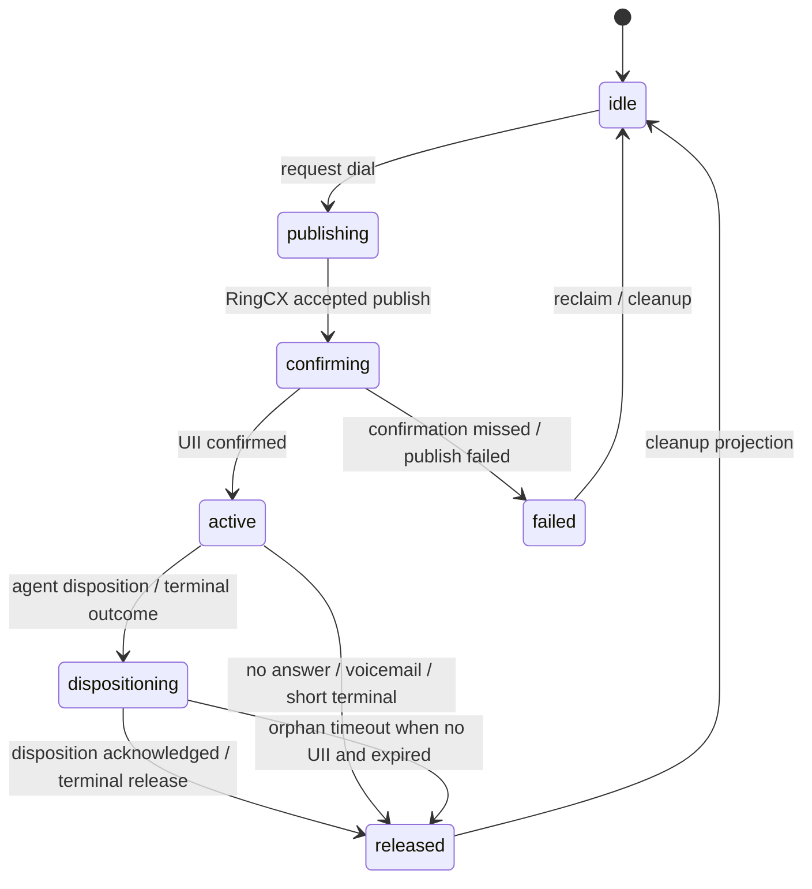

# CX Canonical Call State Architecture

Purpose: remove the flicker/desync/stuck-disposition class by making one small object the source of truth for the agent's current RingCX call.

This is the next patch direction after the strict confirmation change. Restarting the CX service can clear a stuck dispositioning shell, but it is not the fix. The fix is to stop letting `activityState`, `activePlatform`, `currentCall`, queue metadata, RingCX active-call polling, and frontend staging each tell a slightly different story.

## Current Diagnosis

The app is now more stable with:

- `RINGCX_CAMPAIGN_REQUIRE_ACTIVE_CALL_CONFIRMATION=true`
- async campaign capture forced off in strict mode
- shorter active-call capture polling
- missing-UII clear guards
- EX polling decoupled from CX ownership

That solved the worst optimistic-advance behavior, but it left a structural weakness:

- A lead can be protected by `currentCall`.
- A queue row can be claimed or released separately.
- `activityState` can say `dispositioning`.
- RingCX can be between active call, disposition, and next publish.
- The frontend can still render or suppress buttons from its own local idea of the current lead.

That is how we get states such as:

```js
{
  activityState: "dispositioning",
  activePlatform: "CX",
  currentCall: {}, // or no UII / no queue identity
}
```

This is neither fully active nor safely idle. It blocks new work, can cause flicker, and currently needs a healer or restart to escape.

## Design Goal

Create one canonical call lifecycle object and make every writer go through it.

The desired shape is not "faster by optimism." It is:

1. The UI never advances to a different person until the backend accepts the transition.
2. A stale or identity-less shell has an explicit expiration path.
3. Queue serving, RingCX dialing, disposition, and frontend display all read the same call phase.
4. Old fields still exist during migration, but they become projections of the canonical object.

## Proposed Canonical Object

Store this under `agentstates.cxCall` first. Keep `agentstates.currentCall`, `activityState`, and `activePlatform` as compatibility projections until consumers are migrated.

```js
cxCall: {
  phase: "idle" | "publishing" | "confirming" | "active" | "dispositioning" | "released" | "failed",
  phaseReason: "dial-requested" | "ringcx-published" | "uii-confirmed" | "agent-disposition" | "terminal-event" | "orphan-timeout" | "confirmation-missed",

  agentExtensionId: "63914586004",
  agentEmail: "cbolt@example.com",
  domain: "TAG",

  queueItemId: "mongo-id",
  caseId: "128210",
  contactId: null,
  phone: "masked-or-normalized-phone",

  uii: "202606...",
  ringcxSessionId: "202606...",
  dispatchToken: "optional-idempotency-token",
  transitionId: "monotonic-or-uuid",

  requestedAt: "iso",
  publishedAt: "iso",
  confirmedAt: "iso",
  dispositionAt: "iso",
  releasedAt: "iso",
  expiresAt: "iso",

  lastWriter: "dial-execution" | "workspace-disposition" | "cadence-terminal" | "agent-monitor" | "client-release",
  lastObservedAt: "iso",
}
```

Minimal fields for phase 1:

- `phase`
- `queueItemId`
- `caseId`
- `phone`
- `uii`
- `transitionId`
- `expiresAt`
- `lastWriter`

Do not make the object big just because we can. The whole point is fewer arguments passed between systems.

## Lifecycle



The important rule: `active` or `dispositioning` with a UII is sticky. It can only be replaced by a transition that proves it is the same call, or by an explicit emergency cleanup path.

An `active` or `dispositioning` object without UII is allowed only as a short-lived shell. It must have `expiresAt`, and the monitor must log and clear it when expired.

## Invariants

These should become unit-testable rules:

1. No new dial can stage for agent A while `cxCall.phase` is `publishing`, `confirming`, `active`, or `dispositioning` for a different `queueItemId` or UII.
2. A missing-UII clear cannot release a UII-bearing CX call.
3. A UII-bearing CX call cannot be released by EX polling.
4. A no-UII shell cannot live forever. It must either confirm to a UII or expire to `failed` / `released`.
5. `activityState`, `activePlatform`, and `currentCall` are derived from `cxCall` during migration.
6. Every transition carries a `transitionId`; stale writes with an older transition do not overwrite newer state.
7. The frontend receives one `servedCall` / `cxCall` object and does not recompute ownership from several competing fields.

## Current Writers To Consolidate

Primary mutation sites:

- `packages/shared-services/src/ringcxDialExecutionService.js`
  - dial request, RingCX publish, strict confirmation, unconfirmed failure, metadata writes
- `packages/shared-services/src/cxCadenceService.js`
  - call placed / terminal outcome / queue reclaim
- `packages/shared-services/src/cxWorkspaceService.js`
  - workspace disposition, no-answer, next handoff, current lead clearing
- `packages/shared-services/src/ringcxAgentMonitorService.js`
  - active call monitor, missing call detection, orphan disposition cleanup
- `packages/shared-services/src/cxCallStateGuard.js`
  - current guard helpers that should become policy decisions inside the lifecycle layer
- `apps/web-client/src/workspaces/cx/CXWorkspace.tsx`
  - staging/display/buttons; should eventually render server state instead of juggling local lead ownership

Secondary readers to migrate later:

- `packages/shared-services/src/ringcxLeadServingService.js`
- `packages/shared-services/src/agentAvailabilityService.js`
- `packages/shared-services/src/freshLeadAssignmentService.js`
- `packages/shared-services/src/cxLoadBalancerService.js`

## Proposed Service Boundary

Add a small lifecycle module, not a large framework:

```txt
packages/shared-services/src/cxCallLifecycleService.js
```

Suggested exported functions:

```js
reduceCxCallState(previousCxCall, event, now)
applyCxCallTransition({ agentExtensionId, event, expectedTransitionId, logger })
projectAgentStateFromCxCall(cxCall, previousAgentState)
describeCxCallGate(cxCall, requestedDial)
```

Keep `reduceCxCallState` pure. All Mongo writes, logs, and side effects belong in `applyCxCallTransition`.

Suggested event names:

- `dial.requested`
- `dial.publish.accepted`
- `dial.confirmed`
- `dial.confirmation_missed`
- `call.disposition.submitted`
- `call.terminal.observed`
- `call.release.accepted`
- `call.orphan.expired`
- `call.emergency_cleared`

## Patch Phases

### Phase 0: Observability Only

No behavior change.

Add normalized logs at the transition points we already have:

```txt
cx.lifecycle.observed
cx.lifecycle.gate
cx.lifecycle.block
cx.lifecycle.release
cx.lifecycle.orphan
```

Required fields:

- `agentExtensionId`
- `agentEmail`
- `phase`
- `queueItemId`
- `caseId`
- `uiiPresent`
- `uii`
- `activityState`
- `activePlatform`
- `currentCallChannel`
- `reason`
- `transitionId`
- `ageMs`

This is how we prove where the next stuck state is born.

### Phase 1: Write-Through Canonical Object

Add `agentstates.cxCall` but do not read from it yet.

Each existing writer updates both:

- existing fields (`activityState`, `activePlatform`, `currentCall`)
- new `cxCall`

Feature flag:

```txt
CX_CANONICAL_CALL_WRITE_ENABLED=true
CX_CANONICAL_CALL_READ_ENABLED=false
```

Rollback is trivial: set write flag off and ignore the field.

### Phase 2: Gate From Canonical State

Move the lead-serving and dial-block checks to prefer `cxCall`, with fallback to old fields.

Feature flag:

```txt
CX_CANONICAL_CALL_READ_ENABLED=true
CX_CANONICAL_CALL_STRICT_GATE=false
```

This means the logs can say "canonical would block" before the app actually blocks.

Then enable strict gate:

```txt
CX_CANONICAL_CALL_STRICT_GATE=true
```

Expected impact:

- no Tracey-to-Veronica class advance
- no no-UII current-call replacement
- fewer "agent-ineligible:activity-dispositioning" mysteries because the block reason includes the canonical phase

### Phase 3: Explicit Orphan Handling

Convert no-UII shells into a first-class phase with a short TTL.

Suggested default:

```txt
CX_CANONICAL_NO_UII_SHELL_TTL_MS=30000
```

Rules:

- `confirming` without UII can live until capture timeout.
- `dispositioning` without UII can live only until `expiresAt`.
- expired no-UII shells move to `failed` or `released` with `phaseReason:"orphan-timeout"`.
- UII-bearing calls do not expire by age unless an explicit emergency flag is enabled.

This is the Bruce stuck-disposition class.

### Phase 4: Frontend Receives A Single Served Call

Create one backend response shape for the CX workspace:

```js
{
  agent: { id, name, extensionId, domain },
  servedCall: {
    phase,
    queueItemId,
    caseId,
    contactName,
    phone,
    uii,
    canSubmitDisposition,
    canDialNext,
    blockReason,
  },
  queuePreview: { count, nextReadyAt },
  coach: { enabled, sessionId }
}
```

The client should not decide that a different queue row is now current just because it appears in a polling response. The server sends the one call it believes the agent owns.

The UI can still show "finishing previous call" or "confirming call" from `servedCall.phase`, but it should not jump people until the server changes `servedCall`.

### Phase 5: Remove Compatibility Writes

After a full day of logs, make old fields projections only:

- `activityState` is derived from `cxCall.phase`
- `activePlatform` is derived from `cxCall.phase`
- `currentCall` is derived from `cxCall`

No service writes these fields directly except the projection helper.

This is the actual subtraction step.

## Rollout Flags

Recommended flags:

```txt
CX_CANONICAL_CALL_WRITE_ENABLED=false
CX_CANONICAL_CALL_READ_ENABLED=false
CX_CANONICAL_CALL_STRICT_GATE=false
CX_CANONICAL_CALL_PROJECT_LEGACY_FIELDS=false
CX_CANONICAL_NO_UII_SHELL_TTL_MS=30000
CX_CANONICAL_CALL_VERBOSE_LOGS=true
```

Safe order:

1. write enabled, read disabled
2. read enabled, strict gate disabled
3. strict gate enabled
4. legacy projection enabled
5. remove direct legacy writes later

## Testing Plan

Pure reducer tests:

- `idle -> publishing -> confirming -> active`
- `confirming -> failed` when UII is missing after timeout
- `active -> dispositioning -> released`
- missing-UII clear does not release active UII call
- different UII does not release active call
- expired no-UII shell releases
- stale `transitionId` cannot overwrite newer state
- same `queueItemId` handoff is allowed
- different `queueItemId` handoff is blocked

Regression tests:

- Tracey -> Veronica: existing UII call cannot be cleared by no-UII auto-disposition.
- Bruce stuck dispositioning: no-UII disposition shell expires and releases without restart.
- No-answer and VM drop: disposition fires, call releases, next lead is allowed.
- Strict confirmation: endpoint does not return staged success without confirmed UII.

Smoke checks:

- one agent rapid no-answer flow
- one agent voicemail flow
- one agent connected call with disposition
- two agents dialing simultaneously
- one agent browser hard refresh mid-call

## What This Improves

- Reduces flicker because the UI consumes one current-call object.
- Reduces stuck dispositioning because no-UII shells have explicit TTLs.
- Makes strict confirmation cheaper to reason about because "confirmed" is a phase, not a log interpretation.
- Gives us logs that explain the state at every step.
- Makes the next speed work safer because we can optimize capture/polling without reintroducing optimism.

## Safe Visual Clear Pattern

It is acceptable for the frontend to visually clear the last lead before the next lead is loaded, but only if that clear is presentation-only.

The UI should not mutate canonical ownership, queue state, `currentCall`, or `servedCall` just to make the screen feel active. Instead, after a disposition/no-answer/VM submit has been accepted by the client action, the frontend can render a local view state such as:

```js
{
  visualPhase: "wrapping-previous-call",
  lastLeadSnapshot: {
    queueItemId,
    caseId,
    name,
    phone,
  },
  message: "Finishing previous call...",
}
```

Recommended behavior:

- Dim or collapse the previous lead card immediately after the agent clicks a terminal action.
- Replace the main call area with "Finishing previous call..." or "Waiting for RingCX confirmation...".
- Disable terminal action buttons while the backend is resolving the transition.
- Keep a small "Last lead" breadcrumb so the agent knows what just cleared.
- Restore the previous lead if the backend rejects the disposition or says the call is still active.
- Only render the next lead when the server returns a new `servedCall` / `cxCall` that is accepted as current.

This gives agents visible motion without reintroducing the old bug where the UI advanced to a different person before the backend had actually released the prior call.

## What This Does Not Solve

- RingCX API latency.
- RingCX campaign/disposition configuration mistakes.
- Network delays between RingCX, the server, and the browser.
- Stale data from historical queue rows.
- AI coach latency.

Those are real, but they should not be allowed to mutate current lead ownership.

## Recommended Next Patch (Implementation-first, no behavior change)

### Goal for this pass

- Do only Phase 0 + Phase 1.
- Keep existing runtime behavior and frontend rendering decisions unchanged.
- Add canonical lifecycle state in write paths only.
- Collect one full day of evidence before any consumer blocks on it.

### Phase 0 - Observability + write-through shape

1. Add service module

`packages/shared-services/src/cxCallLifecycleService.js`:

- `reduceCxCallState(previousCxCall, event, now)` (pure)
- `applyCxCallTransition({ agentExtensionId, event, expectedTransitionId, logger })`
- `projectAgentStateFromCxCall(cxCall, existingAgentState)`
- `describeCxCallGate(cxCall, requestedDial)`
- typed transition-id generator (`buildCxCallTransitionId()`), small helpers only

2. Add lifecycle logs only (no behavior changes)

In current mutation points, emit new logs:

- `cx.lifecycle.observed`
- `cx.lifecycle.transition`
- `cx.lifecycle.gate`
- `cx.lifecycle.block`
- `cx.lifecycle.release`
- `cx.lifecycle.orphan`

Required payload for each:

- `agentExtensionId`
- `agentEmail`
- `traceId`/`requestId` if present
- `phase`
- `phaseReason`
- `transitionId`
- `queueItemId`
- `caseId`
- `uii`
- `phone`
- `activityState`
- `activePlatform`
- `currentCallChannel`
- `requestedBy`
- `route`
- `ageMs`
- `ok`/`blocked`/`reason`

3. Write-through field model in `agentStates`

Add this minimal legacy-safe payload wherever a call state transition currently writes:

- `cxCall.phase`
- `cxCall.queueItemId`
- `cxCall.caseId`
- `cxCall.phone`
- `cxCall.uii`
- `cxCall.transitionId`
- `cxCall.expiresAt`
- `cxCall.lastWriter`
- `cxCall.lastObservedAt`

Do not remove old writes yet:

- keep existing `activityState`, `activePlatform`, `currentCall`
- keep existing queue metadata behavior exactly as-is

4. Runtime flags for this pass

```bash
CX_CANONICAL_CALL_WRITE_ENABLED=true
CX_CANONICAL_CALL_READ_ENABLED=false
CX_CANONICAL_CALL_STRICT_GATE=false
CX_CANONICAL_NO_UII_SHELL_TTL_MS=30000
CX_CANONICAL_CALL_VERBOSE_LOGS=true
```

5. Initial test coverage

- pure reducer unit tests for the transitions in this doc
- existing critical regression tests for:
  - strict confirmation required path
  - no-UII clear safety
  - stale disposition recovery

### Phase 1 - Read shadowing (gated, non-blocking)

1. Add read helper usage at one boundary only (feature-flagged)

Update one caller path first:

- `packages/shared-services/src/cxWorkspaceService.js` (`check/verify next dial availability`, queue handoff guard checks)

Use:

- canonical gate result for telemetry only
- keep existing legacy checks as source-of-truth
- log `canonicalWouldBlock` + `canonicalPhase` on every decision

2. Add compatibility projection helper

In same writer flow where states are set:

- derive old legacy fields from `cxCall` for consistency *only* when writing
- do not alter consumer reads yet

3. Add one-day evidence window

Keep strict behavior unchanged for one day:

- no blocking from `cxCall` yet (`CX_CANONICAL_CALL_STRICT_GATE=false`)
- `CX_CANONICAL_CALL_READ_ENABLED=true` only to populate telemetry
- evaluate:
  - false-positive blocks count
  - canonical-vs-legacy disagreement count
  - orphan-shell frequency (`phase=confirming/dispositioning`, missing `uii`)
  - median `confirming` duration
  - no-call transition stability

### Phase 0 + 1 completion criteria

- one day of logs with no regressions triggered by feature flag states
- strict phase mismatch ratio from `canonical vs legacy` is trending down or stable
- no observed user-visible regression on:
  - no-answer
  - voicemail
  - connected call disposition
  - rapid manual refresh mid-call
- reduction in "stuck disposition" and "advance-before-release" debug markers

Once these are met, Phase 2 can safely enable strict read/ gate:

```bash
CX_CANONICAL_CALL_READ_ENABLED=true
CX_CANONICAL_CALL_STRICT_GATE=true
```

## Viable Shadow Test Build Scope

This is the minimum work needed before a live shadow-mode test is worth running.

### 1. Add the lifecycle module

Create:

```txt
packages/shared-services/src/cxCallLifecycleService.js
```

It should contain only small policy helpers:

- `reduceCxCallState(previousCxCall, event, now)` - pure reducer
- `projectAgentStateFromCxCall(cxCall, existingAgentState)` - compatibility projection
- `describeCxCallGate(cxCall, requestedDial)` - read-only gate decision
- `buildCxCallTransitionId()` - stable transition id helper
- `normalizeCxCallIdentity(...)` - queue/UII/phone normalization helper

Do not put RingCX API calls, Mongo queries, or frontend assumptions in this module.

### 2. Add write-through calls at existing transition points

Touch only the paths that already mutate CX call state:

- `ringcxDialExecutionService.js`
  - dial requested
  - RingCX publish accepted
  - UII confirmed
  - confirmation missed / unconfirmed
- `cxWorkspaceService.js`
  - no-answer / answer / voicemail / disposition submissions
  - next-dial handoff guard
- `cxCadenceService.js`
  - terminal call outcome
  - expired claim reclaim state
- `ringcxAgentMonitorService.js`
  - active call observed
  - missing call observed
  - orphan disposition cleanup

The write-through must be best-effort. If the canonical write fails, log it and let the existing legacy operation continue.

### 3. Keep legacy state authoritative

For the shadow test:

```bash
CX_CANONICAL_CALL_WRITE_ENABLED=true
CX_CANONICAL_CALL_READ_ENABLED=true
CX_CANONICAL_CALL_STRICT_GATE=false
CX_CANONICAL_CALL_PROJECT_LEGACY_FIELDS=false
CX_CANONICAL_CALL_VERBOSE_LOGS=true
```

Meaning:

- write `agentstates.cxCall`
- compute canonical gate decisions
- log disagreements
- do not block/allow based on canonical state yet
- do not derive old fields from `cxCall` yet

### 4. Add the shadow decision at one boundary

Start with one backend boundary only:

```txt
cxWorkspaceService.js next-dial / handoff guard
```

For every decision, log:

```js
{
  event: "cx.lifecycle.shadow_gate",
  legacyDecision: "allow" | "block",
  legacyReason,
  canonicalDecision: "allow" | "block",
  canonicalReason,
  canonicalPhase,
  agentExtensionId,
  queueItemId,
  caseId,
  uiiPresent,
  transitionId,
}
```

No behavior changes from this log. If legacy says allow, the app still allows. If legacy says block, the app still blocks.

### 5. Add tests before live

Minimum test set:

- reducer transition tests:
  - `idle -> publishing -> confirming -> active`
  - `confirming -> failed`
  - `active -> dispositioning -> released`
- safety tests:
  - missing-UII clear cannot release UII-bearing call
  - different queue item blocks
  - same queue item allows
  - stale transition id cannot overwrite newer phase
  - no-UII shell gets `expiresAt`
- regression tests:
  - Tracey-to-Veronica class stays blocked in canonical gate
  - Bruce-style no-UII disposition shell becomes visible as an orphan candidate

### 6. Live smoke criteria

The shadow test is viable only if we can watch these in logs during the first hour:

- `cx.lifecycle.transition` appears for dial request, confirm, disposition, release
- `cx.lifecycle.shadow_gate` appears for next-dial decisions
- no canonical write failures
- no increase in user-visible dial failures
- no new stuck dispositioning reports
- disagreement logs are understandable, not noisy garbage

### 7. Decision after test window

After the test window, summarize:

- total transitions by phase
- canonical-vs-legacy disagreements
- no-UII shells created and cleared
- median time in `confirming`
- median time in `dispositioning`
- any agents blocked by legacy but allowed by canonical
- any agents allowed by legacy but blocked by canonical

Only after this summary is clean should the next restart flip:

```bash
CX_CANONICAL_CALL_STRICT_GATE=true
```

## Immediate 7000 Shadow Patch (No restart)

### What to code today

- Add `cxCallLifecycleService` and use it at write boundaries only.
- Keep the current legacy path as source-of-truth.
- Make canonical fields best-effort shadow-only:
  - `cxCall.phase`
  - `cxCall.queueItemId`
  - `cxCall.caseId`
  - `cxCall.phone`
  - `cxCall.uii`
  - `cxCall.transitionId`
  - `cxCall.expiresAt`
  - `cxCall.lastWriter`
  - `cxCall.lastObservedAt`
- Add `cx.lifecycle.shadow_gate` once at a single boundary and record both decisions.

### Runtime flags for the shadow pass

```bash
CX_CANONICAL_CALL_WRITE_ENABLED=true
CX_CANONICAL_CALL_READ_ENABLED=true
CX_CANONICAL_CALL_STRICT_GATE=false
CX_CANONICAL_CALL_PROJECT_LEGACY_FIELDS=false
CX_CANONICAL_NO_UII_SHELL_TTL_MS=30000
CX_CANONICAL_CALL_VERBOSE_LOGS=true
```

### One-day acceptance tests

- no new user-visible regressions in no-answer, voicemail, connected call disposition, refresh
- no canonical write failure spikes
- stable canonical-vs-legacy disagreement ratio
- orphan shell transitions are now observable and bounded by TTL
